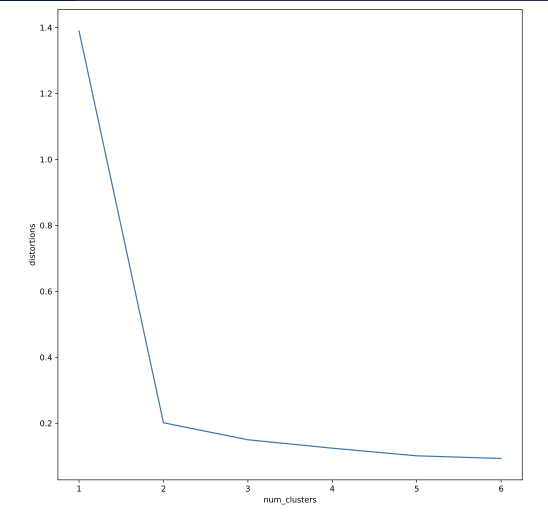

# Parameters

Return values

* cluster centers
* kmeans Single distortion, vq List of distortions one for each data point 


# Number of clusters

Elbow plot. Number of clusters against distortion. They have an inverse relation 

```python
distortions = []
num_clusters = range(1, 7)

# Create a list of distortions from the kmeans function
for i in num_clusters:
    cluster_centers, distortion = kmeans(comic_con[["x_scaled", "y_scaled"]], i)
    distortions.append(distortion)

# Create a DataFrame with two lists - num_clusters, distortions
elbow_plot = pd.DataFrame({'num_clusters': num_clusters, 'distortions': distortions})

# Creat a line plot of num_clusters and distortions
sns.lineplot(x="num_clusters", y="distortions", data = elbow_plot)
plt.xticks(num_clusters)
plt.show()
```
For this example we can clearly see that the optimal number of clusters is 3



But for this one there is not a clear elbow marked 


# Limitations

* Hard to find the optimal number of clusters
* impact of seeds. The initial random selection. This affect especially uniform data. 
