# Deep Learning Fundamentals

Deep learning is a subset of machine learning techniques that uses neural networks with multiple layers to learn representations of data. It allows systems to discover features from raw data automatically, drawing inspiration from how humans learn. Deep learning typically requires more data than traditional machine learning models but can achieve superior performance on complex tasks.

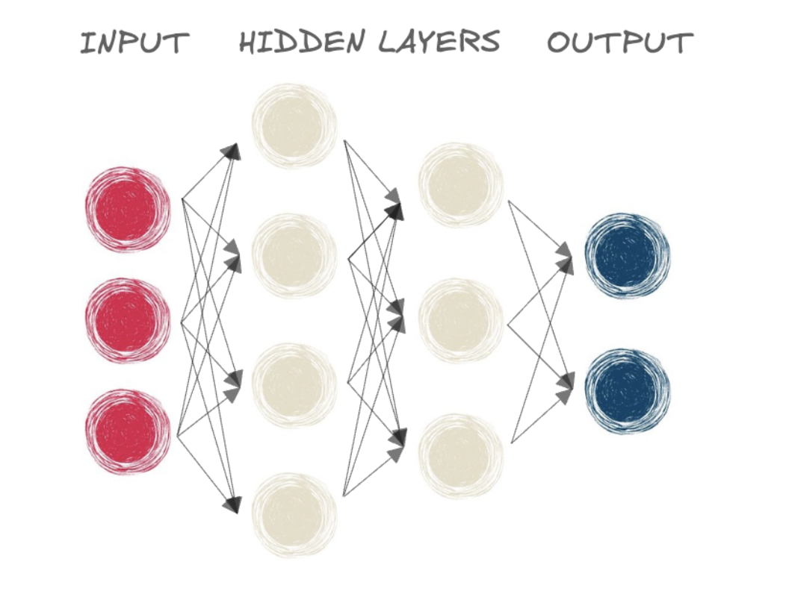

## PyTorch Basics

PyTorch is a popular deep learning framework. Its key construct is a tensor, which is similar to a NumPy array in terms of operations it allows us to perform on data.

```python 
# Import PyTorch
import torch 

# Create a tensor from a list of temperatures
temperatures = [[72, 75, 78], [70, 73, 76]]
temp_tensor = torch.tensor(temperatures)
print(temp_tensor)
```

### Tensor Operations

PyTorch provides various operations to manipulate tensors:

```python 
temperatures = torch.tensor([[72, 75, 78], [70, 73, 76]])
adjustment = torch.tensor([[2, 2, 2], [2, 2, 2]])

# Check the shape of the temperatures tensor
temp_shape = temperatures.shape
print("Shape of temperatures:", temp_shape)  # torch.Size([2, 3])

# Check the type of the temperatures tensor
temp_type = temperatures.dtype
print("Data type of temperatures:", temp_type)  # torch.int64

# Adjust the temperatures by adding the adjustment tensor
corrected_temperatures = temperatures.add(adjustment)
# Alternative: corrected_temperatures = temperatures + adjustment

print("Corrected temperatures:", corrected_temperatures)
```

## Neural Network Fundamentals

### Linear Layers

When you create a neural network with `nn.Linear` layers, the operation performed is as follows:

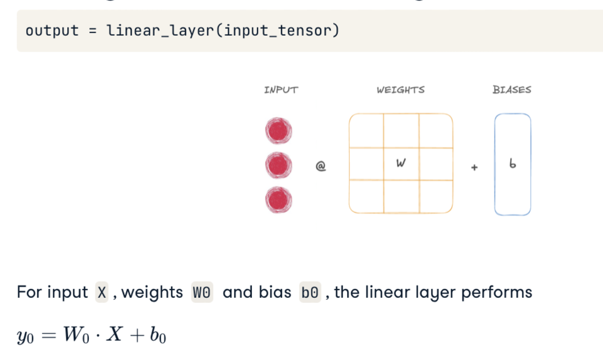

When you initialize a model, the weights and biases are set randomly by default.

```python
import torch
import torch.nn as nn

# Create input tensor
input_tensor = torch.tensor([[2, 3, 6, 7, 9, 3, 2, 1]], dtype=torch.float32)

# Implement a small neural network with two linear layers
model = nn.Sequential(
    nn.Linear(8, 20),  # Input features: 8, Output features: 20
    nn.Linear(20, 1)   # Input features: 20, Output features: 1
)

# Forward pass through the network
output = model(input_tensor)
print(output)
```

## Activation Functions

Activation functions introduce non-linearity to neural networks, allowing them to learn complex patterns. Without activation functions, neural networks would only be capable of learning linear relationships.

### Sigmoid Function

The sigmoid function constrains the result to a range between 0 and 1. It's useful for binary classification problems as the final layer.

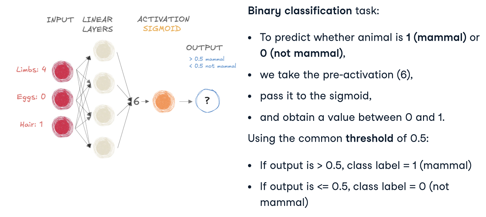

```python 
input_tensor = torch.tensor([[0.8]], dtype=torch.float32)

# Create a sigmoid function and apply it to input_tensor
sigmoid = nn.Sigmoid()
probability = sigmoid(input_tensor)
print(probability)  # Value between 0 and 1
```

### Sigmoid and Softmax Limitations

The sigmoid function was historically popular but has limitations:

- **Vanishing gradient problem**: Gradients become very small for inputs with large absolute values
- **Not zero-centered**: Can cause zig-zagging dynamics in gradient descent
- **Computationally expensive**: Requires exponential operations

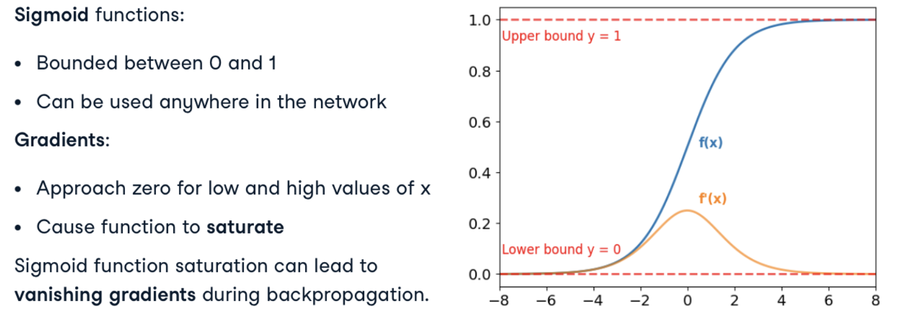

### Softmax Function

The softmax function is used for multi-class classification, converting a vector of values into a probability distribution.

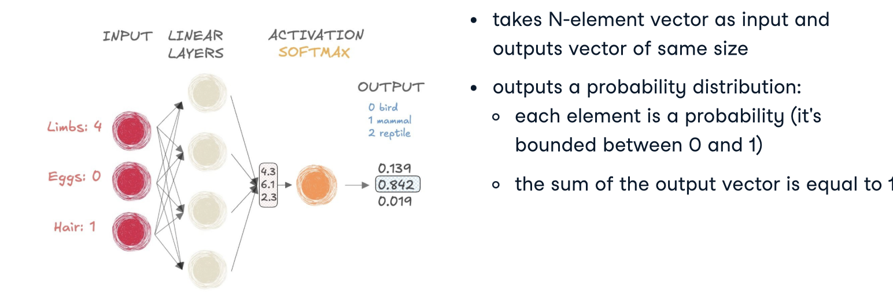

```python 
input_tensor = torch.tensor([[1.0, -6.0, 2.5, -0.3, 1.2, 0.8]], dtype=torch.float32)

# Create a softmax function and apply it to input_tensor
softmax = nn.Softmax(dim=1)  # Apply softmax along dimension 1
probabilities = softmax(input_tensor)
print(probabilities)  # Sum of all values equals 1
```

### ReLU (Rectified Linear Unit)

ReLU has become the default activation function for many neural networks due to its simplicity and effectiveness:

- **Formula**: `f(x) = max(0, x)`
- **Advantages**: Computationally efficient, helps mitigate vanishing gradient problem
- **Disadvantage**: "Dying ReLU" problem - neurons can sometimes get stuck and never activate


```python
# Import necessary libraries
import torch
import torch.nn as nn

# Create a ReLU function with PyTorch
relu_pytorch = nn.ReLU()

# Apply your ReLU function on x, and calculate gradients
x = torch.tensor(-1.0, requires_grad=True)
y = relu_pytorch(x)
y.backward()

# Print the gradient of the ReLU function for x
gradient = x.grad
print(f"Input value: {x.item()}")
print(f"Output value: {y.item()}")
print(f"Gradient: {gradient.item()}")  # Will be 0 for negative inputs
```

### Leaky ReLU

Leaky ReLU addresses the "dying ReLU" problem by allowing a small gradient when the input is negative:

- **Formula**: `f(x) = max(α*x, x)` where α is a small constant (typically 0.01)
- **Advantage**: Prevents neurons from dying during training
- **Parameters**: `negative_slope` controls the slope for negative inputs

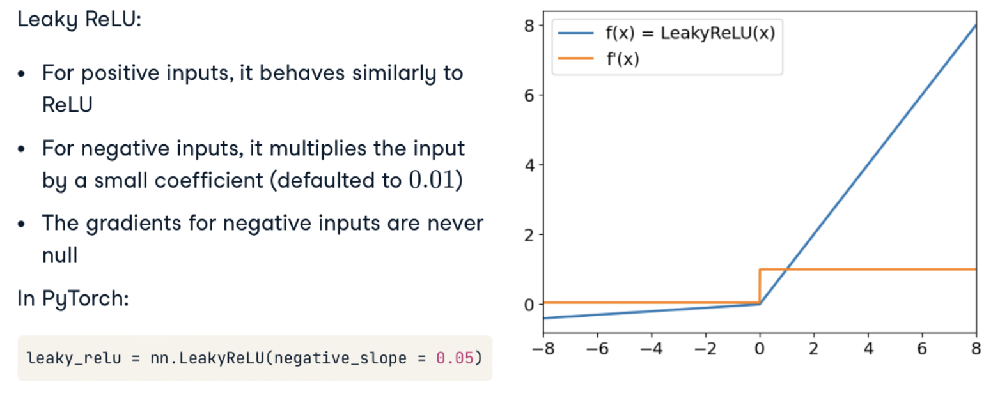

```python
# Import necessary libraries
import torch
import torch.nn as nn
import matplotlib.pyplot as plt
import numpy as np

# Create a leaky ReLU function in PyTorch
leaky_relu_pytorch = nn.LeakyReLU(negative_slope=0.05)

# Test with a negative value
x = torch.tensor(-2.0)
output = leaky_relu_pytorch(x)
print(f"Input: {x.item()}, Output: {output.item()}")

# Visualize the Leaky ReLU function
x_range = np.linspace(-5, 5, 100)
y_values = [leaky_relu_pytorch(torch.tensor(x_val)).item() for x_val in x_range]

plt.figure(figsize=(8, 5))
plt.plot(x_range, y_values)
plt.grid(True)
plt.axhline(y=0, color='k', linestyle='-', alpha=0.3)
plt.axvline(x=0, color='k', linestyle='-', alpha=0.3)
plt.title("Leaky ReLU Function")
plt.xlabel("Input (x)")
plt.ylabel("Output (y)")
plt.show()
```

## Neural Network Architecture Concepts

Understanding key architectural elements helps in designing effective neural networks for specific tasks.

### Fully Connected Network

A fully connected network (dense network) connects each neuron in one layer to every neuron in the next layer.

- **Characteristics**: High parameter count, can learn complex patterns
- **Use cases**: Classification, regression tasks with flat (non-spatial) data

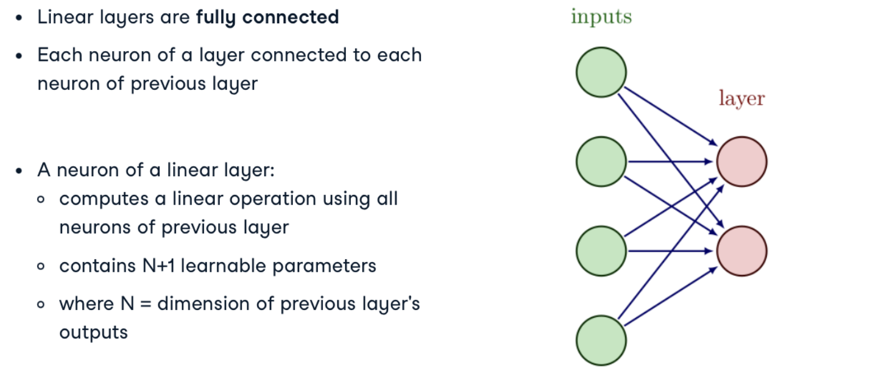

### Layer Types

Different layer types serve different purposes in neural networks:

- **Input Layer**: Receives the raw data
- **Hidden Layers**: Perform feature extraction/transformations
- **Output Layer**: Produces the final prediction

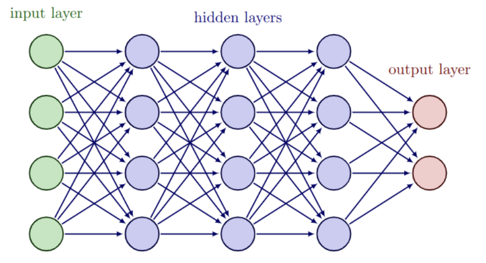

### Parameters and Model Complexity

The number of parameters in a model affects:

- **Training time**: More parameters require more computation
- **Memory usage**: More parameters require more storage
- **Generalization**: Too many parameters can lead to overfitting

The number of parameters in a fully connected layer can be calculated as:
`parameters = (inputs * outputs) + outputs` (weights + biases)

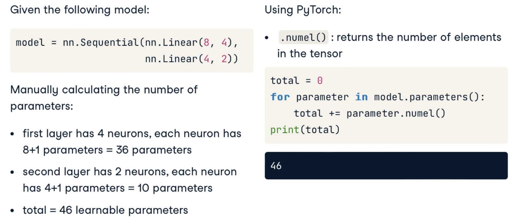

## Hyperparameters

### Learning Rate

The learning rate determines how large of a step to take during optimization. It typically ranges from 10^-2 to 10^-4.

#### Low Learning Rate
Slow convergence but stable.
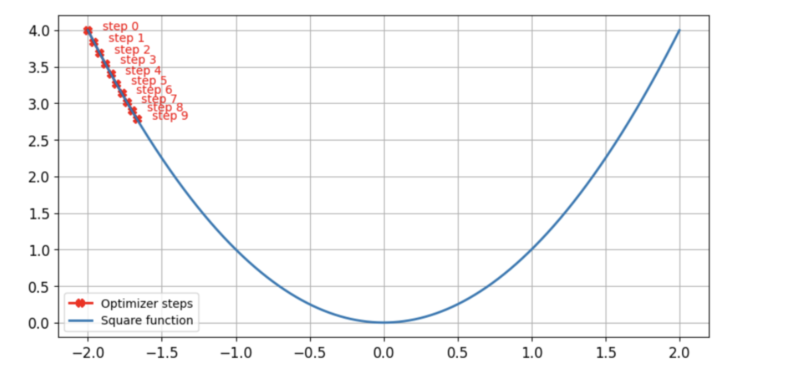

#### High Learning Rate
Fast initial progress but may overshoot or diverge.
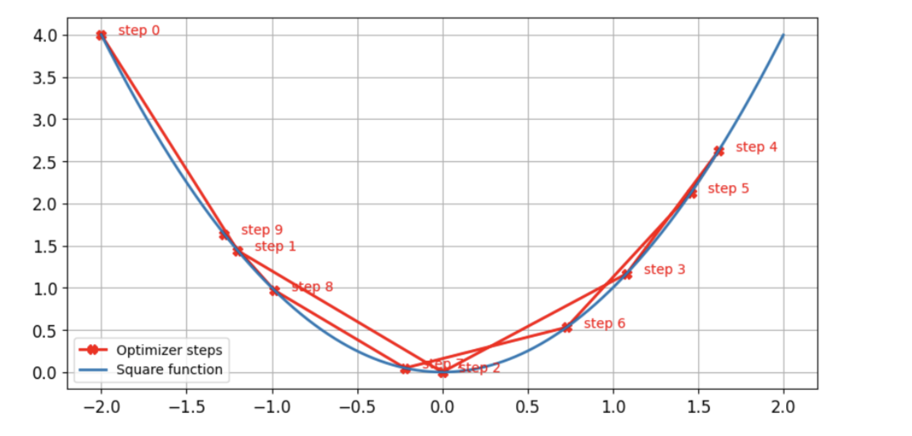

#### Optimal Learning Rate
Good balance between speed and stability.
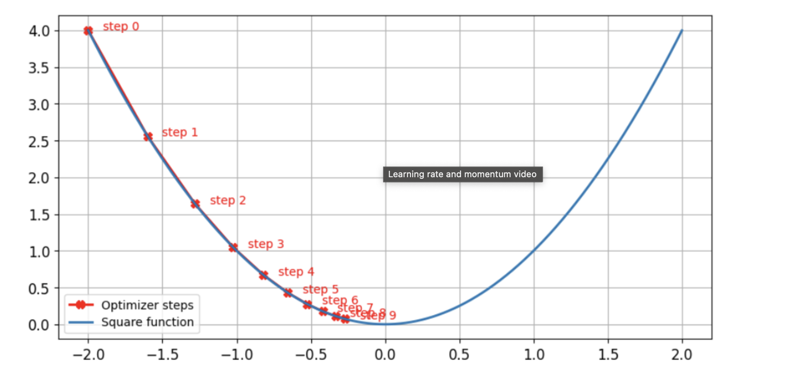

### Momentum

Momentum helps accelerate gradient descent and dampens oscillations. Values typically range from 0.85 to 0.99.

#### Low Momentum
Less acceleration, follows gradient more directly.
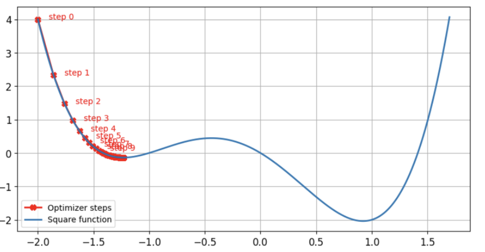

#### Optimal Momentum
Helps overcome local minima and plateaus.
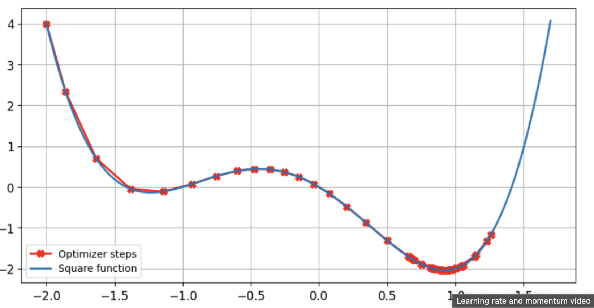

## Choosing the Right Architecture

When designing a neural network, consider:

1. **Task type**: Classification, regression, generation, etc.
2. **Input data**: Structure (image, text, tabular), size, complexity
3. **Computational constraints**: Memory, processing power, inference time
4. **Available data**: Amount of training data relative to model complexity

```python
# Example of creating a simple neural network with PyTorch
import torch
import torch.nn as nn

class SimpleNN(nn.Module):
    def __init__(self, input_size, hidden_size, output_size):
        super(SimpleNN, self).__init__()
        
        # Define layers
        self.layer1 = nn.Linear(input_size, hidden_size)
        self.activation = nn.ReLU()
        self.layer2 = nn.Linear(hidden_size, output_size)
        
    def forward(self, x):
        x = self.layer1(x)
        x = self.activation(x)
        x = self.layer2(x)
        return x

# Create a model with 10 inputs, 50 hidden neurons, and 3 outputs
model = SimpleNN(input_size=10, hidden_size=50, output_size=3)

# Calculate the number of parameters
total_params = sum(p.numel() for p in model.parameters())
print(f"Total parameters: {total_params}")

# Break down by layer
for name, param in model.named_parameters():
    print(f"{name}: {param.numel()} parameters")
```

## Initialization and Transfer Learning

### Weight Initialization

Proper weight initialization can help networks converge faster:

```python 
layer0 = nn.Linear(16, 32)
layer1 = nn.Linear(32, 64)

# Use uniform initialization for layer0 and layer1 weights
nn.init.uniform_(layer0.weight)
nn.init.uniform_(layer1.weight)

model = nn.Sequential(layer0, layer1)
```

### Transfer Learning

Transfer learning reuses a model trained on a first task for a second similar task, accelerating the training process and potentially improving performance.

#### Fine-tuning

When fine-tuning, we typically use a lower learning rate or freeze certain layers (usually the earlier layers) while training the layers closer to the output:

```python 
for name, param in model.named_parameters():    
    # Check if the parameters belong to the first layer
    if name == '0.weight' or name == '0.bias':
        # Freeze the parameters
        param.requires_grad = False
  
    # Check if the parameters belong to the second layer
    if name == '1.weight' or name == '1.bias':
        # Freeze the parameters
        param.requires_grad = False
```

This approach preserves the general feature extraction capabilities of the model while adapting the later layers to the specific new task.
