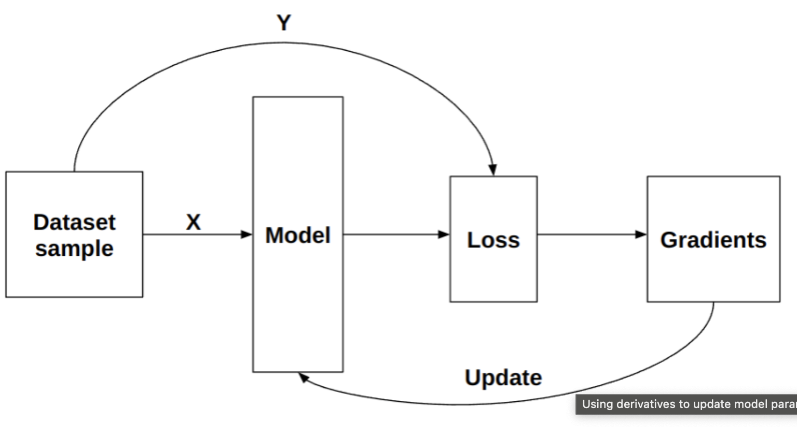
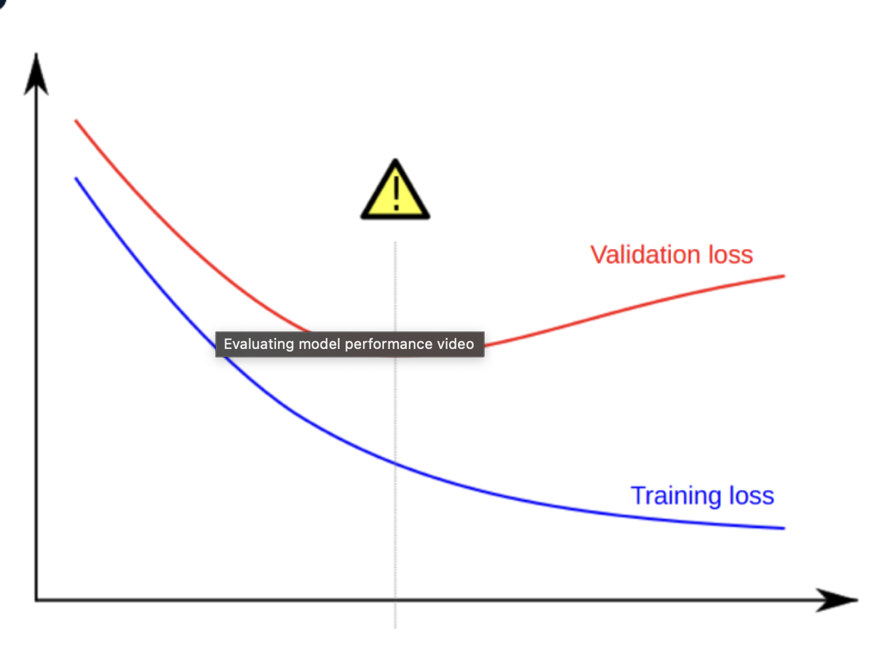

# Training and Optimizing Neural Networks

This document covers the core concepts of neural network training, optimization techniques, and strategies to combat overfitting.

## The Training Process Overview

Neural network training follows a systematic approach:

1. **Forward Pass**: Propagate data through the network to generate predictions
2. **Loss Calculation**: Compare predictions to true values using a loss function
3. **Backward Pass**: Back-propagate gradients to update model weights and biases
4. **Optimization**: Repeat steps 1-3 until weights and biases are tuned to produce accurate outputs



## Forward and Backward Passes

The forward pass computes predictions, while the backward pass updates parameters to improve those predictions.

```python
import torch
import torch.nn as nn
import matplotlib.pyplot as plt

# Create sample input tensor
input_tensor = torch.tensor([[3, 4, 6, 7, 10, 12, 2, 3, 6, 8, 9]], dtype=torch.float32)

# Define a multi-class classification network with four output classes
model = nn.Sequential(
    nn.Linear(11, 20),    # Input features -> 20 hidden units
    nn.ReLU(),            # Activation function after first layer
    nn.Linear(20, 12),    # 20 -> 12 hidden units
    nn.ReLU(),            # Activation function after second layer
    nn.Linear(12, 6),     # 12 -> 6 hidden units
    nn.ReLU(),            # Activation function after third layer
    nn.Linear(6, 4),      # 6 -> 4 output classes
    nn.Softmax(dim=1)     # Convert outputs to probabilities
)

# Forward pass: get the predictions
output = model(input_tensor)
print("Model output (class probabilities):", output)
print("Predicted class:", torch.argmax(output, dim=1).item())
```

### Understanding the Backward Pass

During the backward pass:

1. Gradients of the loss function with respect to model parameters are computed
2. These gradients indicate how to adjust parameters to minimize the loss
3. PyTorch's autograd system automatically computes these gradients

## Loss Functions

Loss functions measure the discrepancy between predictions and ground truth. They provide a differentiable measure of model performance.

### One-Hot Encoding for Classification

For classification tasks, target labels are typically encoded as one-hot vectors:

```python
import torch
import torch.nn.functional as F
import numpy as np
import matplotlib.pyplot as plt

# Example: Encoding class index 1 (second class) in a 3-class problem
y = 1  # Class index
num_classes = 3  # Total number of classes

# Create one-hot encoded vector using NumPy
one_hot_numpy = np.zeros(num_classes)
one_hot_numpy[y] = 1
print("One-hot encoding (NumPy):", one_hot_numpy)

# Create one-hot encoded vector using PyTorch
one_hot_pytorch = F.one_hot(torch.tensor(y), num_classes)
print("One-hot encoding (PyTorch):", one_hot_pytorch)

# Visualize one-hot encoding
plt.figure(figsize=(8, 4))
plt.bar(range(num_classes), one_hot_pytorch.numpy())
plt.xticks(range(num_classes))
plt.xlabel("Class Index")
plt.ylabel("Value")
plt.title("One-Hot Encoding for Class 1")
plt.show()
```

### Cross-Entropy Loss

Cross-Entropy Loss is the most common loss function for classification problems:

- It measures the difference between two probability distributions
- For classification, these are the predicted probabilities and one-hot encoded ground truth
- Minimizing cross-entropy maximizes the likelihood of correct predictions

```python
import torch
import torch.nn.functional as F
from torch.nn import CrossEntropyLoss

# Example raw model outputs (logits) for a 4-class problem
# Higher values indicate stronger predictions for that class
scores = torch.tensor([[0.1, 6.0, -2.0, 3.2]])
print("Model raw outputs (logits):", scores)

# Convert to probabilities with softmax for visualization
probabilities = F.softmax(scores, dim=1)
print("Probabilities after softmax:", probabilities)

# Ground truth: the correct class is 2 (third class, zero-indexed)
y = torch.tensor([2])
print("Target class:", y.item())

# Create a one-hot encoded vector of the label y
one_hot_label = F.one_hot(y, scores.shape[1]).float()
print("One-hot encoded target:", one_hot_label)

# Create the cross entropy loss function
# Note: PyTorch's CrossEntropyLoss combines softmax and negative log-likelihood
criterion = CrossEntropyLoss()

# Calculate the cross entropy loss
# CrossEntropyLoss takes raw logits and class indices (not one-hot)
loss = criterion(scores, y)
print(f"Cross entropy loss: {loss.item():.4f}")

# Visualize the mismatch between predictions and target
plt.figure(figsize=(10, 5))
plt.subplot(1, 2, 1)
plt.bar(range(scores.shape[1]), probabilities[0].detach().numpy())
plt.xticks(range(scores.shape[1]))
plt.title("Model Predictions (Probabilities)")
plt.xlabel("Class")
plt.ylabel("Probability")

plt.subplot(1, 2, 2)
plt.bar(range(scores.shape[1]), one_hot_label[0].numpy())
plt.xticks(range(scores.shape[1]))
plt.title("Target (One-Hot)")
plt.xlabel("Class")
plt.show()
```

### Common Loss Functions

Different tasks require different loss functions:

- **Classification**: Cross Entropy Loss
- **Regression**: Mean Squared Error, Mean Absolute Error, Huber Loss
- **Object Detection**: Intersection over Union (IoU) based losses
- **Generative Models**: Adversarial losses, reconstruction losses

## Loss Landscape and Optimization

The loss function creates a landscape in parameter space that we need to navigate to find the minimum loss.

### Loss Landscapes

- **Convex Functions**: Have a single global minimum, making optimization straightforward
- **Non-Convex Functions**: Have multiple local minima, making optimization challenging
- **Neural Network Loss Landscapes**: Are typically non-convex with many local minima

### Optimization Using Gradients

Gradient-based optimization algorithms use derivatives to navigate the loss landscape:


The gradient points in the direction of steepest ascent, so we move in the opposite direction to minimize the loss.

### Manually Updating Weights

For demonstration, we can manually update weights using gradients:

```python
import torch
import torch.nn as nn
import torch.optim as optim

# Define a simple model
model = nn.Sequential(
    nn.Linear(10, 8),
    nn.ReLU(),
    nn.Linear(8, 4),
    nn.ReLU(),
    nn.Linear(4, 2)
)

# Example input and target
x = torch.randn(1, 10)
target = torch.tensor([1])

# Forward pass
output = model(x)
criterion = nn.CrossEntropyLoss()
loss = criterion(output, target)

# Backward pass (compute gradients)
loss.backward()

# Learning rate
lr = 0.01

# Manual weight update example
weight0 = model[0].weight
weight1 = model[2].weight
weight2 = model[4].weight

# Access the gradients of the weights
grads0 = weight0.grad
grads1 = weight1.grad
grads2 = weight2.grad

# Update the weights using the learning rate and the gradients
with torch.no_grad():  # Temporarily disable gradient tracking
    model[0].weight -= lr * grads0
    model[2].weight -= lr * grads1
    model[4].weight -= lr * grads2

print("Weights updated manually!")
```

### Using PyTorch Optimizers

In practice, we use PyTorch optimizers to automate parameter updates:

```python
import torch
import torch.nn as nn
import torch.optim as optim

# Define model
model = nn.Sequential(
    nn.Linear(10, 8),
    nn.ReLU(),
    nn.Linear(8, 4),
    nn.ReLU(),
    nn.Linear(4, 2)
)

# Define loss function and optimizer
criterion = nn.CrossEntropyLoss()
optimizer = optim.SGD(model.parameters(), lr=0.01)

# Example input and target
x = torch.randn(1, 10)
target = torch.tensor([1])

# Training loop
for epoch in range(100):
    # Forward pass
    output = model(x)
    loss = criterion(output, target)
    
    # Zero gradients
    optimizer.zero_grad()
    
    # Backward pass
    loss.backward()
    
    # Update weights
    optimizer.step()
    
    # Print progress
    if (epoch + 1) % 10 == 0:
        print(f"Epoch {epoch+1}/{100}, Loss: {loss.item():.4f}")
```

## Efficient Data Handling

### DataLoader for Batch Processing

The DataLoader class is a crucial PyTorch utility that handles batch processing, data shuffling, and efficient loading:

```python 
import numpy as np
import torch
from torch.utils.data import TensorDataset, DataLoader

# Load features and target into PyTorch tensors
features = torch.tensor(dataframe[['ph', 'Sulfate', 'Conductivity', 'Organic_carbon']].to_numpy()).float()
target = torch.tensor(dataframe['Potability'].to_numpy()).float()

# Create a dataset from the two tensors
dataset = TensorDataset(features, target)

# Create a dataloader with batching and shuffling
dataloader = DataLoader(
    dataset, 
    shuffle=True,       # Shuffle data at every epoch
    batch_size=32,      # Number of samples per batch
    num_workers=4,      # Number of subprocesses for data loading
    pin_memory=True     # Faster data transfer to GPU
)

# Accessing a batch from the dataloader
x, y = next(iter(dataloader))

# Create a simple model using the Sequential API
model = nn.Sequential(
    nn.Linear(4, 16),
    nn.ReLU(),
    nn.Linear(16, 1),
    nn.Sigmoid()
)

# Forward pass through the model
output = model(features)
print(f"Output shape: {output.shape}")
```

## Model Evaluation

### Training vs. Validation Loss

To properly evaluate a model, you should track both training and validation loss:

```python 
# Set the model to evaluation mode (disables dropout, etc.)
model.eval()

# Initialize validation loss
validation_loss = 0.0

# Disable gradient calculation for validation
with torch.no_grad():
    for data, targets in validation_loader:
        # Move data to device if using GPU
        data = data.to(device)
        targets = targets.to(device)
        
        # Forward pass
        outputs = model(data)
        
        # Calculate loss
        loss = criterion(outputs, targets)
        
        # Accumulate batch loss
        validation_loss += loss.item()
      
# Calculate the mean validation loss
validation_loss_epoch = validation_loss / len(validation_loader)

# Set the model back to training mode
model.train()

print(f"Validation loss: {validation_loss_epoch:.4f}")
```

### Performance Metrics

Using torchmetrics provides a convenient way to track model performance:

```python 
import torchmetrics

# Create accuracy metric for multiclass classification
metric = torchmetrics.Accuracy(task="multiclass", num_classes=3)

# Evaluation loop
model.eval()
with torch.no_grad():
    for features, labels in test_loader:
        # Forward pass
        outputs = model(features)
        
        # Update accuracy metric
        metric.update(outputs, labels.argmax(dim=-1))
    
    # Calculate final accuracy
    accuracy = metric.compute()
    print(f"Test accuracy: {accuracy:.4f}")

    # Reset the metric for next evaluation
    metric.reset()
```

## Combating Overfitting

Overfitting occurs when a model performs well on training data but poorly on unseen data:



### Dropout Layers

Dropout is a regularization technique that randomly deactivates neurons during training:

```python 
# Define a model with dropout
model = nn.Sequential(
    nn.Linear(784, 256),
    nn.ReLU(),
    nn.Dropout(p=0.5),  # 50% dropout probability
    nn.Linear(256, 128),
    nn.ReLU(),
    nn.Dropout(p=0.3),  # 30% dropout probability
    nn.Linear(128, 10)
)

# Note: Dropout is automatically disabled during evaluation
# when model.eval() is called
```

### Weight Decay

Weight decay (L2 regularization) adds a penalty to the loss function to discourage large weights:

```python
import torch.optim as optim

# Create optimizer with weight decay
optimizer = optim.Adam(
    model.parameters(), 
    lr=0.001,
    weight_decay=1e-5  # L2 penalty coefficient
)
```

### Data Augmentation

Data augmentation artificially expands your training dataset by applying transformations:

```python
from torchvision import transforms

# Define image augmentation transformations
transform_train = transforms.Compose([
    transforms.RandomRotation(10),          # Rotate ±10 degrees
    transforms.RandomHorizontalFlip(),      # 50% chance to flip horizontally
    transforms.RandomResizedCrop(224),      # Random crop and resize
    transforms.ColorJitter(brightness=0.2), # Adjust brightness
    transforms.ToTensor(),                  # Convert to tensor
    transforms.Normalize(mean=[0.485, 0.456, 0.406], 
                         std=[0.229, 0.224, 0.225])
])
```

## Optimization Techniques

### Learning Rate Schedules

Learning rate schedules adjust the learning rate during training to improve convergence:

```python
import torch.optim as optim
from torch.optim.lr_scheduler import StepLR

# Create optimizer
optimizer = optim.Adam(model.parameters(), lr=0.001)

# Create a learning rate scheduler
# Reduces the LR by gamma every step_size epochs
scheduler = StepLR(optimizer, step_size=10, gamma=0.5)

# Training loop with scheduler
for epoch in range(100):
    # Training steps
    train_model(model, train_loader, criterion, optimizer)
    
    # Update learning rate
    scheduler.step()
    
    # Print current learning rate
    current_lr = optimizer.param_groups[0]['lr']
    print(f"Epoch {epoch+1}, Learning Rate: {current_lr:.6f}")
```

### Momentum and Adam Optimization

Momentum helps accelerate gradient descent, while Adam combines momentum with adaptive learning rates:

```python
# SGD with momentum
optimizer_sgd = optim.SGD(model.parameters(), lr=0.01, momentum=0.9)

# Adam optimizer
optimizer_adam = optim.Adam(model.parameters(), lr=0.001, betas=(0.9, 0.999))
```

### Gradient Clipping

Gradient clipping prevents exploding gradients by limiting their magnitude:

```python
# Training loop with gradient clipping
for inputs, targets in train_loader:
    # Forward pass
    outputs = model(inputs)
    loss = criterion(outputs, targets)
    
    # Backward pass
    optimizer.zero_grad()
    loss.backward()
    
    # Clip gradients
    torch.nn.utils.clip_grad_norm_(model.parameters(), max_norm=1.0)
    
    # Update weights
    optimizer.step()
```

## Systematic Training Approach

### 1. Start with an Overfit Model

Begin by creating a model that can overfit on a small dataset:

```python
# Create a complex model
model = nn.Sequential(
    nn.Linear(input_size, 512),
    nn.ReLU(),
    nn.Linear(512, 256),
    nn.ReLU(),
    nn.Linear(256, 128),
    nn.ReLU(),
    nn.Linear(128, num_classes)
)

# Train on a small subset of data
small_dataset = Subset(full_dataset, indices=range(100))
small_loader = DataLoader(small_dataset, batch_size=10, shuffle=True)

# Train until the model overfits
for epoch in range(50):
    train_model(model, small_loader, optimizer, criterion)
    
    # Check if model achieves very low training loss
    train_loss = evaluate(model, small_loader, criterion)
    print(f"Epoch {epoch}, Train Loss: {train_loss:.4f}")
```

### 2. Apply Regularization Techniques

Apply techniques to reduce overfitting once you've confirmed the model can learn:

```python
# Add regularization to model
model = nn.Sequential(
    nn.Linear(input_size, 512),
    nn.ReLU(),
    nn.Dropout(0.3),
    nn.Linear(512, 256),
    nn.ReLU(),
    nn.Dropout(0.3),
    nn.Linear(256, 128),
    nn.ReLU(),
    nn.Dropout(0.3),
    nn.Linear(128, num_classes)
)

# Add weight decay to optimizer
optimizer = optim.Adam(model.parameters(), lr=0.001, weight_decay=1e-4)
```

### 3. Hyperparameter Tuning

Use systematic approaches to find optimal hyperparameters:

```python
import numpy as np

# Define hyperparameter ranges
learning_rates = []
momentum_values = []

# Generate 10 random hyperparameter combinations
for idx in range(10):
    # Sample learning rate on a log scale between 10^-4 and 10^-2
    lr_factor = np.random.uniform(2, 4)
    lr = 10 ** -lr_factor
    
    # Sample momentum between 0.85 and 0.99
    momentum = np.random.uniform(0.85, 0.99)
    
    learning_rates.append(lr)
    momentum_values.append(momentum)

# Train and evaluate models with different hyperparameters
results = []
for lr, momentum in zip(learning_rates, momentum_values):
    # Create optimizer with current hyperparameters
    optimizer = optim.SGD(model.parameters(), lr=lr, momentum=momentum)
    
    # Train model
    train_model(model, train_loader, optimizer, criterion, epochs=10)
    
    # Evaluate on validation set
    val_loss = evaluate(model, val_loader, criterion)
    
    # Store results
    results.append({
        'lr': lr,
        'momentum': momentum,
        'val_loss': val_loss
    })
    
    print(f"LR: {lr:.6f}, Momentum: {momentum:.2f}, Val Loss: {val_loss:.4f}")
    
# Find best hyperparameters
best_result = min(results, key=lambda x: x['val_loss'])
print(f"Best hyperparameters: LR={best_result['lr']:.6f}, Momentum={best_result['momentum']:.2f}")
```

### 4. Learning Rate Finder

The learning rate finder is a technique to identify an optimal learning rate:

```python
import math
import matplotlib.pyplot as plt
from torch.utils.data import DataLoader

def find_learning_rate(model, train_loader, criterion, optimizer, start_lr=1e-7, end_lr=10, num_steps=100):
    """
    Performs a learning rate finder experiment.
    
    Parameters:
    -----------
    model : nn.Module
        The model to train
    train_loader : DataLoader
        DataLoader for training data
    criterion : loss function
        Loss function to use
    optimizer : optimizer
        Optimizer to use
    start_lr : float
        Starting learning rate
    end_lr : float
        Ending learning rate
    num_steps : int
        Number of steps to take
        
    Returns:
    --------
    list of learning rates, list of losses
    """
    # Create lists to store results
    lrs = []
    losses = []
    
    # Set initial learning rate
    lr = start_lr
    
    # Calculate the multiplication factor
    mult_factor = (end_lr / start_lr) ** (1 / num_steps)
    
    # Initialize batch index
    batch_idx = 0
    
    # Create a copy of the model's initial state
    initial_state = {k: v.cpu().clone() for k, v in model.state_dict().items()}
    
    # Iterate over batches
    for inputs, targets in train_loader:
        # Update learning rate
        for param_group in optimizer.param_groups:
            param_group['lr'] = lr
            
        # Forward pass
        outputs = model(inputs)
        loss = criterion(outputs, targets)
        
        # Backward pass
        optimizer.zero_grad()
        loss.backward()
        optimizer.step()
        
        # Store learning rate and loss
        lrs.append(lr)
        losses.append(loss.item())
        
        # Update learning rate with multiplicative factor
        lr *= mult_factor
        
        # Increment batch index
        batch_idx += 1
        
        # Break if reached num_steps or if loss is NaN
        if batch_idx >= num_steps or not math.isfinite(loss.item()):
            break
    
    # Restore model to its initial state
    model.load_state_dict(initial_state)
    
    return lrs, losses

# Example usage
lrs, losses = find_learning_rate(model, train_loader, criterion, optimizer)

# Plot results
plt.figure(figsize=(12, 6))
plt.plot(lrs, losses)
plt.xscale('log')
plt.xlabel('Learning Rate')
plt.ylabel('Loss')
plt.title('Learning Rate Finder')
plt.axvline(x=5e-4, color='r', linestyle='--')  # Mark a potential optimal LR
plt.show()
```
