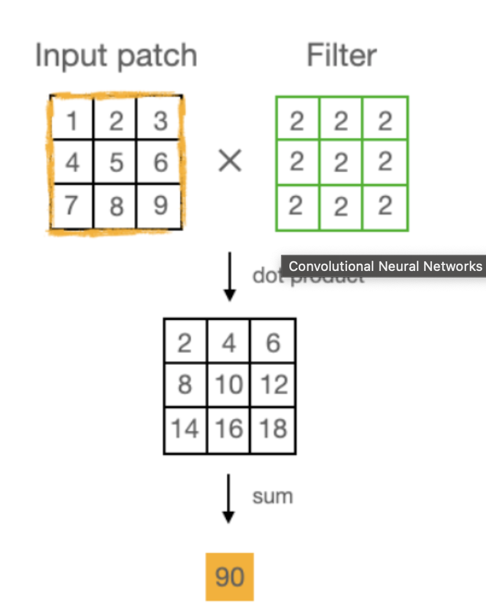
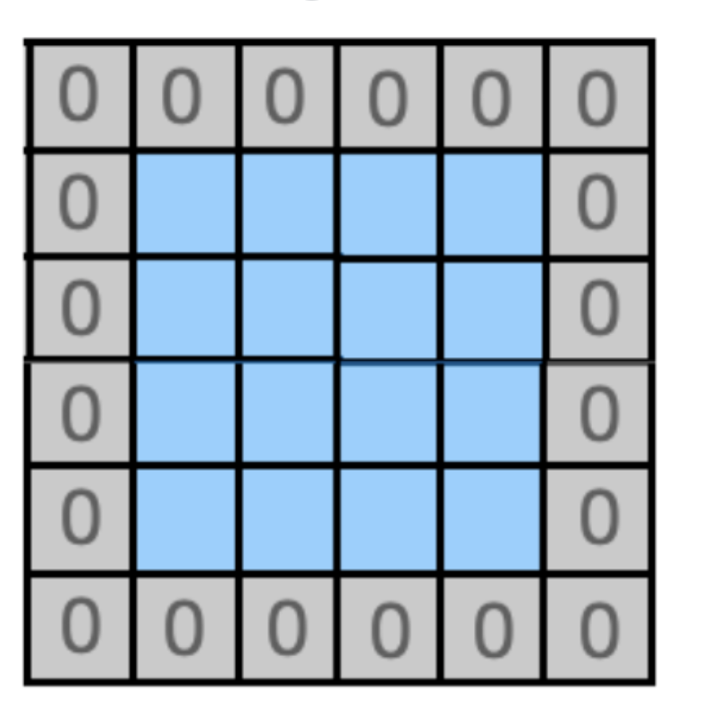
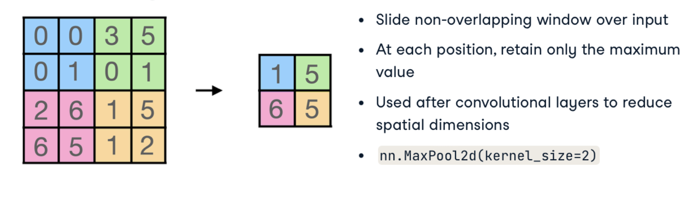
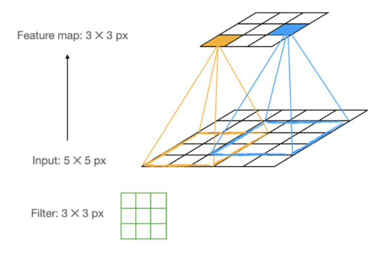

# Convolutional Neural Networks (CNNs)

Convolutional Neural Networks are specialized deep learning architectures designed primarily for image processing tasks. They excel at capturing spatial patterns and hierarchical features within visual data.

## Image Handling with PyTorch

### Basic Image Transformations

PyTorch provides powerful tools for processing images through its `torchvision` package. Image transformations are essential preprocessing steps that help prepare data for training.

```python
# Import necessary libraries
import torch
import torch.nn as nn
import torch.optim as optim
import matplotlib.pyplot as plt
from torchvision.datasets import ImageFolder
from torchvision import transforms
from torch.utils.data import DataLoader

# Define a custom transformation for the Omniglot dataset
class OmniglotDatasetToTensor:
    def __call__(self, img):
        return torch.tensor(np.array(img)).float().unsqueeze(0) / 255.0

# Compose transformations
train_transforms = transforms.Compose([
    OmniglotDatasetToTensor(),  # Convert to tensor and normalize
    transforms.Resize((120, 120)),  # Resize images to uniform dimensions
])

# Create Dataset using ImageFolder
dataset_train = ImageFolder(
    "clouds_train",
    transform=train_transforms,
)

# Visualize a sample image
sample_idx = 0
sample_image, sample_label = dataset_train[sample_idx]
plt.imshow(sample_image.squeeze(), cmap='gray')
plt.title(f"Class: {dataset_train.classes[sample_label]}")
plt.show()
```

### Data Augmentation

Data augmentation artificially expands the training dataset by applying random transformations to the original images. This technique:

* **Increases dataset diversity**: Provides model exposure to variations it might encounter in real scenarios
* **Improves model robustness**: Helps the model generalize better to unseen data
* **Reduces overfitting**: Prevents the model from memorizing the training data

```python
# Import necessary libraries
import torch
import matplotlib.pyplot as plt
from torchvision.datasets import ImageFolder
from torchvision import transforms
from torch.utils.data import DataLoader

# Define transformations with data augmentation
train_transforms = transforms.Compose([
    # Add horizontal flip and rotation
    transforms.RandomHorizontalFlip(p=0.5),      # 50% chance of flipping image horizontally
    transforms.RandomRotation(45),               # Random rotation up to 45 degrees
    transforms.ColorJitter(brightness=0.2,       # Random brightness adjustment
                           contrast=0.2,         # Random contrast adjustment
                           saturation=0.2),      # Random saturation adjustment
    transforms.ToTensor(),                       # Convert to tensor (scales to 0-1)
    transforms.Resize((128, 128)),              # Resize all images to 128x128
])

# Create dataset and dataloader
dataset_train = ImageFolder(
    "clouds_train",
    transform=train_transforms,
)

dataloader_train = DataLoader(
    dataset_train, 
    shuffle=True,     # Shuffle data during training
    batch_size=1      # Process one image at a time (for visualization)
)

# Display a few augmented examples
fig, axes = plt.subplots(2, 3, figsize=(12, 8))
axes = axes.flatten()

for i, (image, label) in enumerate(dataloader_train):
    if i >= len(axes):
        break
        
    # Reshape the image tensor for plotting
    image = image.squeeze().permute(1, 2, 0)  # Change from (C,H,W) to (H,W,C)
    
    # Display the image
    axes[i].imshow(image)
    axes[i].set_title(f"Class: {dataset_train.classes[label]}")
    axes[i].axis('off')
    
plt.tight_layout()
plt.show()
```

## Understanding Convolutional Layers

### Limitations of Fully Connected Layers for Images

Traditional fully connected layers have significant drawbacks when applied to image data:

* **Computational inefficiency**: Require enormous numbers of parameters
* **Ignore spatial structure**: Treat each pixel independently, losing spatial relationships
* **Overfitting**: Prone to memorizing training data rather than generalizing
* **Translation variance**: Cannot recognize the same pattern in different positions

### Convolutional Operations

Convolutional layers address these limitations by applying filters (kernels) to local regions of the input:

1. **Convolution**: Sliding a small filter across the image and computing dot products
2. **Parameter sharing**: The same filter weights are applied across the entire image
3. **Local connectivity**: Each neuron connects only to a small region of the input



#### Zero Padding

Zero padding adds zeros around the border of the input, which helps:
- Preserve spatial dimensions after convolution
- Maintain information from the edges of the image



#### Pooling Layers

Pooling layers reduce the spatial dimensions of feature maps:

* **Max Pooling**: Takes the maximum value from each patch
* **Average Pooling**: Takes the average value from each patch

Benefits include:
- Reducing computational load
- Providing translation invariance
- Controlling overfitting



### Feature Maps

Each convolutional filter produces a feature map that highlights specific patterns in the input:
- Early layers detect simple features (edges, corners)
- Middle layers detect combinations of simple features
- Deep layers detect complex patterns (faces, objects)



### Advantages of Convolutional Layers
* **Preserve spatial relationships**: Maintain the structure of the input
* **Parameter efficiency**: Significantly fewer parameters than fully connected layers
* **Translation invariance**: Recognize patterns regardless of position
* **Hierarchical feature learning**: Automatically learn increasingly complex features

## Building a CNN with PyTorch

```python
# Import necessary libraries
import torch
import torch.nn as nn
import torch.optim as optim
from torchvision import transforms
from torchvision.datasets import ImageFolder
from torch.utils.data import DataLoader
import matplotlib.pyplot as plt

# Define CNN architecture
class Net(nn.Module):
    def __init__(self, num_classes):
        super().__init__()
        
        # Define feature extractor
        self.feature_extractor = nn.Sequential(
            # First convolutional block
            nn.Conv2d(3, 32, kernel_size=3, padding=1),  # Input: 3 channels (RGB), Output: 32 feature maps
            nn.ELU(),                                    # Activation function
            nn.MaxPool2d(kernel_size=2),                 # Reduce spatial dimensions by half
            
            # Second convolutional block
            nn.Conv2d(32, 64, kernel_size=3, padding=1), # Input: 32 channels, Output: 64 feature maps
            nn.ELU(),                                    # Activation function
            nn.MaxPool2d(kernel_size=2),                 # Reduce spatial dimensions by half
            
            # Flatten the feature maps
            nn.Flatten(),                                # Convert 3D feature maps to 1D vector
        )
        
        # Define classifier (fully connected layer)
        self.classifier = nn.Linear(64*16*16, num_classes)  # Connect flattened features to output classes
    
    def forward(self, x):  
        # Pass input through feature extractor and classifier
        x = self.feature_extractor(x)
        x = self.classifier(x)
        return x
    
    def visualize_features(self, x):
        """Visualize activations at different layers"""
        activations = []
        
        # Get activations from first conv layer
        x = self.feature_extractor[0](x)  # Conv2d
        activations.append(x.detach().clone())
        
        # Apply activation
        x = self.feature_extractor[1](x)  # ELU
        
        # Apply pooling and get activations
        x = self.feature_extractor[2](x)  # MaxPool2d
        activations.append(x.detach().clone())
        
        # Continue for second conv layer
        x = self.feature_extractor[3](x)  # Conv2d
        activations.append(x.detach().clone())
        
        return activations
```

## Training a CNN Model

For multi-class classification tasks, we use the Cross-entropy loss function, which is well-suited for categorical prediction problems.

```python
# Import necessary libraries
import torch
import torch.nn as nn
import torch.optim as optim
from torchvision import transforms
from torchvision.datasets import ImageFolder
from torch.utils.data import DataLoader
import matplotlib.pyplot as plt
from tqdm import tqdm

# Define transforms with data augmentation
train_transforms = transforms.Compose([
    transforms.RandomHorizontalFlip(),
    transforms.RandomRotation(45),
    transforms.RandomAutocontrast(),
    transforms.ToTensor(),
    transforms.Resize((128, 128)),
])

# Define transforms for validation (no augmentation)
val_transforms = transforms.Compose([
    transforms.ToTensor(),
    transforms.Resize((128, 128)),
])

# Create datasets
train_dataset = ImageFolder("cloud_images/train", transform=train_transforms)
val_dataset = ImageFolder("cloud_images/val", transform=val_transforms)

# Create dataloaders
train_loader = DataLoader(train_dataset, batch_size=32, shuffle=True)
val_loader = DataLoader(val_dataset, batch_size=32, shuffle=False)

# Create model
num_classes = len(train_dataset.classes)
model = Net(num_classes)

# Define loss function and optimizer
criterion = nn.CrossEntropyLoss()
optimizer = optim.Adam(model.parameters(), lr=0.001)

# Move model to GPU if available
device = torch.device("cuda" if torch.cuda.is_available() else "cpu")
model.to(device)

# Training and validation loop
num_epochs = 10
train_losses = []
val_losses = []

for epoch in range(num_epochs):
    # Training phase
    model.train()
    running_loss = 0.0
    
    for inputs, labels in tqdm(train_loader, desc=f"Epoch {epoch+1}/{num_epochs}"):
        # Move data to device
        inputs, labels = inputs.to(device), labels.to(device)
        
        # Zero gradients
        optimizer.zero_grad()
        
        # Forward pass
        outputs = model(inputs)
        loss = criterion(outputs, labels)
        
        # Backward pass
        loss.backward()
        
        # Update weights
        optimizer.step()
        
        # Track loss
        running_loss += loss.item() * inputs.size(0)
    
    epoch_train_loss = running_loss / len(train_loader.dataset)
    train_losses.append(epoch_train_loss)
    
    # Validation phase
    model.eval()
    val_loss = 0.0
    correct = 0
    total = 0
    
    with torch.no_grad():
        for inputs, labels in tqdm(val_loader, desc="Validation"):
            # Move data to device
            inputs, labels = inputs.to(device), labels.to(device)
            
            # Forward pass
            outputs = model(inputs)
            loss = criterion(outputs, labels)
            
            # Track loss
            val_loss += loss.item() * inputs.size(0)
            
            # Calculate accuracy
            _, predicted = torch.max(outputs, 1)
            total += labels.size(0)
            correct += (predicted == labels).sum().item()
    
    epoch_val_loss = val_loss / len(val_loader.dataset)
    val_losses.append(epoch_val_loss)
    
    # Print metrics
    accuracy = 100 * correct / total
    print(f"Epoch {epoch+1}/{num_epochs}")
    print(f"Train Loss: {epoch_train_loss:.4f}, Val Loss: {epoch_val_loss:.4f}, Accuracy: {accuracy:.2f}%")

# Plot training and validation loss
plt.figure(figsize=(10, 5))
plt.plot(train_losses, label='Training Loss')
plt.plot(val_losses, label='Validation Loss')
plt.xlabel('Epoch')
plt.ylabel('Loss')
plt.title('Training and Validation Loss')
plt.legend()
plt.grid(True)
plt.show()
```

## Visualizing CNN Features

Understanding what CNN layers learn is essential for interpreting model behavior:

```python
# Visualize feature maps for a sample image
sample_image, _ = next(iter(val_loader))
sample_image = sample_image[0:1].to(device)  # Select first image and add batch dimension

# Get activations
activations = model.visualize_features(sample_image)

# Helper function to visualize feature maps
def show_feature_maps(feature_maps, layer_name, num_maps=8):
    # Get a subset of feature maps to display
    num_maps = min(num_maps, feature_maps.size(1))
    fig, axes = plt.subplots(2, 4, figsize=(12, 6))
    axes = axes.flatten()
    
    for i in range(num_maps):
        # Extract the i-th feature map
        feature_map = feature_maps[0, i].cpu().numpy()
        
        # Display on corresponding axis
        im = axes[i].imshow(feature_map, cmap='viridis')
        axes[i].set_title(f"Filter {i+1}")
        axes[i].axis('off')
        
    plt.suptitle(f"{layer_name} Feature Maps")
    plt.tight_layout()
    plt.subplots_adjust(top=0.9)
    plt.show()

# Visualize first convolutional layer feature maps
show_feature_maps(activations[0], "First Conv Layer")

# Visualize feature maps after pooling
show_feature_maps(activations[1], "After First Pooling")

# Visualize second convolutional layer feature maps
show_feature_maps(activations[2], "Second Conv Layer")
```

## Transfer Learning with Pre-trained CNNs

Transfer learning leverages knowledge from models pre-trained on large datasets:

```python
import torch
import torch.nn as nn
import torch.optim as optim
from torchvision import models, transforms
from torch.utils.data import DataLoader
from torchvision.datasets import ImageFolder

# Load a pre-trained ResNet model
model = models.resnet18(pretrained=True)

# Freeze all layers
for param in model.parameters():
    param.requires_grad = False

# Replace the final fully connected layer
num_features = model.fc.in_features
num_classes = 4  # Replace with your number of classes
model.fc = nn.Linear(num_features, num_classes)

# Define loss function and optimizer
# Note: we only optimize the parameters of the final layer
criterion = nn.CrossEntropyLoss()
optimizer = optim.Adam(model.fc.parameters(), lr=0.001)

# Define transforms suitable for the pre-trained model
transform = transforms.Compose([
    transforms.Resize(256),
    transforms.CenterCrop(224),  # ResNet expects 224x224 images
    transforms.ToTensor(),
    transforms.Normalize(mean=[0.485, 0.456, 0.406], std=[0.229, 0.224, 0.225])  # ImageNet normalization
])

# Create dataset and dataloader
dataset = ImageFolder("cloud_images", transform=transform)
dataloader = DataLoader(dataset, batch_size=32, shuffle=True)

# Training loop
device = torch.device("cuda" if torch.cuda.is_available() else "cpu")
model.to(device)

num_epochs = 5
for epoch in range(num_epochs):
    running_loss = 0.0
    correct = 0
    total = 0
    
    model.train()
    for inputs, labels in dataloader:
        # Move data to device
        inputs, labels = inputs.to(device), labels.to(device)
        
        # Zero gradients
        optimizer.zero_grad()
        
        # Forward pass
        outputs = model(inputs)
        loss = criterion(outputs, labels)
        
        # Backward pass
        loss.backward()
        
        # Update weights
        optimizer.step()
        
        # Track statistics
        running_loss += loss.item()
        _, predicted = torch.max(outputs, 1)
        total += labels.size(0)
        correct += (predicted == labels).sum().item()
    
    # Print epoch statistics
    print(f"Epoch {epoch+1}/{num_epochs}")
    print(f"Loss: {running_loss/len(dataloader):.4f}, Accuracy: {100*correct/total:.2f}%")
```

## Advanced CNN Architectures

### Common CNN Architectures

1. **LeNet**: Early CNN architecture with two convolutional layers
2. **AlexNet**: Deeper architecture with ReLU activations and dropout
3. **VGG**: Very deep architecture with small (3x3) filters
4. **ResNet**: Introduced skip connections to enable training of very deep networks
5. **InceptionNet**: Network with parallel convolutional blocks with different filter sizes

### Residual Connections (ResNet)

Residual connections allow gradients to flow directly through the network, enabling training of very deep architectures:

```python
class ResidualBlock(nn.Module):
    def __init__(self, in_channels, out_channels, stride=1):
        super().__init__()
        
        # First convolution
        self.conv1 = nn.Conv2d(in_channels, out_channels, kernel_size=3, 
                              stride=stride, padding=1, bias=False)
        self.bn1 = nn.BatchNorm2d(out_channels)
        
        # Second convolution
        self.conv2 = nn.Conv2d(out_channels, out_channels, kernel_size=3,
                              stride=1, padding=1, bias=False)
        self.bn2 = nn.BatchNorm2d(out_channels)
        
        # Skip connection
        self.shortcut = nn.Sequential()
        if stride != 1 or in_channels != out_channels:
            self.shortcut = nn.Sequential(
                nn.Conv2d(in_channels, out_channels, kernel_size=1, 
                         stride=stride, bias=False),
                nn.BatchNorm2d(out_channels)
            )
    
    def forward(self, x):
        # Main path
        out = torch.relu(self.bn1(self.conv1(x)))
        out = self.bn2(self.conv2(out))
        
        # Skip connection
        out += self.shortcut(x)
        
        # Final activation
        out = torch.relu(out)
        
        return out
```

## Applications of CNNs

1. **Image Classification**: Identifying objects or classes in images
2. **Object Detection**: Localizing and identifying multiple objects in images
3. **Semantic Segmentation**: Classifying each pixel in an image
4. **Face Recognition**: Identifying individuals from facial images
5. **Medical Imaging**: Detecting abnormalities in medical scans
6. **Self-Driving Cars**: Processing camera data for autonomous navigation
