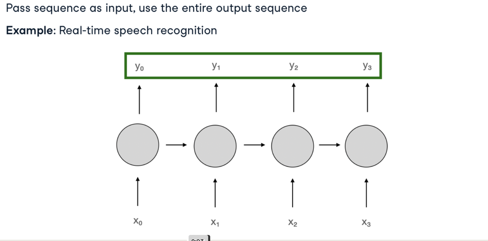
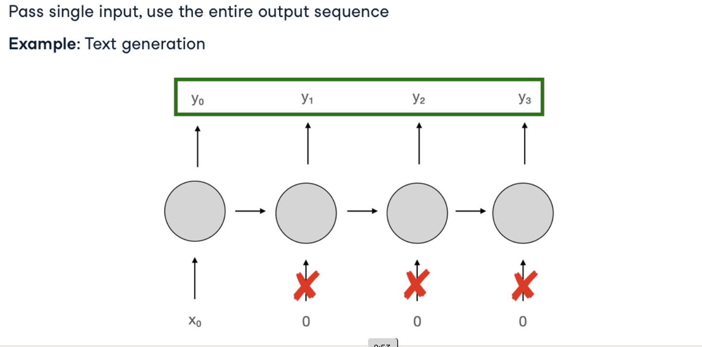
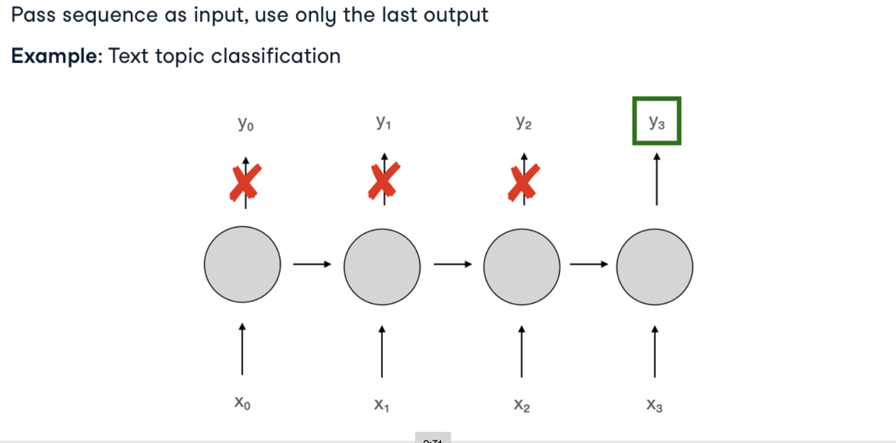
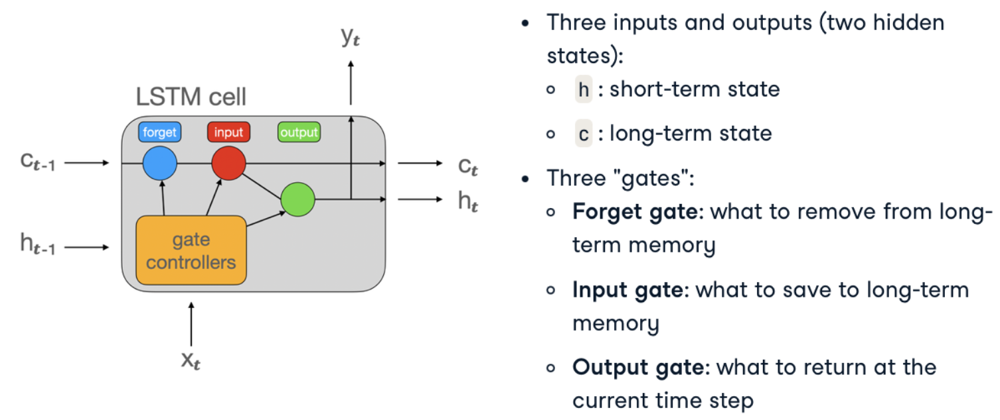
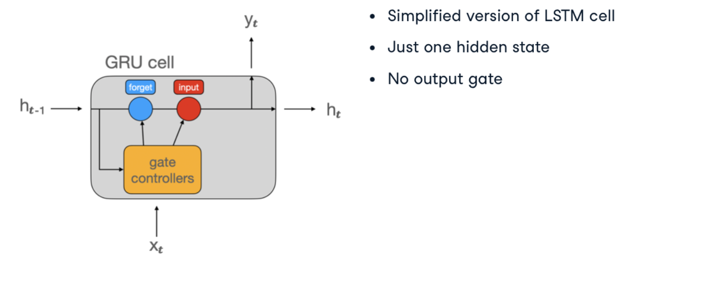

# Processing Sequential Data with Neural Networks

Sequential data presents unique challenges for machine learning models as the order of elements contains important dependencies. This document explores techniques for handling sequential data, including specialized neural network architectures.

## Understanding Sequential Data

Sequential data is characterized by observations that follow a natural order, where each element depends on previous elements. Common examples include:

* **Time Series**: Stock prices, temperature readings, sensor data
* **Text**: Words in sentences, characters in words
* **Audio**: Sound waves, speech recordings
* **Video**: Sequences of image frames

The temporal dependencies in sequential data make standard feed-forward neural networks less effective, as these networks assume each input is independent of others.

## Preparing Sequential Data

### Proper Train-Test Splitting

When working with sequential data, especially time series, the traditional random splitting approach can cause issues:

* **Look-ahead bias**: Model inadvertently learns from future data
* **Data leakage**: Test set contains information that wouldn't be available in real-world scenarios

**Better approach**: Split data chronologically, with earlier observations in the training set and later observations in the test set.


### Creating Sequence Chunks

A common preprocessing technique is to divide sequential data into overlapping windows or chunks:

```python
import numpy as np
import pandas as pd
import matplotlib.pyplot as plt
import torch
from torch.utils.data import TensorDataset, DataLoader

def create_sequences(df, seq_length, target_column=1, feature_columns=None):
    """
    Transform time series data into sequence chunks for supervised learning.
    
    Parameters:
    -----------
    df : pandas.DataFrame
        DataFrame containing the time series data
    seq_length : int
        Length of the sequence chunks to create
    target_column : int or str
        Column index or name to use as the prediction target
    feature_columns : list of int or str, optional
        Column indices or names to use as features (defaults to target_column)
        
    Returns:
    --------
    xs : numpy.ndarray
        Array of sequence inputs with shape (n_sequences, seq_length, n_features)
    ys : numpy.ndarray
        Array of target outputs with shape (n_sequences,)
    """
    xs, ys = [], []
    
    # Default to using target column as feature if not specified
    if feature_columns is None:
        feature_columns = [target_column]
    
    # Ensure target_column and feature_columns are column names if df has named columns
    if isinstance(df.columns, pd.Index) and not isinstance(target_column, int):
        target_column = df.columns.get_loc(target_column)
        if not isinstance(feature_columns[0], int):
            feature_columns = [df.columns.get_loc(col) for col in feature_columns]
    
    # Iterate over possible sequence start positions
    for i in range(len(df) - seq_length):
        # Extract features for this sequence
        if len(feature_columns) == 1:
            # Single feature case (shape: [seq_length])
            x = df.iloc[i:(i+seq_length), feature_columns[0]].values
        else:
            # Multiple features case (shape: [seq_length, n_features])
            x = df.iloc[i:(i+seq_length), feature_columns].values
            
        # Extract target (the value following the sequence)
        y = df.iloc[i+seq_length, target_column]
        
        xs.append(x)
        ys.append(y)
    
    return np.array(xs), np.array(ys)

# Example usage with electricity consumption data
# Assuming df contains daily electricity consumption with datetime index
df = pd.read_csv('electricity_data.csv', parse_dates=['date'], index_col='date')

# Visualize the time series
plt.figure(figsize=(12, 6))
plt.plot(df.index, df['consumption'])
plt.title('Electricity Consumption Over Time')
plt.xlabel('Date')
plt.ylabel('Consumption (kWh)')
plt.show()

# Split data chronologically
split_idx = int(len(df) * 0.8)
train_data = df.iloc[:split_idx]
test_data = df.iloc[split_idx:]

# Create sequences for training (predict consumption based on previous 4 days of hourly data)
X_train, y_train = create_sequences(
    train_data, 
    seq_length=24*4,  # 4 days of hourly data
    target_column='consumption'
)

print(f"Training sequences shape: {X_train.shape}, targets shape: {y_train.shape}")

# Create PyTorch dataset
dataset_train = TensorDataset(
    torch.from_numpy(X_train).float(),
    torch.from_numpy(y_train).float(),
)

# Create dataloader with batch size of 32
dataloader_train = DataLoader(dataset_train, batch_size=32, shuffle=True)

# Repeat for test data
X_test, y_test = create_sequences(test_data, seq_length=24*4, target_column='consumption')
dataset_test = TensorDataset(
    torch.from_numpy(X_test).float(),
    torch.from_numpy(y_test).float(),
)
dataloader_test = DataLoader(dataset_test, batch_size=32, shuffle=False)
```

## Recurrent Neural Networks (RNNs)

Recurrent Neural Networks are designed specifically for sequential data. Unlike feed-forward networks, RNNs maintain an internal state (memory) that captures information about previous inputs in the sequence.

### Basic RNN Structure

RNNs process sequences one element at a time, updating their hidden state at each step:


The key feature of RNNs is the recurrent connection, which passes information from one time step to the next.

```python
import torch
import torch.nn as nn
import torch.optim as optim

class SimpleRNN(nn.Module):
    def __init__(self, input_size=1, hidden_size=32, num_layers=2, output_size=1):
        """
        Basic RNN model for time series forecasting.
        
        Parameters:
        -----------
        input_size : int
            Number of features in the input
        hidden_size : int
            Number of features in the hidden state
        num_layers : int
            Number of recurrent layers
        output_size : int
            Number of features in the output
        """
        super().__init__()
        
        # Define RNN layer
        self.rnn = nn.RNN(
            input_size=input_size,
            hidden_size=hidden_size,
            num_layers=num_layers,
            batch_first=True,  # Expect input shape: (batch_size, seq_length, input_size)
        )
        
        # Output layer
        self.fc = nn.Linear(hidden_size, output_size)
    
    def forward(self, x):
        """
        Forward pass through the network.
        
        Parameters:
        -----------
        x : torch.Tensor
            Input tensor of shape (batch_size, seq_length, input_size)
            
        Returns:
        --------
        torch.Tensor
            Output predictions of shape (batch_size, output_size)
        """
        # Initialize hidden state with zeros
        batch_size = x.size(0)
        h0 = torch.zeros(self.rnn.num_layers, batch_size, self.rnn.hidden_size).to(x.device)
        
        # Forward propagate through RNN
        # out shape: (batch_size, seq_length, hidden_size)
        # h_n shape: (num_layers, batch_size, hidden_size)
        out, h_n = self.rnn(x, h0)
        
        # Get output from the last time step
        # out[:, -1, :] shape: (batch_size, hidden_size)
        out = self.fc(out[:, -1, :])
        
        return out

# Example: Creating and testing the model
# Reshape input to (batch_size, sequence_length, input_features)
sample_batch, _ = next(iter(dataloader_train))
sample_batch = sample_batch.view(sample_batch.size(0), -1, 1)

# Create model and perform a forward pass
model = SimpleRNN(input_size=1, hidden_size=32, num_layers=2)
output = model(sample_batch)
print(f"Input shape: {sample_batch.shape}, Output shape: {output.shape}")
```

### RNN Architectures for Different Tasks

RNNs can be configured in various ways depending on the task:

#### Sequence-to-Sequence (Many-to-Many)

Used when both input and output are sequences (e.g., machine translation).



#### Sequence-to-Vector (Many-to-One)

Used when the input is a sequence but the output is a single value (e.g., sentiment analysis, time series forecasting).



#### Vector-to-Sequence (One-to-Many)

Used when the input is a single value but the output is a sequence (e.g., image captioning).



#### Encoder-Decoder (Many-to-Many with Variable Lengths)

Used for tasks where input and output sequences can have different lengths (e.g., translation).


## Advanced Recurrent Architectures

### LSTM (Long Short-Term Memory)

LSTMs were designed to address the vanishing gradient problem in traditional RNNs through gating mechanisms:



```python
class LSTMModel(nn.Module):
    def __init__(self, input_size=1, hidden_size=32, num_layers=2, output_size=1, dropout=0.2):
        """
        LSTM model for time series forecasting.
        
        Parameters:
        -----------
        input_size : int
            Number of features in the input
        hidden_size : int
            Number of features in the hidden state
        num_layers : int
            Number of recurrent layers
        output_size : int
            Number of features in the output
        dropout : float
            Dropout probability (applied between LSTM layers)
        """
        super().__init__()
        
        # Define LSTM layer
        self.lstm = nn.LSTM(
            input_size=input_size,
            hidden_size=hidden_size,
            num_layers=num_layers,
            batch_first=True,
            dropout=dropout if num_layers > 1 else 0,
        )
        
        # Output layer
        self.fc = nn.Linear(hidden_size, output_size)
    
    def forward(self, x):
        """
        Forward pass through the network.
        
        Parameters:
        -----------
        x : torch.Tensor
            Input tensor of shape (batch_size, seq_length, input_size)
            
        Returns:
        --------
        torch.Tensor
            Output predictions of shape (batch_size, output_size)
        """
        # Initialize hidden state and cell state with zeros
        batch_size = x.size(0)
        h0 = torch.zeros(self.lstm.num_layers, batch_size, self.lstm.hidden_size).to(x.device)
        c0 = torch.zeros(self.lstm.num_layers, batch_size, self.lstm.hidden_size).to(x.device)
        
        # Forward propagate through LSTM
        # out shape: (batch_size, seq_length, hidden_size)
        # h_n shape: (num_layers, batch_size, hidden_size)
        # c_n shape: (num_layers, batch_size, hidden_size)
        out, (h_n, c_n) = self.lstm(x, (h0, c0))
        
        # Get output from the last time step
        # out[:, -1, :] shape: (batch_size, hidden_size)
        out = self.fc(out[:, -1, :])
        
        return out

# Create and test the LSTM model
lstm_model = LSTMModel(input_size=1, hidden_size=64, num_layers=2, dropout=0.3)
lstm_output = lstm_model(sample_batch)
print(f"LSTM output shape: {lstm_output.shape}")
```

### GRU (Gated Recurrent Unit)

GRUs are simplified versions of LSTMs with fewer parameters, yet they often achieve comparable performance:



```python
class GRUModel(nn.Module):
    def __init__(self, input_size=1, hidden_size=32, num_layers=2, output_size=1, dropout=0.2):
        """
        GRU model for time series forecasting.
        
        Parameters are similar to the LSTM model.
        """
        super().__init__()
        
        # Define GRU layer
        self.gru = nn.GRU(
            input_size=input_size,
            hidden_size=hidden_size,
            num_layers=num_layers,
            batch_first=True,
            dropout=dropout if num_layers > 1 else 0,
        )
        
        # Output layer
        self.fc = nn.Linear(hidden_size, output_size)
    
    def forward(self, x):
        """Forward pass through the network."""
        # Initialize hidden state with zeros
        batch_size = x.size(0)
        h0 = torch.zeros(self.gru.num_layers, batch_size, self.gru.hidden_size).to(x.device)
        
        # Forward propagate through GRU
        out, h_n = self.gru(x, h0)
        
        # Get output from the last time step
        out = self.fc(out[:, -1, :])
        
        return out

# Create and test the GRU model
gru_model = GRUModel(input_size=1, hidden_size=64, num_layers=2, dropout=0.3)
gru_output = gru_model(sample_batch)
print(f"GRU output shape: {gru_output.shape}")
```

## Bidirectional RNNs

Bidirectional RNNs process sequences in both forward and backward directions, capturing dependencies from both past and future states:

```python
class BidirectionalLSTM(nn.Module):
    def __init__(self, input_size=1, hidden_size=32, num_layers=2, output_size=1, dropout=0.2):
        """
        Bidirectional LSTM model.
        
        The hidden_size parameter will be divided by 2 to maintain the same
        total parameter count as a unidirectional model with the given hidden_size.
        """
        super().__init__()
        
        # Define bidirectional LSTM layer
        # Note: For bidirectional models, the output size will be 2*hidden_size
        self.lstm = nn.LSTM(
            input_size=input_size,
            hidden_size=hidden_size // 2,  # Divide by 2 to maintain comparable parameter count
            num_layers=num_layers,
            batch_first=True,
            bidirectional=True,
            dropout=dropout if num_layers > 1 else 0,
        )
        
        # Output layer (note the input dimension is the full hidden_size)
        self.fc = nn.Linear(hidden_size, output_size)
    
    def forward(self, x):
        """Forward pass through the network."""
        # Initialize hidden state and cell state with zeros
        batch_size = x.size(0)
        h0 = torch.zeros(2*self.lstm.num_layers, batch_size, self.lstm.hidden_size).to(x.device)
        c0 = torch.zeros(2*self.lstm.num_layers, batch_size, self.lstm.hidden_size).to(x.device)
        
        # Forward propagate through LSTM
        out, _ = self.lstm(x, (h0, c0))
        
        # Get output from the last time step
        out = self.fc(out[:, -1, :])
        
        return out

# Create and test the Bidirectional LSTM model
bi_lstm_model = BidirectionalLSTM(input_size=1, hidden_size=64, num_layers=2, dropout=0.3)
bi_lstm_output = bi_lstm_model(sample_batch)
print(f"Bidirectional LSTM output shape: {bi_lstm_output.shape}")
```

## Attention Mechanisms

Attention mechanisms allow models to focus on relevant parts of the input sequence when generating each output:

```python
class AttentionLSTM(nn.Module):
    def __init__(self, input_size=1, hidden_size=32, num_layers=2, output_size=1):
        """
        LSTM model with self-attention mechanism.
        """
        super().__init__()
        
        # Define LSTM layer
        self.lstm = nn.LSTM(
            input_size=input_size,
            hidden_size=hidden_size,
            num_layers=num_layers,
            batch_first=True,
        )
        
        # Attention layer components
        self.attention_weights = nn.Parameter(torch.Tensor(hidden_size, 1))
        nn.init.xavier_uniform_(self.attention_weights)
        
        # Output layer
        self.fc = nn.Linear(hidden_size, output_size)
    
    def forward(self, x):
        """Forward pass with attention mechanism."""
        # Process through LSTM
        lstm_out, _ = self.lstm(x)  # shape: (batch_size, seq_len, hidden_size)
        
        # Calculate attention scores
        attention_scores = torch.matmul(lstm_out, self.attention_weights)  # shape: (batch_size, seq_len, 1)
        attention_weights = torch.softmax(attention_scores, dim=1)  # shape: (batch_size, seq_len, 1)
        
        # Apply attention weights to LSTM outputs
        context_vector = torch.sum(lstm_out * attention_weights, dim=1)  # shape: (batch_size, hidden_size)
        
        # Final prediction
        output = self.fc(context_vector)
        
        return output, attention_weights
```

## Training and Evaluation

Training RNN models follows a similar process to other neural networks:

```python
def train_model(model, train_loader, val_loader, criterion, optimizer, num_epochs=10, device='cpu'):
    """
    Train a recurrent neural network.
    
    Parameters:
    -----------
    model : torch.nn.Module
        The model to train
    train_loader : DataLoader
        DataLoader for training data
    val_loader : DataLoader
        DataLoader for validation data
    criterion : loss function
        Loss function to optimize
    optimizer : optimizer
        Optimizer to use for weight updates
    num_epochs : int
        Number of epochs to train
    device : str
        Device to run the training on ('cpu' or 'cuda')
        
    Returns:
    --------
    dict
        Dictionary containing training and validation losses for each epoch
    """
    # Move model to device
    model.to(device)
    
    # Initialize dictionaries to store results
    history = {
        'train_loss': [],
        'val_loss': []
    }
    
    # Loop over epochs
    for epoch in range(num_epochs):
        # Training phase
        model.train()
        train_loss = 0.0
        
        for inputs, targets in train_loader:
            # Move data to device
            inputs = inputs.to(device)
            targets = targets.to(device)
            
            # Reshape inputs if needed (depends on model's expected input shape)
            # For 1D time series, reshape to (batch_size, seq_length, input_features)
            if len(inputs.shape) == 2:
                inputs = inputs.unsqueeze(-1)
                
            # Forward pass
            optimizer.zero_grad()
            outputs = model(inputs)
            loss = criterion(outputs, targets)
            
            # Backward pass
            loss.backward()
            optimizer.step()
            
            # Track loss
            train_loss += loss.item() * inputs.size(0)
        
        # Calculate average training loss
        train_loss = train_loss / len(train_loader.dataset)
        history['train_loss'].append(train_loss)
        
        # Validation phase
        model.eval()
        val_loss = 0.0
        
        with torch.no_grad():
            for inputs, targets in val_loader:
                # Move data to device
                inputs = inputs.to(device)
                targets = targets.to(device)
                
                # Reshape inputs if needed
                if len(inputs.shape) == 2:
                    inputs = inputs.unsqueeze(-1)
                
                # Forward pass
                outputs = model(inputs)
                loss = criterion(outputs, targets)
                
                # Track loss
                val_loss += loss.item() * inputs.size(0)
        
        # Calculate average validation loss
        val_loss = val_loss / len(val_loader.dataset)
        history['val_loss'].append(val_loss)
        
        # Print progress
        print(f"Epoch {epoch+1}/{num_epochs}")
        print(f"Train Loss: {train_loss:.4f}, Val Loss: {val_loss:.4f}")
    
    return history

# Example usage
model = LSTMModel(input_size=1, hidden_size=64, num_layers=2)
criterion = nn.MSELoss()
optimizer = optim.Adam(model.parameters(), lr=0.001)

# Train the model
device = torch.device("cuda" if torch.cuda.is_available() else "cpu")
history = train_model(model, dataloader_train, dataloader_test, criterion, optimizer, num_epochs=20, device=device)

# Plot training and validation loss
plt.figure(figsize=(10, 6))
plt.plot(history['train_loss'], label='Training Loss')
plt.plot(history['val_loss'], label='Validation Loss')
plt.xlabel('Epoch')
plt.ylabel('Loss')
plt.title('Training and Validation Loss')
plt.legend()
plt.grid(True)
plt.show()
```

## Making Predictions

After training, the model can be used to make forecasts:

```python
def predict_sequence(model, initial_sequence, n_predictions, device='cpu'):
    """
    Generate predictions using the trained model.
    
    Parameters:
    -----------
    model : torch.nn.Module
        Trained model
    initial_sequence : torch.Tensor
        Initial sequence to start predictions from
    n_predictions : int
        Number of future steps to predict
    device : str
        Device to run predictions on
        
    Returns:
    --------
    torch.Tensor
        Predicted values
    """
    # Move model and data to device
    model.to(device)
    model.eval()
    
    # Initialize sequence with the provided initial values
    curr_sequence = initial_sequence.clone().to(device)
    if len(curr_sequence.shape) == 2:
        curr_sequence = curr_sequence.unsqueeze(-1)  # Add feature dimension
    
    # List to store predictions
    predictions = []
    
    # Generate future predictions
    with torch.no_grad():
        for _ in range(n_predictions):
            # Get prediction for next step
            output = model(curr_sequence)
            predictions.append(output.item())
            
            # Update sequence by removing the first time step and appending the prediction
            # Process depends on whether this is an autoregressive forecast
            # This example assumes a many-to-one RNN predicting the next single value
            new_step = output.view(1, 1, -1)
            curr_sequence = torch.cat([curr_sequence[:, 1:, :], new_step], dim=1)
    
    return predictions

# Example: Use the model to predict the next 24 hours
# Take a random test sequence as the starting point
test_sample, _ = next(iter(dataloader_test))
test_sample = test_sample[0].unsqueeze(0)  # Add batch dimension

# Generate predictions
predictions = predict_sequence(model, test_sample, n_predictions=24, device=device)

# Plot the actual vs. predicted values
plt.figure(figsize=(12, 6))
plt.plot(range(len(test_sample[0])), test_sample[0].numpy(), label='Historical Data')
plt.plot(range(len(test_sample[0]), len(test_sample[0]) + len(predictions)), predictions, label='Predictions', color='red')
plt.xlabel('Time Step')
plt.ylabel('Value')
plt.title('Time Series Prediction')
plt.legend()
plt.grid(True)
plt.show()
```

## Common Challenges with RNNs

1. **Vanishing and Exploding Gradients**: LSTMs and GRUs help address this issue, but gradient clipping and proper initialization are still important
2. **Computational Efficiency**: Processing sequences can be slow, especially for long sequences
3. **Long-term Dependencies**: Even LSTMs may struggle with very long-range dependencies
4. **Model Complexity**: Recurrent models have many hyperparameters to tune
5. **Overfitting**: Sequential models can easily overfit, so regularization techniques are crucial
