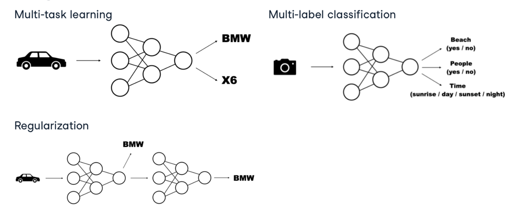

# Multi-Input and Multi-Output Models

## Overview

Multi-input and multi-output models are neural network architectures that can process multiple input sources and/or produce multiple outputs. These models are particularly useful for complex tasks where information comes from different sources or when we need to predict multiple related targets.

## Multi-Input Models

### Definition and Use Cases

- **Definition**: Models that accept inputs from multiple sources or in multiple formats
- **Use Cases**:
  - Combining text and images (e.g., captioning)
  - Sensor fusion in autonomous vehicles
  - Recommendation systems using user demographics and interaction history
  - Medical diagnosis using multiple test results

### Implementation with PyTorch

```python
import torch
import torch.nn as nn

class MultiInputModel(nn.Module):
    def __init__(self):
        super(MultiInputModel, self).__init__()
        
        # Process first input type (e.g., text)
        self.text_processor = nn.Sequential(
            nn.Linear(300, 128),
            nn.ReLU(),
            nn.Dropout(0.3)
        )
        
        # Process second input type (e.g., image)
        self.image_processor = nn.Sequential(
            nn.Conv2d(3, 16, kernel_size=3, padding=1),
            nn.ReLU(),
            nn.MaxPool2d(2),
            nn.Conv2d(16, 32, kernel_size=3, padding=1),
            nn.ReLU(),
            nn.MaxPool2d(2),
            nn.Flatten(),
            nn.Linear(32 * 8 * 8, 128)
        )
        
        # Combined processing
        self.combined = nn.Sequential(
            nn.Linear(256, 64),
            nn.ReLU(),
            nn.Linear(64, 1)
        )
        
    def forward(self, text_input, image_input):
        text_features = self.text_processor(text_input)
        image_features = self.image_processor(image_input)
        
        # Concatenate the features
        combined = torch.cat((text_features, image_features), dim=1)
        
        # Process the combined features
        output = self.combined(combined)
        return output
```

### Handling Different Input Types

- **Embedding layers** for categorical or textual data
- **Convolutional layers** for image data
- **Recurrent layers** for sequential data
- **Normalization** to handle different scales across inputs

## Multi-Output Models

### Definition and Use Cases

- **Definition**: Models that produce multiple outputs, often related to different tasks
- **Use Cases**:
  - Multi-task learning (e.g., sentiment and topic classification)
  - Object detection (class and bounding box)
  - Image segmentation and classification
  - Multi-language translation

### Implementation with PyTorch

```python
import torch
import torch.nn as nn

class MultiOutputModel(nn.Module):
    def __init__(self):
        super(MultiOutputModel, self).__init__()
        
        # Shared layers
        self.backbone = nn.Sequential(
            nn.Conv2d(3, 16, kernel_size=3, padding=1),
            nn.ReLU(),
            nn.MaxPool2d(2),
            nn.Conv2d(16, 32, kernel_size=3, padding=1),
            nn.ReLU(),
            nn.MaxPool2d(2),
            nn.Flatten()
        )
        
        # Task-specific heads
        self.classification_head = nn.Sequential(
            nn.Linear(32 * 8 * 8, 64),
            nn.ReLU(),
            nn.Linear(64, 10)  # 10 classes
        )
        
        self.regression_head = nn.Sequential(
            nn.Linear(32 * 8 * 8, 64),
            nn.ReLU(),
            nn.Linear(64, 1)
        )
        
    def forward(self, x):
        features = self.backbone(x)
        
        classification_output = self.classification_head(features)
        regression_output = self.regression_head(features)
        
        return classification_output, regression_output
```

### Loss Functions for Multi-Output Models

- **Combined loss functions** that weight individual task losses
- **Task-specific loss functions** (e.g., cross-entropy for classification, MSE for regression)

```python
def multi_task_loss(classification_pred, regression_pred, classification_true, regression_true, alpha=0.5):
    classification_loss = nn.CrossEntropyLoss()(classification_pred, classification_true)
    regression_loss = nn.MSELoss()(regression_pred, regression_true)
    
    # Weighted sum of losses
    total_loss = alpha * classification_loss + (1 - alpha) * regression_loss
    return total_loss
```

## Multi-Input/Multi-Output (MIMO) Models

### Architecture Design



- **Shared backbone** for feature extraction
- **Task-specific heads** for different outputs
- **Feature fusion mechanisms** for different inputs

### Implementation Example

```python
import torch
import torch.nn as nn

class MIMOModel(nn.Module):
    def __init__(self):
        super(MIMOModel, self).__init__()
        
        # Process first input type
        self.input1_processor = nn.Sequential(
            nn.Linear(100, 64),
            nn.ReLU()
        )
        
        # Process second input type
        self.input2_processor = nn.Sequential(
            nn.Linear(50, 32),
            nn.ReLU()
        )
        
        # Shared representation
        self.shared = nn.Sequential(
            nn.Linear(96, 48),
            nn.ReLU(),
            nn.Dropout(0.2)
        )
        
        # Output heads
        self.output1_head = nn.Linear(48, 10)  # Classification
        self.output2_head = nn.Linear(48, 1)   # Regression
        
    def forward(self, input1, input2):
        # Process inputs
        proc_input1 = self.input1_processor(input1)
        proc_input2 = self.input2_processor(input2)
        
        # Combine processed inputs
        combined = torch.cat((proc_input1, proc_input2), dim=1)
        
        # Shared representation
        shared_features = self.shared(combined)
        
        # Generate outputs
        output1 = self.output1_head(shared_features)
        output2 = self.output2_head(shared_features)
        
        return output1, output2
```

## Training Strategies

### Loss Balancing

- **Static weighting**: Pre-defined weights for each task loss
- **Uncertainty weighting**: Automatically determining task weights based on uncertainty
- **GradNorm**: Balancing gradient magnitudes across tasks

```python
def uncertainty_weighted_loss(outputs, targets, log_vars):
    """
    Uncertainty weighted loss, where each task's weight is learned
    
    Args:
        outputs: List of model outputs
        targets: List of target values
        log_vars: List of log variances (one per task)
    """
    loss = 0
    for i, (output, target, log_var) in enumerate(zip(outputs, targets, log_vars)):
        precision = torch.exp(-log_var)
        if i == 0:  # Classification task
            task_loss = nn.CrossEntropyLoss()(output, target)
        else:  # Regression task
            task_loss = nn.MSELoss()(output, target)
        
        loss += precision * task_loss + log_var
    
    return loss
```

### Curriculum Learning

- Start with simple tasks
- Gradually increase complexity
- Focus on harder tasks later in training

### Task Scheduling

- **Alternating batch updates** for different tasks
- **Periodic focusing** on underperforming tasks
- **Gradient accumulation** across multiple batches

## Applications

### Image Captioning

- **Inputs**: Image features
- **Outputs**: Sequential text (captions)
- **Architecture**: CNN for image processing + RNN/Transformer for caption generation

### Audio-Visual Speech Recognition

- **Inputs**: Audio signals and video of lip movements
- **Outputs**: Text transcription
- **Architecture**: CNN for video, LSTM/GRU for audio, fusion layer for combined features

### Autonomous Driving

- **Inputs**: Camera images, LiDAR data, radar measurements
- **Outputs**: Object detection, lane positioning, steering commands
- **Architecture**: Multi-stream network with task-specific heads

## Performance Evaluation

- **Task-specific metrics** for each output (accuracy, F1, MSE, etc.)
- **Joint performance metrics** that consider all outputs together
- **Trade-off analysis** between different tasks

## Challenges and Solutions

### Negative Transfer

- **Problem**: Learning one task hinders performance on another
- **Solutions**:
  - Task-specific layers
  - Gradient manipulation
  - Selective parameter sharing

### Computational Complexity

- **Problem**: MIMO models require more parameters and computation
- **Solutions**:
  - Parameter sharing
  - Knowledge distillation
  - Efficient architectures

### Imbalanced Tasks

- **Problem**: Some tasks dominate the learning process
- **Solutions**:
  - Adaptive loss weighting
  - Task-specific learning rates
  - Gradient normalization

## Best Practices

1. Start with a single task and gradually add more
2. Use transfer learning when possible
3. Monitor performance of each task separately
4. Experiment with different loss weighting schemes
5. Consider task relationships when designing the architecture
