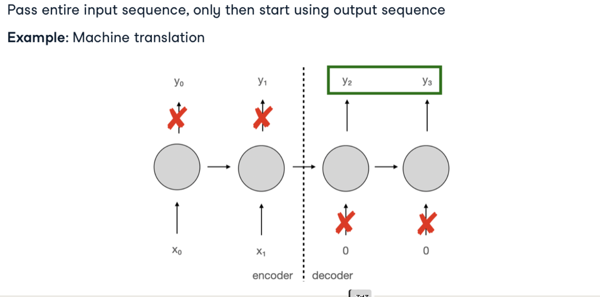

# Autoencoders and Generative Adversarial Networks

## Autoencoders

### Introduction to Autoencoders

Autoencoders are neural networks designed to learn efficient data encodings in an unsupervised manner. Their architecture consists of two main parts:

- **Encoder**: Compresses the input data into a latent-space representation
- **Decoder**: Reconstructs the input data from the latent representation



The key idea is to force the network to learn a compressed representation of the input data by minimizing the reconstruction error.

### Types of Autoencoders

#### Vanilla Autoencoder

The simplest form of autoencoder with fully connected layers.

```python
import torch
import torch.nn as nn

class SimpleAutoencoder(nn.Module):
    def __init__(self, input_dim, encoding_dim):
        super(SimpleAutoencoder, self).__init__()
        
        # Encoder
        self.encoder = nn.Sequential(
            nn.Linear(input_dim, 128),
            nn.ReLU(),
            nn.Linear(128, encoding_dim),
            nn.ReLU()
        )
        
        # Decoder
        self.decoder = nn.Sequential(
            nn.Linear(encoding_dim, 128),
            nn.ReLU(),
            nn.Linear(128, input_dim),
            nn.Sigmoid()  # For image data in [0,1] range
        )
    
    def forward(self, x):
        # Flatten the input if it's an image
        x = x.view(x.size(0), -1)
        
        # Encode
        encoded = self.encoder(x)
        
        # Decode
        decoded = self.decoder(encoded)
        
        return decoded
```

#### Sparse Autoencoder

Introduces a sparsity constraint to the hidden layer, making only a small number of nodes active at once.

```python
def sparse_loss(encoded, sparsity_target=0.05, sparsity_weight=0.1):
    """Sparsity loss function to encourage sparse activations"""
    # Average activation of each neuron across the batch
    rho_hat = torch.mean(encoded, dim=0)
    
    # KL divergence between target sparsity and actual sparsity
    kl_div = sparsity_target * torch.log(sparsity_target / rho_hat) + \
             (1 - sparsity_target) * torch.log((1 - sparsity_target) / (1 - rho_hat))
    
    return sparsity_weight * torch.sum(kl_div)
```

#### Denoising Autoencoder

Trained to reconstruct clean inputs from corrupted versions, making the network more robust.

```python
def add_noise(inputs, noise_factor=0.3):
    """Add random noise to inputs"""
    noisy = inputs + noise_factor * torch.randn_like(inputs)
    # Clip to ensure values remain in valid range
    return torch.clamp(noisy, 0., 1.)

# Training loop for denoising autoencoder
for epoch in range(num_epochs):
    for data in dataloader:
        # Add noise to the input
        noisy_inputs = add_noise(data)
        
        # Forward pass: use noisy input but try to reconstruct original
        outputs = autoencoder(noisy_inputs)
        
        # Loss is based on reconstruction of the original clean data
        loss = criterion(outputs, data)
        
        # Backpropagation
        optimizer.zero_grad()
        loss.backward()
        optimizer.step()
```

#### Variational Autoencoder (VAE)

A probabilistic approach that learns a distribution in the latent space rather than specific encodings.

```python
class VariationalAutoencoder(nn.Module):
    def __init__(self, input_dim, latent_dim):
        super(VariationalAutoencoder, self).__init__()
        
        # Encoder
        self.encoder = nn.Sequential(
            nn.Linear(input_dim, 256),
            nn.ReLU(),
            nn.Linear(256, 128),
            nn.ReLU()
        )
        
        # Mean and variance of the latent distribution
        self.fc_mu = nn.Linear(128, latent_dim)
        self.fc_logvar = nn.Linear(128, latent_dim)
        
        # Decoder
        self.decoder = nn.Sequential(
            nn.Linear(latent_dim, 128),
            nn.ReLU(),
            nn.Linear(128, 256),
            nn.ReLU(),
            nn.Linear(256, input_dim),
            nn.Sigmoid()
        )
    
    def encode(self, x):
        x = x.view(x.size(0), -1)  # Flatten
        h = self.encoder(x)
        return self.fc_mu(h), self.fc_logvar(h)
    
    def reparameterize(self, mu, logvar):
        std = torch.exp(0.5 * logvar)
        eps = torch.randn_like(std)
        return mu + eps * std
        
    def decode(self, z):
        return self.decoder(z)
    
    def forward(self, x):
        mu, logvar = self.encode(x)
        z = self.reparameterize(mu, logvar)
        return self.decode(z), mu, logvar

# VAE loss function
def vae_loss(recon_x, x, mu, logvar, beta=1.0):
    """
    VAE loss with reconstruction and KL divergence terms
    beta parameter controls the balance between reconstruction and regularization
    """
    # Reconstruction loss (binary cross entropy for binary images)
    BCE = nn.functional.binary_cross_entropy(recon_x, x.view(-1, 784), reduction='sum')
    
    # KL divergence between the learned distribution and a standard normal distribution
    KLD = -0.5 * torch.sum(1 + logvar - mu.pow(2) - logvar.exp())
    
    return BCE + beta * KLD
```

### Applications of Autoencoders

1. **Dimensionality Reduction**: Compressing data while preserving important features
2. **Anomaly Detection**: Identifying outliers based on high reconstruction error
3. **Denoising**: Removing noise from images or signals
4. **Feature Learning**: Extracting useful features for downstream tasks
5. **Image Generation**: Creating new images (especially with VAEs)

## Generative Adversarial Networks (GANs)

### Introduction to GANs

GANs consist of two neural networks competing against each other in a zero-sum game:

- **Generator (G)**: Creates synthetic data samples
- **Discriminator (D)**: Distinguishes between real and generated samples


The goal is to train G to generate samples that D cannot distinguish from real data.

### Basic GAN Implementation

```python
import torch
import torch.nn as nn

# Generator network
class Generator(nn.Module):
    def __init__(self, latent_dim, output_dim):
        super(Generator, self).__init__()
        
        self.model = nn.Sequential(
            nn.Linear(latent_dim, 128),
            nn.LeakyReLU(0.2),
            nn.Linear(128, 256),
            nn.LeakyReLU(0.2),
            nn.Linear(256, 512),
            nn.LeakyReLU(0.2),
            nn.Linear(512, output_dim),
            nn.Tanh()  # Output in range [-1, 1]
        )
    
    def forward(self, z):
        return self.model(z)

# Discriminator network
class Discriminator(nn.Module):
    def __init__(self, input_dim):
        super(Discriminator, self).__init__()
        
        self.model = nn.Sequential(
            nn.Linear(input_dim, 512),
            nn.LeakyReLU(0.2),
            nn.Linear(512, 256),
            nn.LeakyReLU(0.2),
            nn.Linear(256, 128),
            nn.LeakyReLU(0.2),
            nn.Linear(128, 1),
            nn.Sigmoid()  # Output probability in [0, 1]
        )
    
    def forward(self, x):
        return self.model(x)

# Training a GAN
def train_gan(dataloader, generator, discriminator, num_epochs, latent_dim, lr=0.0002):
    # Binary cross entropy loss and optimizer
    criterion = nn.BCELoss()
    optimizer_G = torch.optim.Adam(generator.parameters(), lr=lr)
    optimizer_D = torch.optim.Adam(discriminator.parameters(), lr=lr)
    
    for epoch in range(num_epochs):
        for i, real_samples in enumerate(dataloader):
            batch_size = real_samples.size(0)
            
            # Create the labels which are real and fake
            real_labels = torch.ones(batch_size, 1)
            fake_labels = torch.zeros(batch_size, 1)
            
            # Train the discriminator
            optimizer_D.zero_grad()
            
            # Train on real samples
            real_outputs = discriminator(real_samples)
            d_loss_real = criterion(real_outputs, real_labels)
            
            # Train on fake samples
            z = torch.randn(batch_size, latent_dim)  # Random noise
            fake_samples = generator(z)
            fake_outputs = discriminator(fake_samples.detach())  # Don't backprop to generator
            d_loss_fake = criterion(fake_outputs, fake_labels)
            
            # Combine losses and backprop
            d_loss = d_loss_real + d_loss_fake
            d_loss.backward()
            optimizer_D.step()
            
            # Train the generator
            optimizer_G.zero_grad()
            
            # Generate fake samples again
            z = torch.randn(batch_size, latent_dim)
            fake_samples = generator(z)
            fake_outputs = discriminator(fake_samples)
            
            # Generator wants discriminator to think its outputs are real
            g_loss = criterion(fake_outputs, real_labels)
            g_loss.backward()
            optimizer_G.step()
            
            # Print progress
            if i % 100 == 0:
                print(f"Epoch [{epoch}/{num_epochs}] Batch {i} "
                      f"d_loss: {d_loss.item():.4f}, g_loss: {g_loss.item():.4f}")
```

### GAN Variants

#### Deep Convolutional GAN (DCGAN)

Uses convolutional layers instead of fully connected layers, better for image generation.

```python
class DCGANGenerator(nn.Module):
    def __init__(self, latent_dim, channels=3):
        super(DCGANGenerator, self).__init__()
        
        self.init_size = 4  # Initial size before upsampling
        self.l1 = nn.Sequential(nn.Linear(latent_dim, 128 * self.init_size ** 2))
        
        self.conv_blocks = nn.Sequential(
            nn.BatchNorm2d(128),
            nn.Upsample(scale_factor=2),
            nn.Conv2d(128, 128, 3, stride=1, padding=1),
            nn.BatchNorm2d(128, 0.8),
            nn.LeakyReLU(0.2, inplace=True),
            nn.Upsample(scale_factor=2),
            nn.Conv2d(128, 64, 3, stride=1, padding=1),
            nn.BatchNorm2d(64, 0.8),
            nn.LeakyReLU(0.2, inplace=True),
            nn.Conv2d(64, channels, 3, stride=1, padding=1),
            nn.Tanh()
        )

    def forward(self, z):
        out = self.l1(z)
        out = out.view(out.shape[0], 128, self.init_size, self.init_size)
        img = self.conv_blocks(out)
        return img
```

#### Conditional GAN (CGAN)

Allows controlling the generation process with conditioning variables like class labels.

```python
class ConditionalGenerator(nn.Module):
    def __init__(self, latent_dim, n_classes, img_shape):
        super(ConditionalGenerator, self).__init__()
        
        self.img_shape = img_shape
        
        self.label_emb = nn.Embedding(n_classes, n_classes)
        
        def block(in_feat, out_feat, normalize=True):
            layers = [nn.Linear(in_feat, out_feat)]
            if normalize:
                layers.append(nn.BatchNorm1d(out_feat, 0.8))
            layers.append(nn.LeakyReLU(0.2, inplace=True))
            return layers
        
        self.model = nn.Sequential(
            *block(latent_dim + n_classes, 128, normalize=False),
            *block(128, 256),
            *block(256, 512),
            *block(512, 1024),
            nn.Linear(1024, int(np.prod(img_shape))),
            nn.Tanh()
        )

    def forward(self, noise, labels):
        # Concatenate label embedding and image to produce input
        gen_input = torch.cat((self.label_emb(labels), noise), -1)
        img = self.model(gen_input)
        img = img.view(img.size(0), *self.img_shape)
        return img
```

#### Wasserstein GAN (WGAN)

Improves training stability by using Wasserstein distance instead of Jensen-Shannon divergence.

```python
# WGAN loss functions
def wasserstein_loss(y_pred, y_true):
    return torch.mean(y_true * y_pred)

# Weight clipping for WGAN discriminator (critic)
def clip_weights(model, clip_value):
    for p in model.parameters():
        p.data.clamp_(-clip_value, clip_value)
```

#### CycleGAN

Enables unpaired image-to-image translation using cycle consistency.


### GAN Training Challenges

1. **Mode Collapse**: Generator produces limited varieties of samples
2. **Training Instability**: Difficult to balance generator and discriminator training
3. **Vanishing Gradients**: When discriminator becomes too good
4. **Evaluation Metrics**: Difficult to quantitatively assess GAN performance

### Techniques to Improve GAN Training

1. **Feature Matching**: Match statistics of features in an intermediate layer
2. **Minibatch Discrimination**: Allow discriminator to look at multiple examples
3. **Historical Averaging**: Keep track of parameters over time
4. **One-sided Label Smoothing**: Use soft labels (0.9 instead of 1.0) for real examples
5. **Spectral Normalization**: Normalize weights to control Lipschitz constant

```python
# Example of label smoothing
real_labels = torch.ones(batch_size, 1) * 0.9  # Use 0.9 instead of 1
```

## Applications

### Autoencoder Applications

1. **Image Compression**: Reducing image size while maintaining quality
2. **Data Denoising**: Removing noise from corrupted data
3. **Anomaly Detection**: Identifying outliers in data
4. **Dimensionality Reduction**: Alternative to PCA for nonlinear relationships

### GAN Applications

1. **Image Generation**: Creating realistic images
2. **Image-to-Image Translation**: Converting images from one domain to another
3. **Super-Resolution**: Enhancing image resolution
4. **Text-to-Image Synthesis**: Generating images from text descriptions
5. **Data Augmentation**: Creating synthetic training data

## Advanced Topics

### Evaluation Metrics

- **Inception Score (IS)**: Measures quality and diversity of generated images
- **Fréchet Inception Distance (FID)**: Compares statistics of generated and real samples
- **Precision and Recall**: Measures quality vs. diversity trade-off

### Recent Developments

- **StyleGAN**: Control different aspects of generated images
- **BigGAN**: Large-scale GAN for high-resolution image synthesis
- **Diffusion Models**: Alternative to GANs for image generation

## Practical Tips

1. **Start Simple**: Begin with basic architectures and gradually add complexity
2. **Normalize Inputs**: Scale inputs to [-1, 1] or [0, 1] range
3. **Use Appropriate Activation Functions**: tanh for generator output, leaky ReLU for hidden layers
4. **Balance Discriminator and Generator**: Avoid one becoming too strong
5. **Implement Regularization**: Dropout, weight decay, or spectral normalization
6. **Monitor Generated Samples**: Regularly check visual quality during training 