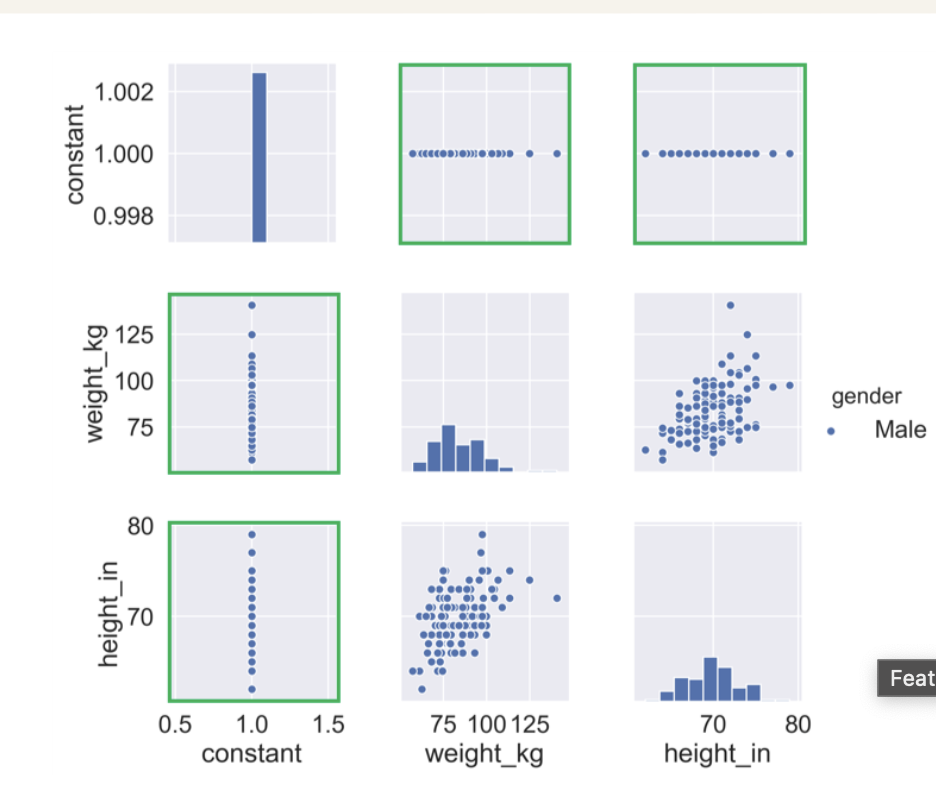

# Exploratory analysis

use .shape to get the shape of your dataset
use .describe() to see basic statistics like mean, std. Low variancve feature in general add low value to the model
use .describe(exclude='number') to see basic statistics for non numeric values

# visualization

Seaborn pairplot. Compares every variable against the others using scatter plots.

``` python 
pairplot(df, hue:"hue", diag_kind='hist')
```
## Perfect correlation


## No variance



# t-SNE

It will maximize the distance between observations in a 2D space for observations different in a higher dimension space. IT creates a two dimension fdata you can plot using scatter plot. You can use hue to find patterns in the data

```python 
# Non-numerical columns in the dataset
non_numeric = ['Branch', 'Gender', 'Component']

# Drop the non-numerical columns from df
df_numeric = df.drop(non_numeric, axis=1)

# Create a t-SNE model with learning rate 50
m = TSNE(learning_rate=50)

# Fit and transform the t-SNE model on the numeric dataset
tsne_features = m.fit_transform(df_numeric)
print(tsne_features.shape)

sns.scatterplot(x="x", y="y", hue="Component", data=df)

# Show the plot
plt.show()
```

# Benefits

* less complex
* require less disk space
* computation is faster
* lower chance of overfitting

# Strategies

Feature selection: drop features with repeated information or low variance

Feature extraction: create new variables from the ones we have