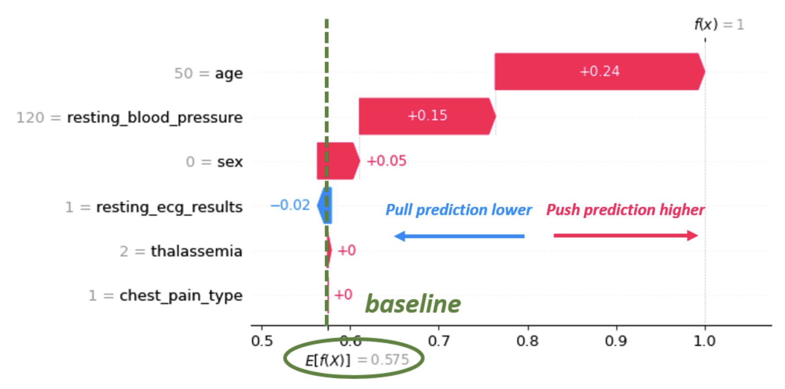
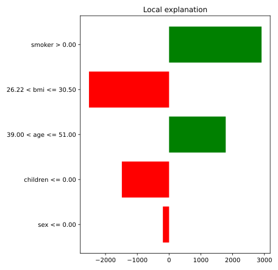
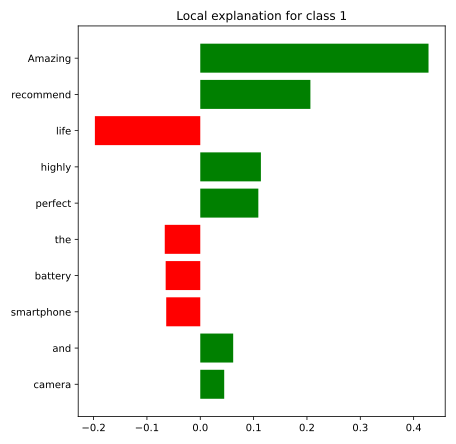

# Local explainability

It focuses in specific records instead of global model.

## Waterfall plot



```python 
import shap

# Create the SHAP explainer
explainer = shap.KernelExplainer(model.predict_proba, shap.kmeans(X, 10))

# Compute SHAP values for the first instance in the test dataset
shap_values = explainer.shap_values(X.iloc[0,:])

# Plot the SHAP values using a waterfall plot
shap.waterfall_plot(shap.Explanation(values=shap_values[:,1], 
                    base_values=explainer.expected_value[1], 
                    data=X.iloc[0,:], 
                    feature_names=X.columns))
```
# Local Interpretable Model-Agnostic Explanations (LIME)

It works for different types of data. It has different classes for each kind of data (Tabular, text, Image). I works creating perturbations around a sample and looking into the model output and constructing a simpler model for explanation. 

## Tabular

```python 
from lime.lime_tabular import LimeTabularExplainer

sample_data_point = X.iloc[2, :]

# Create the explainer
explainer = LimeTabularExplainer(
    X.values,
    feature_names=X.columns,
    mode='regression'
)

# Generate the explanation
exp = explainer.explain_instance(
    sample_data_point.values,
    model.predict
)

# Display the explanation
exp.as_pyplot_figure()
plt.show()
```



## Text

```python 
from lime.lime_text import LimeTextExplainer

text_instance = "Amazing battery life and the camera quality is perfect! I highly recommend this smartphone."

# Create a LIME text explainer
explainer = LimeTextExplainer()

# Generate the explanation
exp = explainer.explain_instance(
    text_instance,
    model_predict
)

# Display the explanation
exp.as_pyplot_figure()
plt.show()
```


## Image


```python 
from lime import lime_image
np.random.seed(10)

# Create a LIME explainer
explainer = lime_image.LimeImageExplainer()

# Generate the explanation
explanation = explainer.explain_instance(image, model_predict, hide_color=0, num_samples=50)

# Display the explanation
temp, _ = explanation.get_image_and_mask(explanation.top_labels[0], hide_rest=True)
plt.imshow(temp)
plt.title('LIME Explanation')
plt.axis('off')
plt.show()
```
The most important areas will be highlighted in the output

