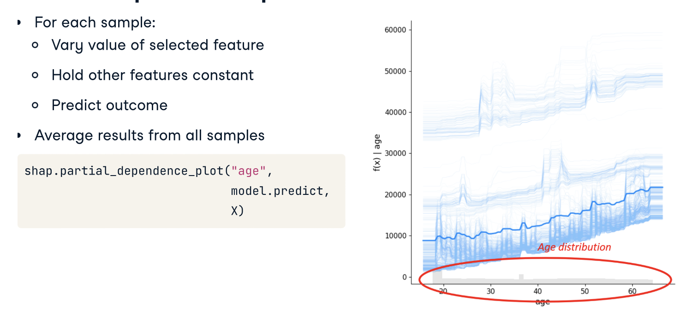

# Permutation importance

MEasures effect of feature shuffling on performance


```python 
from sklearn.neural_network import MLPClassifier
from sklearn.inspection import permutation_importance

model = MLPClassifier(hidden_layer_sizes=(10), random_state=1)
model.fit(X, y)

# Compute the permutation importance
result = permutation_importance(model, X, y, n_repeats=10, random_state=1, scoring='accuracy')

# Plot feature importances
plt.bar(X.columns, result.importances_mean)
plt.xticks(rotation=45)
plt.show()
```

# SHapley Additive exPlanations (SHAP)

Based on game theory. The Shapley value is a solution concept used in game theory that involves fairly distributing both gains and costs to several actors working in a coalition
## Regression
```python 
import shap

# Create a SHAP Tree Explainer
explainer = shap.TreeExplainer(model)

# Calculate SHAP values
shap_values = explainer.shap_values(X)

# Calculate mean absolute SHAP values
mean_abs_shap = np.abs(shap_values).mean(axis=0)

plt.bar(X.columns, mean_abs_shap)
plt.title('Mean Absolute SHAP Values for RandomForest')
plt.xticks(rotation=45)
plt.show()
```
## Classification
You need to slice one of the two values to predict
```python 
import shap

# Create a SHAP Tree Explainer
explainer = shap.TreeExplainer(model)

# Calculate SHAP values
shap_values = explainer.shap_values(X)

# Calculate mean absolute SHAP values
mean_abs_shap = np.abs(shap_values[:,:,1]).mean(axis=0)

plt.bar(X.columns, mean_abs_shap)
plt.title('Mean Absolute SHAP Values for RandomForest')
plt.xticks(rotation=45)
plt.show()
```
# SHAP Kernel explainer

KErnel is universal but slower cause it does not rely on specific model structures to optimize
## Regression
```python 
import shap

# Create a SHAP Kernel Explainer
explainer = shap.KernelExplainer(model.predict, shap.kmeans(X, 10))

# Calculate SHAP values
shap_values = explainer.shap_values(X)

# Calculate mean absolute SHAP values
mean_abs_shap = np.abs(shap_values).mean()

plt.bar(X.columns, mean_abs_shap)
plt.title('Mean Absolute SHAP Values for MLPRegressor')
plt.xticks(rotation=45)
plt.show()
```
## Classification
```python 
import shap

# Create a SHAP Kernel Explainer
explainer = shap.KernelExplainer(
    model.predict_proba,
    shap.kmeans(X,10)
)

# Calculate SHAP values
shap_values = explainer.shap_values(X)

# Calculate mean absolute SHAP values
mean_abs_shap = np.abs(shap_values[:,:,1]).mean()

plt.bar(X.columns, mean_abs_shap)
plt.title('Mean Absolute SHAP Values for MLPClassifier')
plt.xticks(rotation=45)
plt.show()
```
# Visualize SHAP

## Feature importance plot

```python 
model = RandomForestRegressor(random_state=42)
model.fit(X_train, y_train)

# Derive shap values
explainer = shap.TreeExplainer(model)
shap_values = explainer.shap_values(X_train)

# Plot the feature importance plot
shap.summary_plot(shap_values, X_train, plot_type='bar')
```


## Beeswarm plot
```python 
model = RandomForestRegressor(random_state=42)
model.fit(X_train, y_train)

# Derive shap values
# Derive shap values
explainer = shap.TreeExplainer(model)
shap_values = explainer.shap_values(X_train)

# Plot the beeswarm plot
shap.summary_plot(shap_values, X_train, plot_type='dot')
```


## Partial dependence plot
```python 
from sklearn.ensemble import RandomForestRegressor
import shap

model = RandomForestRegressor(random_state=42)
model.fit(X_train, y_train)

# Generate the partial dependence plot for CGPA
shap.partial_dependence_plot("CGPA", model.predict, X_train)
```

