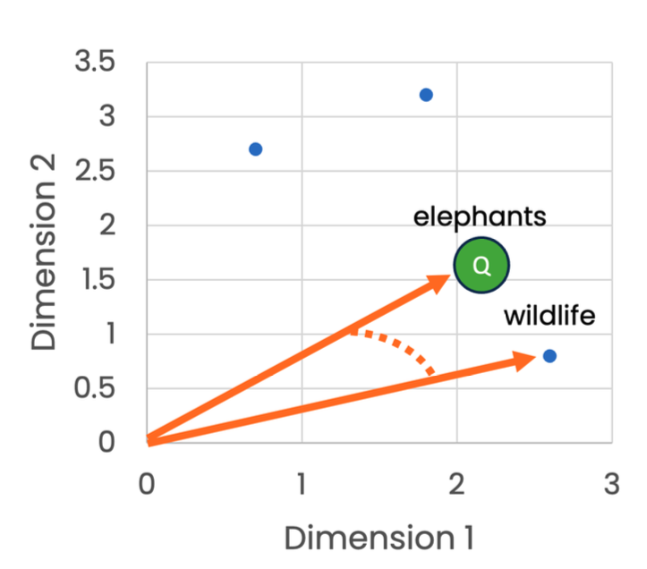

# Fine-Tuning Models with Hugging Face

Fine-tuning is the process of adjusting pre-trained models to adapt them to specific domains or tasks. This approach offers several key advantages:

- **Efficiency**: Dramatically reduces the time and computational resources needed compared to training from scratch
- **Performance**: Leverages knowledge from the pre-trained model while specializing for your specific use case
- **Data Requirements**: Requires significantly less data than training from scratch
- **Customization**: Adapts general-purpose models to domain-specific applications

## Fine-Tuning Process

The fine-tuning process involves several key steps:


1. **Select a pre-trained model** appropriate for your task
2. **Prepare your dataset** with proper formatting and preprocessing
3. **Configure the training** by setting hyperparameters
4. **Train the model** on your dataset
5. **Evaluate the results** and iterate if necessary
6. **Deploy the fine-tuned model** for inference

### Basic Fine-Tuning Example

Below is a complete example of fine-tuning a pre-trained model for a text classification task:

```python 
# Import necessary modules
from transformers import (
    AutoModelForSequenceClassification, 
    AutoTokenizer,
    Trainer,
    TrainingArguments,
    DataCollatorWithPadding
)
from datasets import load_dataset, Dataset
import evaluate
import numpy as np

# 1. Load a pre-trained model and tokenizer
model_name = "distilbert-base-uncased"  # Starting with a base model
tokenizer = AutoTokenizer.from_pretrained(model_name)
model = AutoModelForSequenceClassification.from_pretrained(
    model_name, 
    num_labels=2  # Binary classification (e.g., positive/negative sentiment)
)

# 2. Prepare your dataset
# Example: Loading a sentiment analysis dataset
dataset = load_dataset("imdb")  # Movie reviews with sentiment labels

# Preprocess the dataset with the tokenizer
def preprocess_function(examples):
    return tokenizer(
        examples["text"], 
        padding="max_length",
        truncation=True,
        max_length=512
    )

# Apply preprocessing to the entire dataset
tokenized_dataset = dataset.map(
    preprocess_function,
    batched=True,
    remove_columns=["text"]  # Remove the original text column
)

# 3. Configure training arguments
training_args = TrainingArguments(
    output_dir="./results",               # Directory to save model checkpoints
    learning_rate=2e-5,                   # Learning rate
    per_device_train_batch_size=16,       # Batch size for training
    per_device_eval_batch_size=16,        # Batch size for evaluation
    num_train_epochs=3,                   # Number of training epochs
    weight_decay=0.01,                    # Weight decay for regularization
    evaluation_strategy="epoch",          # Evaluate after each epoch
    save_strategy="epoch",                # Save checkpoint after each epoch
    load_best_model_at_end=True           # Load the best model at the end of training
)

# Define metrics for evaluation
metric = evaluate.load("accuracy")

def compute_metrics(eval_pred):
    predictions, labels = eval_pred
    predictions = np.argmax(predictions, axis=1)
    return metric.compute(predictions=predictions, references=labels)

# 4. Create the trainer
data_collator = DataCollatorWithPadding(tokenizer=tokenizer)

trainer = Trainer(
    model=model,                          # The pre-trained model
    args=training_args,                   # Training arguments
    train_dataset=tokenized_dataset["train"],  # Training dataset
    eval_dataset=tokenized_dataset["test"],    # Evaluation dataset
    tokenizer=tokenizer,                  # Tokenizer
    data_collator=data_collator,          # Data collator for batching
    compute_metrics=compute_metrics       # Metrics function
)

# 5. Train the model
trainer.train()

# 6. Save the fine-tuned model
model_path = "./fine_tuned_model"
trainer.save_model(model_path)
tokenizer.save_pretrained(model_path)
```

## Using a Fine-Tuned Model

After fine-tuning, you can use your model for inference:

```python 
# Import necessary libraries
from transformers import pipeline
from transformers import AutoTokenizer, AutoModelForSequenceClassification

# Method 1: Using pipeline (recommended for most cases)
classifier = pipeline(
    task="sentiment-analysis", 
    model="./fine_tuned_model"
)

# Example text for inference
text_example = "I absolutely loved this movie, the acting was superb!"

# Classify the text
results = classifier(text=text_example)
print(f"Sentiment: {results[0]['label']}, Score: {results[0]['score']:.4f}")

# Method 2: Using the model and tokenizer directly
# Load the fine-tuned model and tokenizer
model = AutoModelForSequenceClassification.from_pretrained("./fine_tuned_model")
tokenizer = AutoTokenizer.from_pretrained("./fine_tuned_model")

# Tokenize input
inputs = tokenizer(text_example, return_tensors="pt")

# Get predictions
import torch
with torch.no_grad():
    outputs = model(**inputs)
    predictions = torch.nn.functional.softmax(outputs.logits, dim=-1)
    
print(f"Probability of positive sentiment: {predictions[0][1].item():.4f}")
```

## Fine-Tuning for Text Generation

### Text Generation from Text Prompts

```python 
# Import necessary libraries
from transformers import AutoTokenizer, AutoModelForCausalLM, TrainingArguments, Trainer, DataCollatorForLanguageModeling
from datasets import load_dataset

# 1. Set model name
model_name = "gpt2"

# 2. Get the tokenizer and model
tokenizer = AutoTokenizer.from_pretrained(model_name)
model = AutoModelForCausalLM.from_pretrained(model_name)

# Add the EOS token as PAD token to avoid warnings
tokenizer.pad_token = tokenizer.eos_token

# 3. Prepare a dataset for fine-tuning (example: using a text dataset)
dataset = load_dataset("text", data_files={"train": "path_to_your_text_data.txt"})

# 4. Tokenize the dataset
def tokenize_function(examples):
    return tokenizer(examples["text"], truncation=True, max_length=512)

tokenized_dataset = dataset.map(tokenize_function, batched=True, remove_columns=["text"])

# 5. Create a data collator for language modeling
data_collator = DataCollatorForLanguageModeling(
    tokenizer=tokenizer,
    mlm=False  # Not using masked language modeling
)

# 6. Set up training arguments
training_args = TrainingArguments(
    output_dir="./results",
    overwrite_output_dir=True,
    num_train_epochs=3,
    per_device_train_batch_size=8,
    save_steps=10_000,
    save_total_limit=2,
)

# 7. Create the trainer
trainer = Trainer(
    model=model,
    args=training_args,
    data_collator=data_collator,
    train_dataset=tokenized_dataset["train"],
)

# 8. Fine-tune the model
trainer.train()

# 9. Save the fine-tuned model
trainer.save_model("./fine_tuned_gpt2")
tokenizer.save_pretrained("./fine_tuned_gpt2")

# 10. Use the fine-tuned model for text generation
fine_tuned_model = AutoModelForCausalLM.from_pretrained("./fine_tuned_gpt2")
fine_tuned_tokenizer = AutoTokenizer.from_pretrained("./fine_tuned_gpt2")

# Example prompt
prompt = "Wear sunglasses when it's sunny because"

# Tokenize the input
input_ids = fine_tuned_tokenizer.encode(prompt, return_tensors="pt")

# Generate the text output
output = fine_tuned_model.generate(
    input_ids, 
    max_length=50,
    num_return_sequences=1,
    temperature=0.7,  # Controls randomness (lower = more deterministic)
    top_p=0.9,        # Nucleus sampling parameter
    no_repeat_ngram_size=2  # Prevents repetition of n-grams
)

# Decode the output
generated_text = fine_tuned_tokenizer.decode(output[0], skip_special_tokens=True)
print(f"Generated: {generated_text}")
```

### Image-to-Text Generation

```python 
# Import necessary libraries
from transformers import AutoModelForCausalLM, AutoProcessor
from PIL import Image
import requests
import matplotlib.pyplot as plt

# 1. Get the processor and model
model = AutoModelForCausalLM.from_pretrained("microsoft/git-base-coco")
processor = AutoProcessor.from_pretrained("microsoft/git-base-coco")

# 2. Load an image (either from local file or URL)
# From URL
image_url = "https://huggingface.co/datasets/huggingface/documentation-images/resolve/main/vision-transformer-architecture.png"
image = Image.open(requests.get(image_url, stream=True).raw)

# Or from local file
# image = Image.open("path_to_your_image.jpg")

# 3. Process the image
pixels = processor(images=[image], return_tensors="pt").pixel_values

# 4. Generate the ids
output = model.generate(
    pixel_values=pixels,
    max_length=50,
    num_beams=4,  # Beam search for better quality captions
    early_stopping=True
)

# 5. Decode the output
caption = processor.batch_decode(output, skip_special_tokens=True)[0]
print(f"Generated caption: {caption}")

# 6. Display the image with caption
plt.figure(figsize=(10, 10))
plt.imshow(image)
plt.title(caption)
plt.axis('off')
plt.show()
```

## Working with Embeddings

Embeddings are vector representations of text that capture semantic meaning. They offer several benefits:

* **Semantic Understanding**: Capture meaning beyond simple keyword matching
* **Feature Extraction**: Provide rich inputs for downstream ML tasks
* **Improved Generalization**: Transfer learning from large, pre-trained models

However, they also present challenges:

* **Data Requirements**: May require substantial data to fine-tune effectively
* **Bias**: Can inherit biases present in pre-training data
* **Interpretability**: Vector representations can be difficult to interpret

### Comparing Different Embedding Models

```python 
# Import necessary libraries
from sentence_transformers import SentenceTransformer
import numpy as np
import matplotlib.pyplot as plt

# Create a sample sentence
sentence = "Neural networks have revolutionized natural language processing."

# Create the first embedding model
embedder1 = SentenceTransformer("all-MiniLM-L6-v2")

# Embed the sentence
embedding1 = embedder1.encode([sentence])

# Create and use second embedding model
embedder2 = SentenceTransformer("sentence-transformers/paraphrase-albert-small-v2")
embedding2 = embedder2.encode([sentence])
 
# Compare the shapes
print(f"Embedding 1 shape: {embedding1.shape}")
print(f"Embedding 2 shape: {embedding2.shape}")
print(f"Same dimensions: {embedding1.shape == embedding2.shape}")

# Visualize the first few dimensions of each embedding
plt.figure(figsize=(12, 5))
plt.subplot(1, 2, 1)
plt.bar(range(10), embedding1[0][:10])
plt.title("First 10 dimensions of Embedding 1")
plt.subplot(1, 2, 2)
plt.bar(range(10), embedding2[0][:10])
plt.title("First 10 dimensions of Embedding 2")
plt.tight_layout()
plt.show()
```

Output:
```shell
Embedding 1 shape: (1, 384)
Embedding 2 shape: (1, 768)
Same dimensions: False
```

Different embedding models produce vectors of different dimensions. The choice of embedding model depends on your specific application needs, including storage capacity, computational power, and the semantic properties you want to capture.

## Semantic Search with Embeddings

Semantic search understands the intent and contextual meaning of queries rather than just matching keywords:

* Captures the meaning behind the query
* Uses contextual understanding
* Finds content that matches the meaning, not just the exact words

Semantic search is typically implemented using vector-based search with embeddings, often employing cosine similarity to measure the relatedness between query and document vectors.



```python 
# Import necessary libraries
from sentence_transformers import SentenceTransformer, util
import torch

# Create an embedding model
embedder = SentenceTransformer("all-MiniLM-L6-v2")

# Sample sentences for our document corpus
sentences = [
    "Can anyone suggest a desktop book reader for Mac that works similar to Stanza on the iPhone?",
    "I'm looking for a good quality headset that doesn't cost too much. Any recommendations?",
    "What's the best way to backup data on a Windows laptop?",
    "I need help choosing between the latest iPhone and Samsung Galaxy models.",
    "Does anyone know of a good recipe app that lets you search by ingredients?"
]

# Generate embeddings for all sentences
sentence_embeddings = embedder.encode(sentences)

# Example query
query = "I need a desktop book reader for Mac"

# Generate embedding for the query
query_embedding = embedder.encode([query])[0]

# Compare embeddings using cosine similarity
hits = util.semantic_search(
    query_embedding, 
    sentence_embeddings, 
    top_k=3  # Return top 3 matches
)

# Print the top results with similarity scores
print(f"Query: \"{query}\"\n")
print("Top matches:")
for i, hit in enumerate(hits[0]):
    print(f"{i+1}. \"{sentences[hit['corpus_id']]}\"")
    print(f"   Similarity score: {hit['score']:.4f}")
    print()
```

Output:
```shell
Query: "I need a desktop book reader for Mac"

Top matches:
1. "Can anyone suggest a desktop book reader for Mac that works similar to Stanza on the iPhone?"
   Similarity score: 0.8011

2. "I'm looking for a good quality headset that doesn't cost too much. Any recommendations?"
   Similarity score: 0.1437

3. "What's the best way to backup data on a Windows laptop?"
   Similarity score: 0.1254
```

The high similarity score (0.8011) for the first result indicates a strong semantic match with the query, even though the exact wording differs. The remaining results have much lower scores, indicating less relevance to the query.
