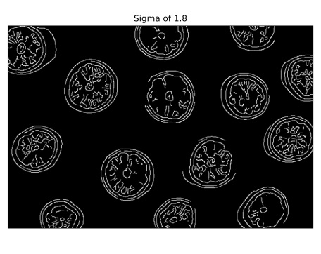
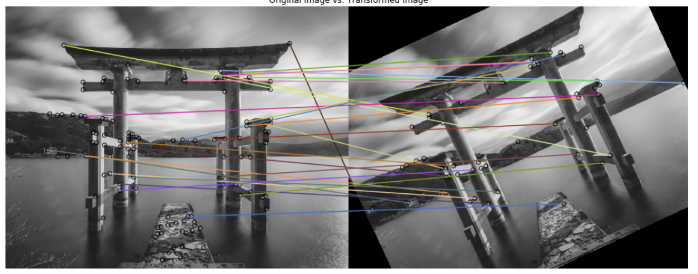
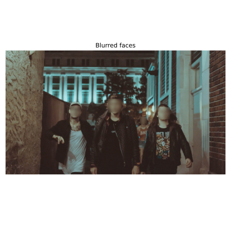

# Edges

Reduce the amount of information while keeping meaningful features like the shape.


```python
# Import the canny edge detector 
from skimage.feature import canny

# Convert image to grayscale
grapefruit = color.rgb2grey(grapefruit)

# Apply canny edge detector with a sigma of 1.8
edges_1_8 = canny(grapefruit, sigma=1.8)

# Apply canny edge detector with a sigma of 2.2
edges_2_2 = canny(grapefruit, sigma=2.2)

# Show resulting images
show_image(edges_1_8, "Sigma of 1.8")
show_image(edges_2_2, "Sigma of 2.2")
```

Sigma: Lower it is less effect of gaussian filter. More edges will be detected.




# Corners

Intersection of edges. 

# Usage 

## Matching corners in transformed images



```python 
# Import the corner detector related functions and module
from skimage.feature import corner_harris, corner_peaks

# Convert image from RGB-3 to grayscale
building_image_gray = color.rgb2grey(building_image)

# Apply the detector  to measure the possible corners
measure_image = corner_harris(building_image_gray)

# Find the peaks of the corners using the Harris detector
coords = corner_peaks(measure_image, min_distance=20, threshold_rel=0.02)

# Show original and resulting image with corners detected
show_image(building_image, "Original")
show_image_with_corners(building_image, coords)
```

# Face detection 

`scale_ratio`. To find all faces, the algorithm does the search on multiple scales. This is done by changing the size of searching window. The smallest window size is the size of window that was used in training. This size is specified in the xml file with trained parameters. The scale_ratio parameter specifies by which ratio the search window is increased on each step. If you increase this parameter, the search time decreases and the accuracy decreases.

`step_ratio` specifies the step of sliding window that is used to search for faces on each scale of the image. If this parameter is equal to one, then all the possible locations are searched. If the parameter is greater than one, for example, two, the window will be moved by two pixels and not all of the possible locations will be searched for faces. By increasing this parameter we can reduce the working time of the algorithm, but the accuracy will also be decreased

`min_size` is the minimum size of search window during the scale search. max_size specifies the maximum size of the window. If you know the size of faces on the images that you want to search, you should specify these parameters as precisely as possible, because you can avoid doing expensive computations and possibly decrease the amount of false detections. You can save a lot of time by increasing the min_size parameter, because the majority of time is spent on searching on the smallest scales.

```python 
# Load the trained file from data
trained_file = data.lbp_frontal_face_cascade_filename()

# Initialize the detector cascade
detector = Cascade(trained_file)

# Detect faces with min and max size of searching window
detected = detector.detect_multi_scale(img = night_image,
                                       scale_factor=1.2,
                                       step_ratio=1,
                                       min_size=(10, 10),
                                       max_size=(200, 200))

# Show the detected faces
show_detected_face(night_image, detected)
```

## Using segmentation for large images

```python 
# Obtain the segmentation with default 100 regions
segments = slic(profile_image)

# Obtain segmented image using label2rgb
segmented_image = label2rgb(segments, profile_image, kind='avg')

# Detect the faces with multi scale method
detected = detector.detect_multi_scale(img=segmented_image, 
                                       scale_factor=1.2, 
                                       step_ratio=1, 
                                       min_size=(10, 10), max_size=(1000, 1000))

# Show the detected faces
show_detected_face(segmented_image, detected)
```

# Real world examples

## Blur faces


```python 
# Detect the faces
detected = detector.detect_multi_scale(img=group_image, 
                                       scale_factor=1.2, step_ratio=1, 
                                       min_size=(10,10), max_size=(100, 100))
# For each detected face
for d in detected:  
    # Obtain the face rectangle from detected coordinates
    face = getFaceRectangle(d)
    
    # Apply gaussian filter to extracted face
    blurred_face = gaussian(face, multichannel=True, sigma = 8)
    
    # Merge this blurry face to our final image and show it
    resulting_image = mergeBlurryFace(group_image, blurred_face) 
show_image(resulting_image, "Blurred faces")
```



## Image restoration


```python 
# Import the necessary modules
from skimage.restoration import denoise_tv_chambolle, inpaint
from skimage import transform

# Transform the image so it's not rotated
upright_img = rotate(damaged_image, 20)

# Remove noise from the image, using the chambolle method
upright_img_without_noise = denoise_tv_chambolle(upright_img,weight=0.1, multichannel=True)

# Reconstruct the image missing parts
mask = get_mask(upright_img)
result = inpaint.inpaint_biharmonic(upright_img_without_noise, mask, multichannel=True)

show_image(result)
```

