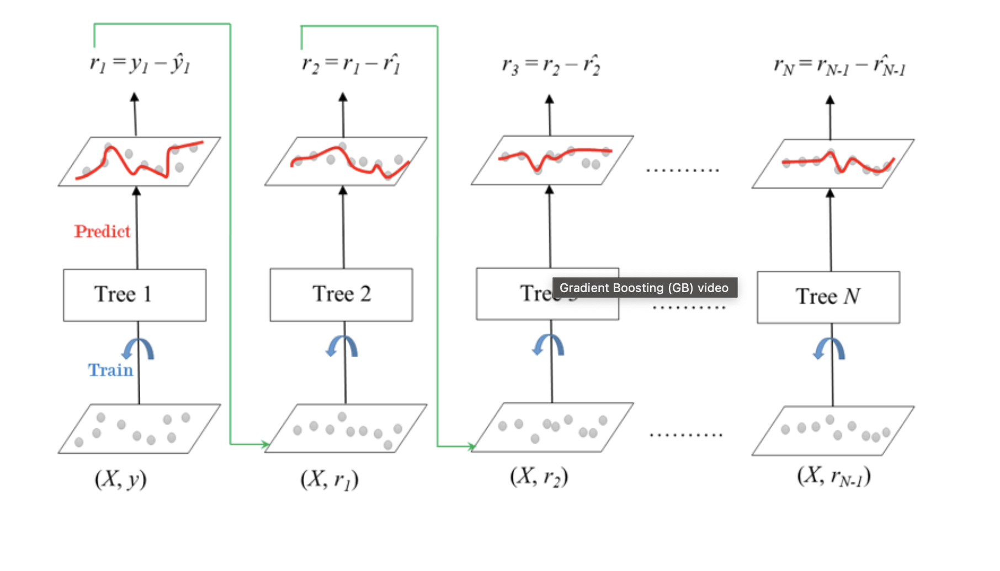

## Gradient Boosting 

* Sequential correction of predecessor's erro
* does not tweak wights instead each predictor is trained using its predecessor residual errors as labels
Errors are shrinked using etha parameter



Classification: `GradientBoostingClassifier`. It uses majority voting.
Regression: `GradientBoostingRegressor`. It uses average 

```python
# Import GradientBoostingRegressor
from sklearn.ensemble import GradientBoostingRegressor
from sklearn.metrics import mean_squared_error as MSE

# Instantiate gb
gb = GradientBoostingRegressor(n_estimators=200, 
            max_depth=4,
            random_state=2)

# Fit gb to the training set
gb.fit(X_train, y_train)

# Predict test set labels
y_pred = gb.predict(X_test)

# Compute MSE
mse_test = MSE(y_pred, y_test)

# Compute RMSE
rmse_test = mse_test ** (0.5)

# Print RMSE
print('Test set RMSE of gb: {:.3f}'.format(rmse_test))
```