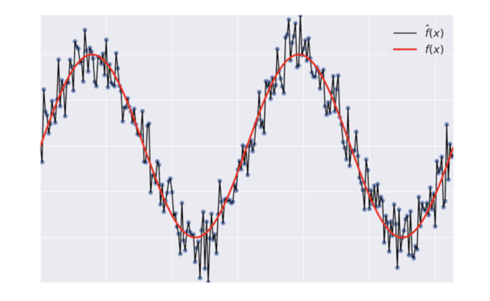
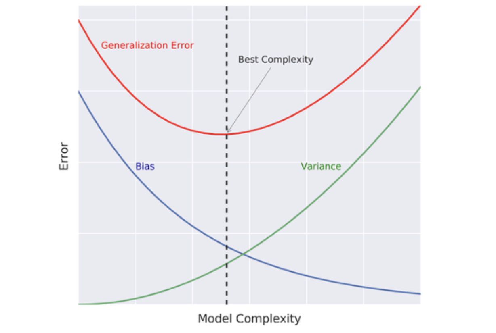
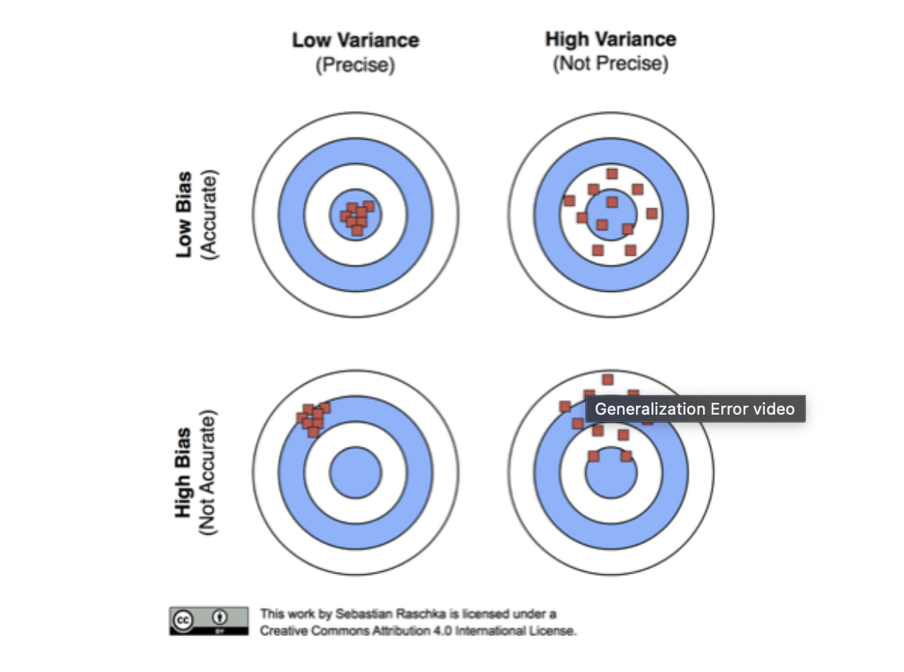

# Generalization error
## Formula:
```math
f = bias^2 + variance + irreducible error
```
* bias error term that tells you on average how much the model diverge of the real data. High bias leads to underfitting


* variance how much the model is inconsistent over different training sets. Hih variance lead to overfitting


* irreducible error (noise) considered constant

## Model complexity and generalization error trade off





## Diagnose bias and variance issues 

Use cross validation

IF CV error is greater than training set error. IT suffers high variance. Decrease  model complexity. For decision tree decrease max depth or increase min samples per leaf. Increase the number of samples to train the data

IF CV error is roughly equal tp training error but greater than desired error. IT suffers high bias. Increase complexity or get more features for your data


```python
from sklearn.model_selection import train_test_split
from sklearn.model_selection import cross_val_score
from sklearn.metrics import mean_squared_error

# Set SEED for reproducibility
SEED = 1

# Split the data into 70% train and 30% test
X_train, X_test, y_train, y_test = train_test_split(X, y, test_size=0.3, random_state=SEED)

# Instantiate a DecisionTreeRegressor dt
dt = DecisionTreeRegressor(max_depth=4, min_samples_leaf=0.26, random_state=SEED)

# Compute the array containing the 10-folds CV MSEs
MSE_CV_scores = - cross_val_score( dt,X_train, y_train, cv=10, 
                       scoring='neg_mean_squared_error',
                       n_jobs=-1)

# Compute the 10-folds CV RMSE
RMSE_CV = (MSE_CV_scores.mean())**(0.5)

# Print RMSE_CV
print('CV RMSE: {:.2f}'.format(RMSE_CV))

# Fit dt to the training set
dt.fit(X_train, y_train)

# Predict the labels of the training set
y_pred_train = dt.predict(X_train)

# Evaluate the training set RMSE of dt
RMSE_train = (mean_squared_error(y_train, y_pred_train))**(0.5)

# Print RMSE_train
print('Train RMSE: {:.2f}'.format(RMSE_train))
```

