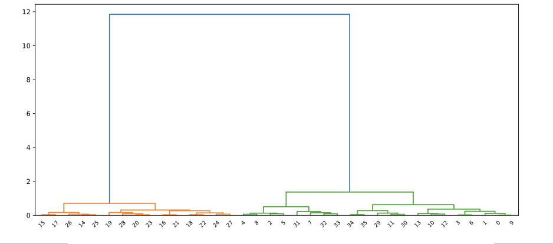
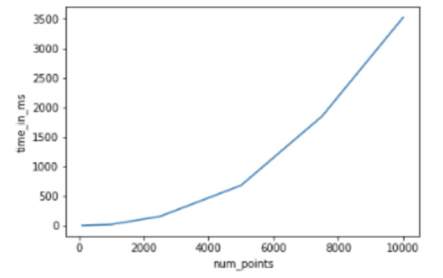

# Parameters

## Linkage computes distances between clusters

method how clusters are separated 
* single based on two closes objects
* complete based on two farthest objects
* average based on the arithmetic mean of all objects
* centroid based on the geometric mean of all objects
* median based on the median of all objects
* ward based on the sum of squares

# Visualization 

Scatter plot using Seaborn (More convenient)

```python
# Import the seaborn module
import seaborn as sns

# Plot a scatter plot using seaborn
sns.scatterplot(x="x_scaled", 
                y="y_scaled", 
                hue="cluster_labels", 
                data = comic_con)
plt.show()
```

## Decide how many clusters to choose (dendrogram)

```python
# Import the dendrogram function
from scipy.cluster.hierarchy import dendrogram

# Create a dendrogram
dn = dendrogram(distance_matrix)

# Display the dendogram
plt.show()
```



We can easily see two clusters are good for this example 

# Limitation

Quadratic complexity. This makes hierarchical clustering not suitable for a bg number of samples

