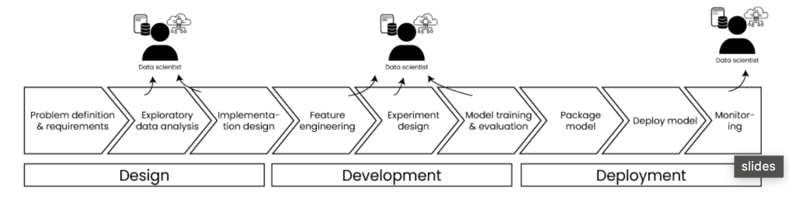
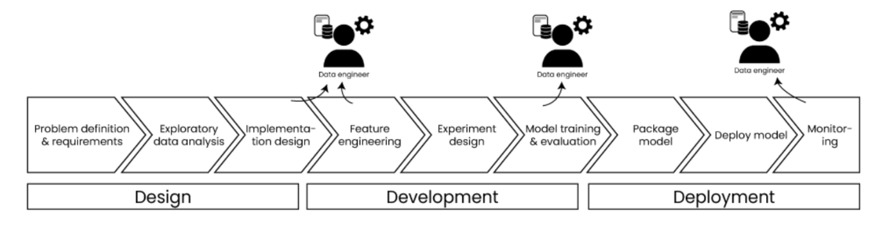
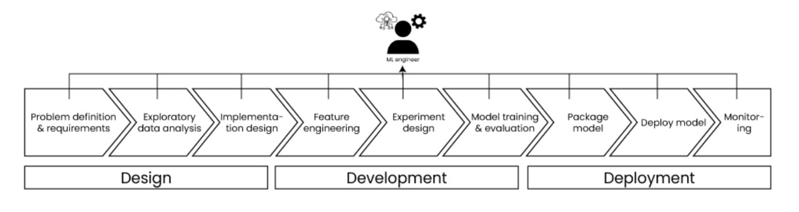

# What is MLOps

Machine Learning Operations (MLOps) is a set of practices and principles designed to ensure continuous, reliable, and efficient deployment of ML models in production environments. MLOps covers the entire lifecycle of machine learning systems from initial conception to retirement.

MLOps aims to bridge the gap between data science experimentation and production-ready ML systems by:
- Standardizing and automating ML workflows
- Ensuring reproducibility of results
- Facilitating collaboration between teams
- Enabling continuous integration and deployment of models
- Providing comprehensive monitoring and management of models in production

Key components of MLOps include quality data management, feature engineering, model training, validation, deployment strategies, and continuous monitoring.

# Phases of MLOps

## 1. Design
- **Problem Definition**: Clarify business context and define the problem scope
- **Requirement Gathering**: Collaborate with stakeholders to establish clear business requirements
- **Success Metrics**: Define key performance indicators (KPIs) and evaluation metrics
- **Data Assessment**: Identify required data sources, assess data quality, and plan for data collection
- **Feasibility Analysis**: Evaluate technical constraints and determine if ML is the appropriate solution

## 2. Development
- **Data Preparation**: Clean, transform, and normalize data
- **Feature Engineering**: Select, create, and optimize features
- **Model Selection**: Experiment with different algorithms and architectures
- **Hyperparameter Tuning**: Optimize model parameters for best performance
- **Validation**: Evaluate models against defined metrics
- **Versioning**: Track code, data, and model versions for reproducibility

## 3. Deployment
- **Infrastructure Setup**: Prepare the production environment
- **Deployment Strategy**: Select appropriate deployment method (batch, real-time, edge)
- **Integration**: Connect the model with business systems and applications
- **Testing**: Perform integration and performance testing
- **Monitoring**: Implement systems to track model performance, data drift, and concept drift
- **Governance**: Establish policies for security, compliance, and ethical considerations

## 4. Operations
- **Performance Monitoring**: Track model accuracy and business KPIs
- **Maintenance**: Update models to address performance degradation
- **Retraining**: Implement automated or scheduled retraining pipelines
- **Incident Response**: Define protocols for handling model failures
- **Scaling**: Adjust resources based on demand and performance requirements

# Roles in MLOps

## Business Stakeholders
- Define business objectives and requirements
- Provide domain knowledge for problem framing
- Evaluate business impact of ML solutions
- Make strategic decisions about project prioritization

## Subject Matter Experts
- Provide specialized domain knowledge
- Help identify relevant features and data sources
- Validate model outputs from a domain perspective
- Guide interpretation of results in the context of the business domain

## Data Scientists

- Explore and analyze data to gain insights
- Design and develop machine learning models
- Evaluate model performance and iterate on improvements
- Collaborate with ML engineers for model deployment
- Research and apply new techniques and algorithms

## Data Engineers

- Design and implement data pipelines
- Ensure data quality, reliability, and availability
- Optimize data storage and retrieval systems
- Create and maintain data infrastructure
- Implement data governance and security measures

## ML Engineers

- Translate models from development to production
- Build and maintain ML infrastructure
- Implement CI/CD pipelines for ML workflows
- Optimize models for production performance
- Develop monitoring systems for deployed models

## Other Key Roles:
- **Software Engineers**: Develop applications that integrate ML capabilities
- **Data Analysts**: Provide business intelligence and data insights
- **DevOps Engineers**: Maintain infrastructure and deployment pipelines
- **Product Managers**: Define product requirements and roadmap
- **Compliance/Ethics Specialists**: Ensure responsible AI practices

# MLOps Maturity Levels

## Level 0: Manual Process
- Manual data processing and model training
- No formal deployment process
- Limited or no monitoring
- Ad-hoc collaboration between teams

## Level 1: Pipeline Automation
- Automated data preparation and training pipelines
- Basic model deployment process
- Simple monitoring in place
- Still significant manual intervention required

## Level 2: CI/CD Integration
- Automated testing and validation
- Continuous integration for ML pipelines
- Standardized deployment processes
- Basic drift detection and alerting

## Level 3: Full Automation & Governance
- Fully automated ML lifecycle
- Advanced monitoring and self-healing systems
- Comprehensive governance framework
- Continuous optimization of models and pipelines

# Key MLOps Tools and Technologies

## Data Management
- Data versioning tools (DVC, LakeFS)
- Data validation frameworks (Great Expectations, TensorFlow Data Validation)
- Feature stores (Feast, Tecton)

## Model Development
- Experiment tracking (MLflow, Weights & Biases)
- Hyperparameter optimization (Optuna, Ray Tune)
- Model registries (MLflow, Neptune)

## CI/CD and Orchestration
- Pipeline orchestration (Airflow, Kubeflow)
- Container orchestration (Kubernetes)
- CI/CD tools (GitHub Actions, Jenkins)

## Deployment and Serving
- Model serving frameworks (TensorFlow Serving, TorchServe)
- API frameworks (FastAPI, Flask)
- Edge deployment solutions (TensorFlow Lite, ONNX Runtime)

## Monitoring and Observability
- Performance monitoring (Prometheus, Grafana)
- Model monitoring (Evidently AI, Seldon)
- Logging and tracing (ELK Stack, Jaeger)