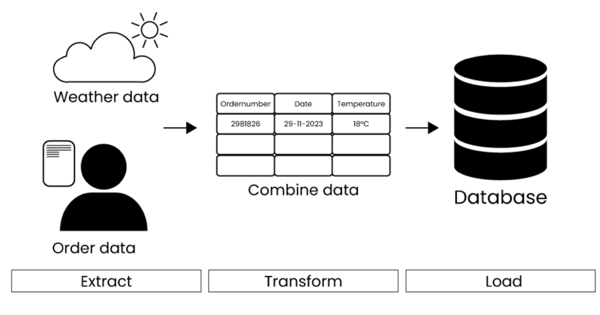

# MLOps: Design and Development

## Project Design Phase

### Value Estimation
Before starting any ML project, estimate its expected value to:
- Aid resource allocation decisions
- Prioritize projects with highest ROI
- Set realistic expectations with stakeholders
- Justify investment in ML infrastructure

The value estimation should consider:
- Direct revenue impact
- Cost savings
- Improved customer experience
- Competitive advantage

### Business Requirements Analysis
Carefully document requirements including:
- **Frequency**: How often predictions need to be made (real-time, batch, etc.)
- **Accuracy**: Minimum performance thresholds needed for business value
- **Transparency**: Required level of model interpretability
- **Compliance**: Regulatory requirements (GDPR, CCPA, industry-specific regulations)
- **Deployment constraints**: Latency, resource limitations, etc.

### Success Metrics Alignment
Different stakeholders care about different metrics:
- **Data Scientists**: Focus on technical metrics (accuracy, precision, recall, F1 score)
- **Subject Matter Experts**: Care about domain-specific outcomes (customer happiness, user engagement)
- **Business Stakeholders**: Prioritize business impacts (revenue, cost reduction, market share)

Align on primary and secondary metrics early to avoid misaligned expectations.

## Data Quality and Ingestion

### Data Quality Dimensions
Assess and monitor data quality across these key dimensions:

* **Accuracy**: Does the data correctly represent the real-world entities?
  - Example: Ensuring product prices in the database match actual prices
  - Validation: Cross-check with authoritative sources
  
* **Completeness**: Are there missing values or records?
  - Example: Customer profiles with missing demographic information
  - Mitigation: Imputation strategies, collection improvement
  
* **Consistency**: Is data uniform across different sources?
  - Example: Date formats standardized across databases
  - Testing: Reconciliation checks between systems
  
* **Timeliness**: Is the data current enough for the use case?
  - Example: Real-time recommendations require fresh user behavior data
  - Monitoring: Track data freshness metrics

### ETL (Extract, Transform, Load) Pipeline Design

A robust ETL pipeline forms the foundation of any ML system:

#### Key ETL Considerations:
- **Scalability**: Can the pipeline handle increasing data volumes?
- **Reliability**: Are there monitoring and failure recovery mechanisms?
- **Reproducibility**: Is the process documented and versioned?
- **Scheduling**: How frequently does the pipeline need to run?

#### Implementation Technologies:
- Batch processing: Apache Airflow, Luigi
- Stream processing: Apache Kafka, Apache Flink
- Cloud-native: AWS Glue, Google Dataflow

## Feature Engineering

### Importance of Feature Engineering
Feature engineering involves selecting, manipulating, and transforming raw data into formats that better represent the underlying problem, often requiring domain-specific knowledge.

### Feature Selection Techniques
- **Univariate Selection**: Statistical tests to select features with strongest relationship to the output variable
- **Principal Component Analysis (PCA)**: Dimension reduction to create uncorrelated features
- **Recursive Feature Elimination**: Iteratively removing attributes and building model on remaining attributes

### Feature Store
A feature store serves as a centralized repository for:
- Storing and managing features
- Ensuring consistency between training and inference
- Promoting feature reuse across projects
- Tracking feature lineage and metadata

Popular implementations include:
- Feast (Feature Store)
- Amazon SageMaker Feature Store
- Tecton
- Hopsworks Feature Store

### Data Version Control
Track changes to datasets and features using tools like:
- DVC (Data Version Control)
- Git LFS
- Pachyderm
- Neptune.ai

## Experiment Tracking

Systematic process to train and evaluate multiple ML models:

### Experiment Workflow
1. **Formulate Hypothesis**: Define what you're trying to accomplish and why
2. **Gather Data**: Collect and prepare relevant datasets
3. **Define Experiments**: Choose:
   - Model architectures (Linear models, tree-based, neural networks)
   - Hyperparameters to test
   - Evaluation methodology (cross-validation strategy)
4. **Setup Experiment Tracking**: Configure tools to track metrics, parameters, and artifacts
5. **Train Models**: Execute training runs, potentially in parallel
6. **Evaluate Performance**: Test models on holdout datasets
7. **Register Suitable Models**: Save promising models to model registry
8. **Visualize and Report**: Share results with team and stakeholders

### Experiment Tracking Tools
- MLflow
- Weights & Biases
- TensorBoard
- Neptune.ai
- Comet.ml

### Best Practices
- Use consistent evaluation metrics across experiments
- Track all hyperparameters and random seeds
- Version control your code, data, and environment
- Document experiment motivation and conclusions
- Automate repetitive experiment patterns