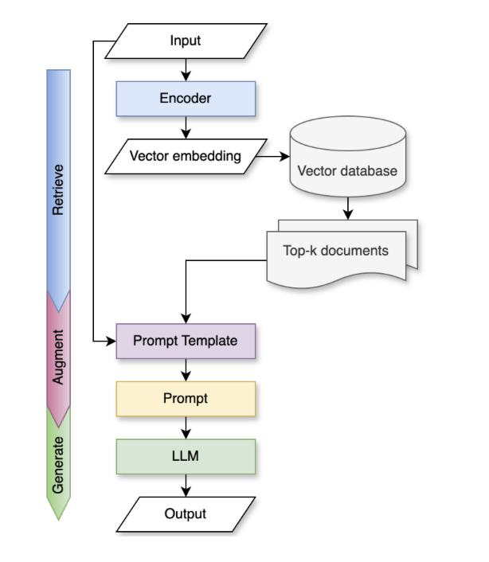
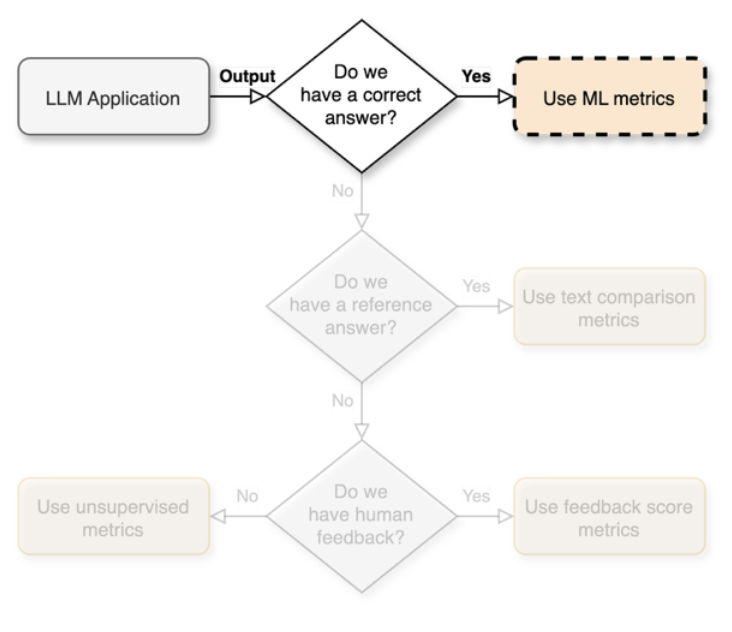

# LLM Development Techniques

After selecting a base model, several techniques can be used to adapt it to specific use cases. This section covers the primary development approaches in LLM-Ops.

## Prompt Engineering

Prompt engineering is the practice of designing effective inputs to guide LLM outputs. It's often the first and most accessible customization approach.

### Prompt Engineering Best Practices

1. **Systematic Tracking**:
   - Document prompts, outputs, model versions, and parameter settings
   - Use proper version control for prompt templates
   - Conduct A/B testing to compare prompt variations

2. **Prompt Management**:
   - Implement prompt managers to standardize organization-wide prompts
   - Use template systems with variable substitution
   - Apply modular design with reusable components

3. **Pattern Techniques**:
   - Few-shot learning (providing examples)
   - Chain-of-thought reasoning
   - Role-based framing
   - Task decomposition
   - Output format specification

## Chains and Agents

More complex applications often require connecting multiple components or allowing models to use tools.

### LLM Chains

Chains connect multiple components in a predetermined sequence. For example:

```
User Query → Retrieve Documents → Format Prompt → Generate Response
```

| Characteristics | Details |
|-----------------|---------|
| Flow Type | Deterministic |
| Complexity | Low to Medium |
| Flexibility | Limited to predefined paths |
| Risk | Lower, more predictable |
| Use Cases | Question answering, summarization, classification |

### LLM Agents

Agents allow LLMs to decide which actions to take and use tools to accomplish tasks.

```
User Query → Agent (LLM decides next action) → Tool Use → Observe Result → Decide Next Action
```

| Characteristics | Details |
|-----------------|---------|
| Flow Type | Adaptive |
| Complexity | High |
| Flexibility | Can handle diverse scenarios |
| Risk | Higher, potentially unpredictable |
| Use Cases | Complex reasoning, search, multi-step tasks |

## Retrieval-Augmented Generation (RAG)

RAG combines retrieval mechanisms with generative capabilities to enhance factual accuracy and domain relevance.

### RAG Architecture



### RAG Process Flow

1. **Retrieve**:
   - Convert user input to vector embeddings
   - Search vector database for semantically similar documents
   - Retrieve top-N most relevant documents

2. **Augment**:
   - Combine user input with retrieved documents
   - Create context-enriched prompt

3. **Generate**:
   - Process augmented prompt through LLM
   - Generate contextually informed response

### RAG Advantages

- Includes up-to-date factual knowledge
- Retains general capabilities of original LLM
- Relatively easy to implement
- Reduces hallucination for domain-specific knowledge

### RAG Challenges

- Adds complexity with vector databases and embedding models
- Requires effective retrieval strategies
- May struggle with multi-hop reasoning
- Context window limitations for large document sets

## Fine-tuning

Fine-tuning involves further training of pre-trained models on domain-specific data.

### When to Consider Fine-tuning

- Specialized domain adaptation is needed
- Consistent response formatting is critical
- Prompt engineering and RAG aren't sufficient
- You have high-quality labeled data

### Fine-tuning Approaches

#### Supervised Fine-tuning

| Aspect | Details |
|--------|---------|
| Data Requirements | Demonstration data (input-output pairs) |
| Approach | Retrain parts of the model using backpropagation |
| Use Cases | Domain adaptation, specialized tasks |

#### Reinforcement Learning from Human Feedback (RLHF)

| Aspect | Details |
|--------|---------|
| Data Requirements | Ranking or quality scores for outputs |
| Approach | Train a reward model, then optimize LLM to maximize rewards |
| Use Cases | Alignment with human preferences, safety, helpfulness |

### Fine-tuning Challenges

- Requires substantial labeled data
- Demands specialized ML knowledge
- Risk of bias amplification
- Potential for catastrophic forgetting
- Higher computational resources

## Testing and Evaluation

Robust testing is essential for LLM application quality assurance.

### Testing Data Collection

- Representative user queries
- Edge cases and potential failure modes
- Sensitive or problematic inputs
- Competitor or reference examples

### Primary Evaluation Metrics



| Task Type | Recommended Metrics |
|-----------|---------------------|
| Generation | ROUGE, BLEU, human evaluation |
| Classification | Accuracy, F1, confusion matrix |
| Question Answering | Exact match, semantic similarity |
| Summarization | ROUGE, BERTScore, human evaluation |

### Secondary Evaluation Metrics

#### Output Characteristics
- Bias and fairness
- Toxicity and safety
- Helpfulness and relevance
- Factual accuracy

#### Operational Characteristics
- Latency and throughput
- Cost per query
- Memory usage
- Reliability

### Evaluation Automation

Implement continuous evaluation pipelines that test:
- Regression against known examples
- Performance on evolving test sets
- Edge cases and potential vulnerabilities
- Compliance with guardrails and policies

Effective development combines these techniques based on application requirements, available resources, and performance needs. 