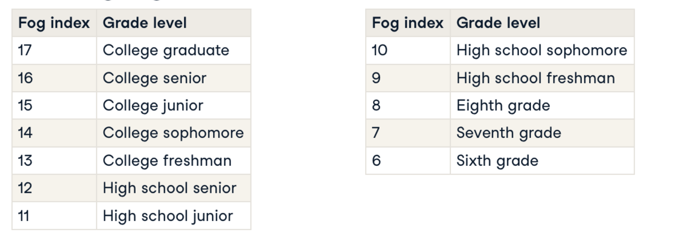

# Readability tests

IT allows to compute scores which represents the difficulty to read a text.

Flesh reading ease

Greater the average sentence length, the harder is to read


```python 
# Import Readability
from readability import Readability

# Compute the readability scores object
readability_scores = Readability(sisyphus_essay)

# Print the flesch reading ease score
flesch = readability_scores.flesch()
print("The Flesch Reading Ease is %.2f" % (flesch.score))
```

## Gunning fog index



Percentage of complex words. Three or more silabels

```python 
# Import Readability
from readability import Readability

# List of excerpts
excerpts = [forbes, harvard_law, r_digest, time_kids]

# Loop through excerpts and compute gunning fog index
gunning_fog_scores = []
for excerpt in excerpts:
  gf = Readability(excerpt).gunning_fog()
  gf_score = gf.score
  gunning_fog_scores.append(gf_score)
  
# Print the gunning fog indices
print(gunning_fog_scores)
```

Output:

```shell
[16.333333333333332, 22.486808510638298, 12.164171779141105, 7.658560794044665]
```
The Harvard Law Review excerpt has the highest Gunning fog index; indicating that it can be comprehended only by readers who have graduated college. On the other hand, the Time for Kids article, intended for children, has a much lower fog index and can be comprehended by 5th grade students.
