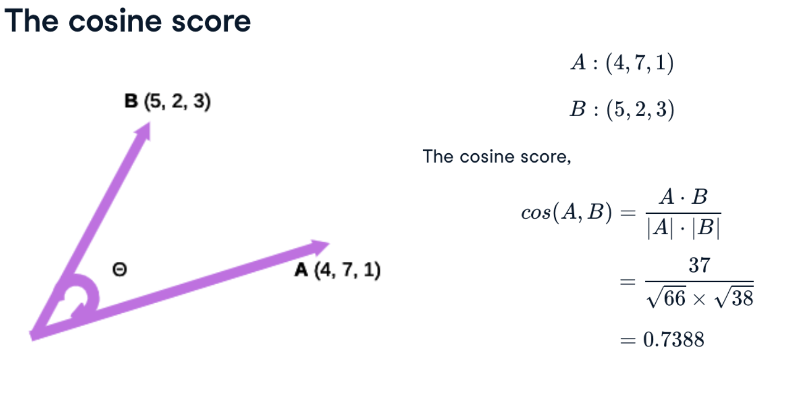

# TF-ID

```python 
# Import TfidfVectorizer
from sklearn.feature_extraction.text import TfidfVectorizer

# Create TfidfVectorizer object
vectorizer = TfidfVectorizer()

# Generate matrix of word vectors
tfidf_matrix = vectorizer.fit_transform(ted)

# Print the shape of tfidf_matrix
print(tfidf_matrix.shape)
```

# Cosine similarity




The value is bounded from -1 to 1. In NLP we use values from 0 (no similarity) to 1 (identical).

Product of vectors

``` python 
# Initialize an instance of tf-idf Vectorizer
tfidf_vectorizer = TfidfVectorizer()

# Generate the tf-idf vectors for the corpus
tfidf_matrix = tfidf_vectorizer.fit_transform(corpus)

# Compute and print the cosine similarity matrix
cosine_sim = cosine_similarity(tfidf_matrix, tfidf_matrix)
print(cosine_sim)
```
# Word embeedings

Bag of words and TF-IDF lack of context to find similar words. You can turn a token in a vector of associated tokens using Spacy 

``` python 

```