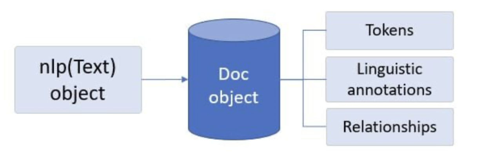
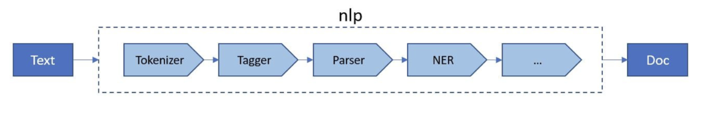

# Main 

Sentiment analysis: Classify piece of text into positive neutral, negative
Name entity recognition: Given a text string, named-entity recognition classifies named entities mentioned in unstructured text into pre-defined categories as described in the video.
Chat bots: like Chat GPT

# Spacy

It has several kind of model that you can install through a command

Doc object 

It acts as a container to store processed data (tokens, relations, )



```python 
# Load en_core_web_sm and create an nlp object
nlp = spacy.load('en_core_web_sm')

# Create a Doc container for the text object
doc = nlp(text)

# Create a list containing the text of each token in the Doc container
print([token.text for token in doc])
```

# Pipeline 



Doc: container for accessing linguistic annotations of text
Span: Slice from a Doc
Token: An individual token (Word, punctuation, whitespace, etc)

## Tokenizer

Always first step. All other operations needs tokens. Tokens can be words numbers or punctuation.

## Sentence segmentation

IT's part of `DependencyParser` component and is also more complex than tokenization

```python 
# Generating a documents list of all Doc containers
documents = [nlp(text) for text in texts]

# Iterate through documents and append sentences in each doc to the sentences list
sentences = []
for doc in documents:
  sentences.append([s for s in doc.sents])
  
# Find number of sentences per each doc container
print([len(s) for s in sentences])
```

### Lemmatization: 

reduce tokens to a lemma. (improves accuracy of language models)

```python 
document = nlp(text)
tokens = [token.text for token in document]

# Append the lemma for all tokens in the document
lemmas = [token.lemma_ for token in document]
print("Lemmas:\n", lemmas, "\n")

# Print tokens and compare with lemmas list
print("Tokens:\n", tokens)
```

Output:

```shell
Lemmas:
['I', 'have', 'buy', 'several', 'of', 'the', 'vitality', 'can', 'dog', 'food', 'product', 'and', 'have', 'find', 'they', 'all', 'to', 'be', 'of', 'good', 'quality', '.', 'the', 'product', 'look', 'more', 'like', 'a', 'stew', 'than', 'a', 'process', 'meat', 'and', 'it', 'smell', 'well', '.', 'my', 'Labrador', 'be', 'finicky', 'and', 'she', 'appreciate', 'this', 'product', 'well', 'than', ' ', 'most', '.'] 
    
Tokens:
['I', 'have', 'bought', 'several', 'of', 'the', 'Vitality', 'canned', 'dog', 'food', 'products', 'and', 'have', 'found', 'them', 'all', 'to', 'be', 'of', 'good', 'quality', '.', 'The', 'product', 'looks', 'more', 'like', 'a', 'stew', 'than', 'a', 'processed', 'meat', 'and', 'it', 'smells', 'better', '.', 'My', 'Labrador', 'is', 'finicky', 'and', 'she', 'appreciates', 'this', 'product', 'better', 'than', ' ', 'most', '.']
```

## Part of the speech 

Categorize grammatically bases on function and context within the sentence. into noun, verbs, adjective, adverb conjunction. Use cases: Confirms the meaning of the words 

```python 
# Compile a list of all Doc containers of texts
documents = [nlp(text) for text in texts]

# Print token texts and POS tags for each Doc container
for doc in documents:
    for token in doc:
        print("Text: ", token.text, "| POS tag: ", token.pos_)
    print("\n")
```
Output:

```shell  
Text:  Round | POS tag:  ADJ
Text:  trip | POS tag:  NOUN
Text:  fares | POS tag:  NOUN
Text:  from | POS tag:  ADP
Text:  Pittsburgh | POS tag:  PROPN
Text:  to | POS tag:  ADP
Text:  Philadelphia | POS tag:  PROPN
Text:  are | POS tag:  AUX
Text:  under | POS tag:  ADP
Text:  1000 | POS tag:  NUM
Text:  dollars | POS tag:  NOUN
Text:  ! | POS tag:  PUNCT
```

## Name entity recognition: 

Identify entities like persons, organizations, etc

```python 
# Compile a list of all Doc containers of texts
documents = [nlp(text) for text in texts]

# Print the entity text and label for the entities in each document
for doc in documents:
    print([(ent.text, ent.label_) for ent in doc.ents])
```
Output:
```shell
[('Boston', 'GPE'), ('8:38 am', 'TIME'), ('Denver', 'GPE'), ('11:10 in the morning', 'TIME')]
[('Pittsburgh', 'GPE'), ('Baltimore', 'GPE'), ('Thursday', 'DATE'), ('morning', 'TIME')]
[('San francisco', 'GPE'), ('Washington', 'GPE')]
```