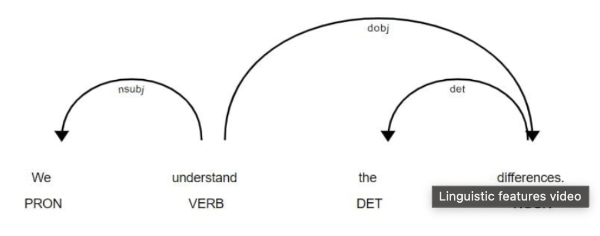
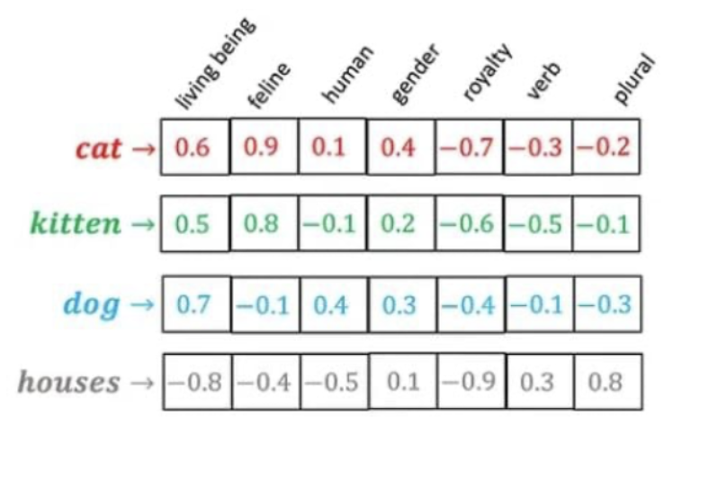

# POS tagging

It depend on the context, surrounding words and their tags. 

Use cases
Word sense disambiguation (WSD): Known the sense of word is needed for words which are written the same for different senses

```python 
texts = ["This device is used to jam the signal.",
         "I am stuck in a traffic jam"]

# Create a list of Doc containers in the texts list
documents = [nlp(t) for t in texts]

# Print a token's text and POS tag if the word jam is in the token's text
for i, doc in enumerate(documents):
    print(f"Sentence {i+1}: ", [(token.text, token.pos_) for token in doc if "jam" in token.text], "\n")
```

```shell
Sentence 1:  [('jam', 'VERB')] 
Sentence 2:  [('jam', 'NOUN')] 
```

Dependency parsing

* Explores sentence syntax
* Link between tow tokens
* Results in a tree



it use dependency labels to establish relations 


```python 
# Create a list of Doc contains of texts list
documents = [nlp(t) for t in texts]

# Print each token's text, dependency label and its explanation
for doc in documents:
    print([(token.text, token.dep_, spacy.explain(token.dep_)) for token in doc], "\n")
```

Output:

```shell 
[('I', 'nsubj', 'nominal subject'), ('want', 'ROOT', None), ('to', 'aux', 'auxiliary'), ('fly', 'xcomp', 'open clausal complement'), ('from', 'prep', 'prepositional modifier'), ('Boston', 'pobj', 'object of preposition'), ('at', 'prep', 'prepositional modifier'), ('8:38', 'nummod', 'numeric modifier'), ('am', 'pobj', 'object of preposition'), ('and', 'cc', 'coordinating conjunction'), ('arrive', 'conj', 'conjunct'), ('in', 'prep', 'prepositional modifier'), ('Denver', 'pobj', 'object of preposition'), ('at', 'prep', 'prepositional modifier'), ('11:10', 'pobj', 'object of preposition'), ('in', 'prep', 'prepositional modifier'), ('the', 'det', 'determiner'), ('morning', 'pobj', 'object of preposition')] 

[('What', 'det', 'determiner'), ('flights', 'nsubj', 'nominal subject'), ('are', 'ROOT', None), ('available', 'acomp', 'adjectival complement'), ('from', 'prep', 'prepositional modifier'), ('Pittsburgh', 'pobj', 'object of preposition'), ('to', 'prep', 'prepositional modifier'), ('Baltimore', 'pobj', 'object of preposition'), ('on', 'prep', 'prepositional modifier'), ('Thursday', 'compound', 'compound'), ('morning', 'pobj', 'object of preposition'), ('?', 'punct', 'punctuation')] 

[('What', 'attr', 'attribute'), ('is', 'ROOT', None), ('the', 'det', 'determiner'), ('arrival', 'compound', 'compound'), ('time', 'nsubj', 'nominal subject'), ('in', 'prep', 'prepositional modifier'), ('San', 'compound', 'compound'), ('francisco', 'pobj', 'object of preposition'), ('for', 'prep', 'prepositional modifier'), ('the', 'det', 'determiner'), ('7:55', 'nummod', 'numeric modifier'), ('AM', 'compound', 'compound'), ('flight', 'pobj', 'object of preposition'), ('leaving', 'acl', 'clausal modifier of noun (adjectival clause)'), ('Washington', 'dobj', 'direct object'), ('?', 'punct', 'punctuation')] 
```

# Word vectors

Numerical representations of words



```python 
# Load the en_core_web_md model
md_nlp = spacy.load('en_core_web_md')

# Print the number of words in the model's vocabulary
print("Number of words: ", md_nlp.meta["vectors"]["vectors"], "\n")

# Print the dimensions of word vectors in en_core_web_md model
print("Dimension of word vectors: ", md_nlp.meta["vectors"]["width"])
```
Output:

```Shell
Number of words:  20000 
Dimension of word vectors:  300
```
Get vectors for a string

```python 
words = ["like", "love"]

# IDs of all the given words
ids = [nlp.vocab.strings[w] for w in words]

# Store the first ten elements of the word vectors for each word
word_vectors = [nlp.vocab.vectors[i][:10] for i in ids]

# Print the first ten elements of the first word vector
print(word_vectors[0])
```

# Visualize word vectors
You can get analogies from applying arithmetic operation to word vectors

Example 
airplane - air + ship = sea 

PCA to reduce the dimension of the vectors multidimensional to 2 dimensions

```python 
words = ["tiger", "bird"]

# Extract word IDs of given words
word_ids = [nlp.vocab.strings[w] for w in words]

# Extract word vectors and stack the first five elements vertically
word_vectors = np.vstack([nlp.vocab.vectors[i][:5] for i in word_ids])

# Calculate the transformed word vectors using the pca object
pca = PCA(n_components=2)
word_vectors_transformed = pca.fit_transform(word_vectors)

# Print the first component of the transformed word vectors
print(word_vectors_transformed[:, 0])

# Find the most similar word to the word computer
most_similar_words = nlp.vocab.vectors.most_similar(np.asarray([
    nlp.vocab.vectors[nlp.vocab.strings["computer"]]
]), n = 1)

# Find the list of similar words given the word IDs
words = [nlp.vocab.strings[w] for w in most_similar_words[0][0]]
print(words)
```

# Semantic similarity 

Similarity is a number between 0 and 1 and it's related to the angle of the compared vectors. You can compare docs, slices or tokens using the similarity method in Spacey.

[cosine similarity](./assets/cosine-similarity.png)

```python  
# Create a documents list containing Doc containers
documents = [nlp(t) for t in texts]

# Create a Doc container of the category
category = "canned dog food"
category_document = nlp(category)

# Print similarity scores of each Doc container and the category_document
for i, doc in enumerate(documents):
  print(f"Semantic similarity with document {i+1}:", round(doc.similarity(category_document), 3))
```