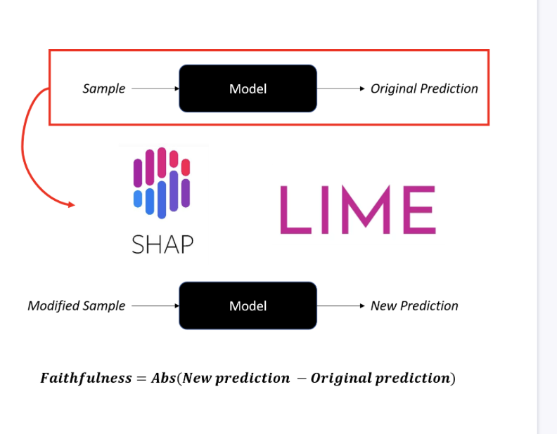

# Metrics

## Consistency 

Assesses stability of explanations when model trained on different subsets. Define the amount of subset is key cause more subset incur in more computational cost


```python 
# Calculate SHAP values and feature importance for model1
explainer1 = shap.TreeExplainer(model1)
shap_values1 = explainer1.shap_values(X1)
feature_importance1 = np.mean(np.abs(shap_values1), axis=0)

# Calculate SHAP values and feature importance for model2
explainer2 = shap.TreeExplainer(model2)
shap_values2 = explainer2.shap_values(X2)
feature_importance2 = np.mean(np.abs(shap_values2), axis=0)

# Consistency calculation
consistency = cosine_similarity([feature_importance1], [feature_importance2])
```

## Faithfulness

Evaluates if important features influence model's prediction. Low value misleads trust in model reasoning



```python 
original_prediction = model.predict_proba(X_instance)[0, 1]
print(f"Original prediction: {original_prediction}")

# Change the gender value to 0 
X_instance['gender'] = 0

# Generate the new prediction
new_prediction = model.predict_proba(X_instance)[0, 1]
print(f"Prediction after perturbing 'gender': {new_prediction}")

# Estimate faithfulness
faithfulness_score = np.abs(original_prediction - new_prediction)
print(f"Local Faithfulness Score: {faithfulness_score}")
```

# Explaining unsupervised models

## Silhouette score

it ranges from -1 to 1 where 1 indicates well separated clusters and -1 incorrectly assigned points.


```python 
kmeans = KMeans(n_clusters=5, random_state=10, n_init=10).fit(X)
# Derive the original silhouette score
original_score = silhouette_score(X, kmeans.labels_)

for i in range(X.shape[1]):
  	# Remove feature at index i
    X_reduced = np.delete(X, i, axis=1)
    kmeans.fit(X_reduced)
    # Compute the new silhouette score
    new_score = silhouette_score(X_reduced, kmeans.labels_)
    # Compute the feature's impact
    impact = original_score - new_score
    print(f'Feature {column_names[i]}: Impact = {impact}')
```

## Adjusted rand index (ARI)

MEasures how well cluster assignments match, ARI =1 means perfet cluster alignment.

```python 
kmeans = KMeans(n_clusters=5, random_state=10, n_init=10).fit(X)
# Derive original clusters
original_clusters = kmeans.predict(X)

for i in range(X.shape[1]):
  	# Remove feature at index i
    X_reduced = np.delete(X, i, axis=1)
    # Derive reduced clusters
    reduced_clusters = kmeans.fit_predict(X_reduced)
    # Derive feature importance
    importance = 1 - adjusted_rand_score(original_clusters, reduced_clusters)
    print(f'{column_names[i]}: {importance}')
```

# Explaining Chat based generative AI 

# chain of tought

```python 
# Complete the chain-of-thought prompt
prompt = "In a basket, there are twice as many apples as oranges and three times as many oranges as bananas. If there are 6 bananas in the basket, how many fruits are there in total? Explain your thoughts step by step"

response = get_response(prompt)
print(response)
```
output:
```shell
Let's start by determining the number of oranges in the basket. Since there are three times as many oranges as bananas, and there are 6 bananas, there are 3 * 6 = 18 oranges.

Next, we need to find the number of apples in the basket. Since there are twice as many apples as oranges, there are 2 * 18 = 36 apples.

Now, we can calculate the total number of fruits in the basket by adding the number of bananas, oranges, and apples together. So, the total number of fruits in the basket is 6 (bananas) + 18 (oranges) + 36 (apples) = 60 fruits.

Therefore, there are a total of 60 fruits in the basket.
```


# self consistency prompt 

```python 
prompt = """Classify the following review as positive or negative. 
You should reply with either "positive" or "negative", nothing else.
Review: 'The coffee was excellent, but the service left much to be desired.'"""

responses = []
for i in range(5):
    sentiment = get_response(prompt)
    # Append the response to the responses list
    responses.append(sentiment)

# Compute the confidence for each sentiment
confidence = {
    'positive': responses.count('positive'),
    'negative': responses.count('negative')
}

print(confidence)
```
output:
```shell
{'positive': 2, 'negative': 3}
```