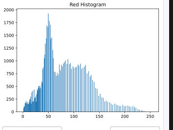
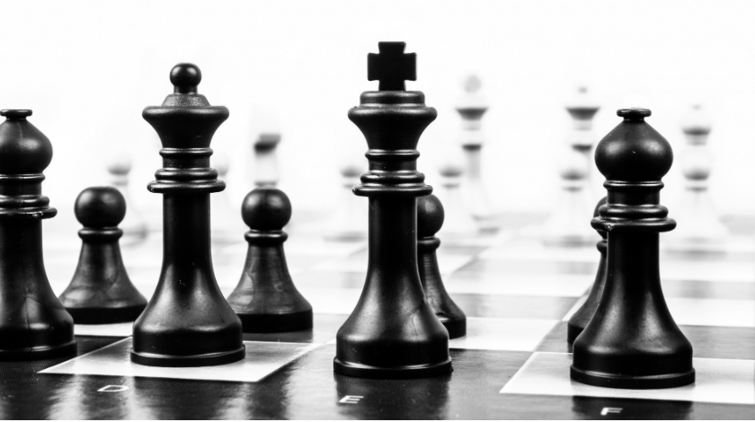
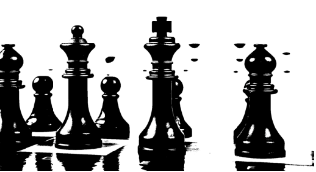
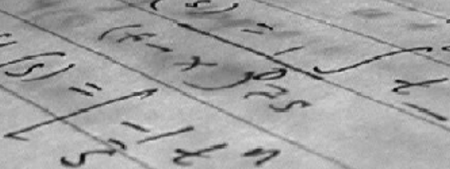
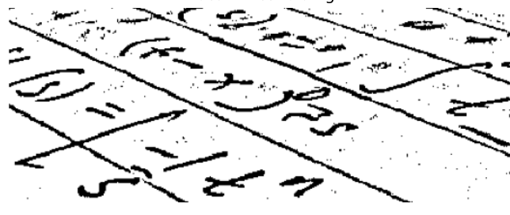
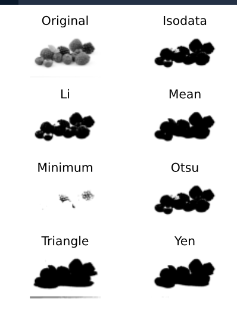

# Image Processing Fundamentals

## Applications of Image Processing

* **Visualization**: Converting data into visual forms for better interpretation
* **Image Enhancement**: Improving image quality through sharpening and restoration
* **Image Retrieval**: Finding similar or related images from databases
* **Pattern Measurement**: Quantitative analysis of visual patterns 
* **Image Recognition**: Identifying objects, people, or features within images
* **Medical Imaging**: Analysis of medical scans and diagnostic images
* **Satellite Imagery**: Processing remote sensing data for various applications

## Libraries for Image Processing in Python

### scikit-image (skimage)

scikit-image is a comprehensive Python library for image processing that provides algorithms for segmentation, geometric transformations, color space manipulation, analysis, filtering, morphology, feature detection, and more.

```python
# Import basic modules from skimage
from skimage import data, io, color
from skimage.transform import resize
import matplotlib.pyplot as plt
import numpy as np

# Helper function to display images
def show_image(image, title='Image', cmap_type='gray'):
    plt.figure(figsize=(6, 4))
    if len(image.shape) == 2 or image.shape[2] == 1:  # Grayscale
        plt.imshow(image, cmap=cmap_type)
    else:  # Color
        plt.imshow(image)
    plt.title(title)
    plt.axis('off')
    plt.tight_layout()
    plt.show()

# Load a sample image
rocket = data.rocket()

# Convert the image to grayscale
gray_scaled_rocket = color.rgb2gray(rocket)

# Show the original image
show_image(rocket, 'Original RGB image', cmap_type=None)

# Show the grayscale image
show_image(gray_scaled_rocket, 'Grayscale image')
```

### NumPy for Basic Image Manipulation

NumPy provides efficient operations for basic image transformations:

```python 
# Load an image (using scikit-image)
from skimage import data
image = data.astronaut()

# Flip the image vertically (upside down)
vertical_flip = np.flipud(image)

# Flip the image horizontally (mirror image)
horizontal_flip = np.fliplr(image)

# Show all three images
plt.figure(figsize=(15, 5))

plt.subplot(131)
plt.imshow(image)
plt.title('Original Image')
plt.axis('off')

plt.subplot(132)
plt.imshow(vertical_flip)
plt.title('Vertical Flip')
plt.axis('off')

plt.subplot(133)
plt.imshow(horizontal_flip)
plt.title('Horizontal Flip')
plt.axis('off')

plt.tight_layout()
plt.show()
```

## Image Histograms

Image histograms provide valuable information about the distribution of pixel intensities in an image. They can help in:
- Understanding image exposure
- Identifying contrast issues
- Planning enhancement strategies
- Setting thresholds for segmentation

For RGB images, we typically analyze histograms for each color channel separately.

```python
# Import necessary libraries
import matplotlib.pyplot as plt
from skimage import data
import numpy as np

# Load a sample image
image = data.astronaut()

# Create a figure with 4 subplots
plt.figure(figsize=(15, 10))

# Display the original image
plt.subplot(2, 2, 1)
plt.imshow(image)
plt.title('Original Image')
plt.axis('off')

# Plot histogram for red channel
plt.subplot(2, 2, 2)
red_channel = image[:, :, 0]
plt.hist(red_channel.ravel(), bins=256, color='red', alpha=0.7)
plt.title('Red Channel Histogram')
plt.xlabel('Pixel Intensity')
plt.ylabel('Frequency')
plt.xlim([0, 255])

# Plot histogram for green channel
plt.subplot(2, 2, 3)
green_channel = image[:, :, 1]
plt.hist(green_channel.ravel(), bins=256, color='green', alpha=0.7)
plt.title('Green Channel Histogram')
plt.xlabel('Pixel Intensity')
plt.ylabel('Frequency')
plt.xlim([0, 255])

# Plot histogram for blue channel
plt.subplot(2, 2, 4)
blue_channel = image[:, :, 2]
plt.hist(blue_channel.ravel(), bins=256, color='blue', alpha=0.7)
plt.title('Blue Channel Histogram')
plt.xlabel('Pixel Intensity')
plt.ylabel('Frequency')
plt.xlim([0, 255])

plt.tight_layout()
plt.show()
```



## Thresholding

Thresholding is a fundamental technique used to segment an image by converting grayscale images into binary images. Each pixel is set to either 255 (white) or 0 (black) based on a threshold value.

### Types of Thresholding

#### 1. Global (Histogram-based) Thresholding

Global thresholding applies a single threshold value to the entire image. It works well for images with uniform backgrounds and good contrast.

**Otsu's Method**: Automatically determines the optimal threshold by minimizing intra-class variance.

```python
# Import necessary libraries
from skimage import data, filters, color
from skimage.filters import threshold_otsu
import matplotlib.pyplot as plt
import numpy as np

# Load a sample image with chess pieces
chess_pieces_image = data.chess_board()  # Using chessboard as example

# Make the image grayscale
chess_pieces_image_gray = color.rgb2gray(chess_pieces_image)

# Obtain the optimal threshold value with Otsu's method
thresh = threshold_otsu(chess_pieces_image_gray)

# Apply thresholding to create binary image
binary = chess_pieces_image_gray > thresh

# Display results
plt.figure(figsize=(10, 5))

plt.subplot(121)
plt.imshow(chess_pieces_image_gray, cmap='gray')
plt.title('Original Grayscale Image')
plt.axis('off')

plt.subplot(122)
plt.imshow(binary, cmap='gray')
plt.title(f'Binary Image (Threshold: {thresh:.2f})')
plt.axis('off')

plt.tight_layout()
plt.show()
```




#### 2. Local (Adaptive) Thresholding

Local thresholding calculates different threshold values for different regions of the image. This method is effective for images with uneven illumination or varying backgrounds.

```python
# Import necessary libraries
from skimage import data, color, filters
from skimage.filters import threshold_local
import matplotlib.pyplot as plt
import numpy as np

# Load a sample document image
# For demonstration, let's create a synthetic document-like image
from skimage.draw import rectangle
page_image = np.ones((300, 400)) * 0.8  # Light gray background

# Add some darker regions to simulate uneven illumination
rr, cc = rectangle((50, 50), (250, 350))
page_image[rr, cc] = 0.9

# Add text-like features
for i in range(10):
    y_pos = 70 + i*20
    x_start = 70
    length = np.random.randint(200, 300)
    page_image[y_pos:y_pos+5, x_start:x_start+length] = 0.1

# Set the block size for local thresholding
block_size = 35

# Apply local thresholding
local_thresh = threshold_local(page_image, block_size, offset=0.1)
binary_local = page_image < local_thresh  # Note: inverted comparison for document images

# Display results
plt.figure(figsize=(10, 5))

plt.subplot(121)
plt.imshow(page_image, cmap='gray')
plt.title('Original Document Image')
plt.axis('off')

plt.subplot(122)
plt.imshow(binary_local, cmap='gray')
plt.title(f'Local Thresholding (Block Size: {block_size})')
plt.axis('off')

plt.tight_layout()
plt.show()
```




### Comparing Thresholding Methods

scikit-image provides a convenient function to compare different thresholding methods:

```python
# Import the try_all_threshold function
from skimage.filters import try_all_threshold
from skimage import data
from skimage.color import rgb2gray

# Load a sample image
fruits_image = data.astronaut()

# Convert to grayscale
grayscale = rgb2gray(fruits_image)

# Try all thresholding methods and display results
fig, ax = try_all_threshold(grayscale, figsize=(10, 8), verbose=False)
plt.tight_layout()
plt.show()
```



## Summary

This module introduced the fundamental concepts of image processing:
- Common applications and use cases
- Key Python libraries (scikit-image and NumPy)
- Basic image manipulation techniques
- Image histograms for understanding pixel distributions
- Thresholding techniques for image segmentation

In the next modules, we'll explore more advanced techniques including filtering, contrast enhancement, morphological operations, and image restoration. 