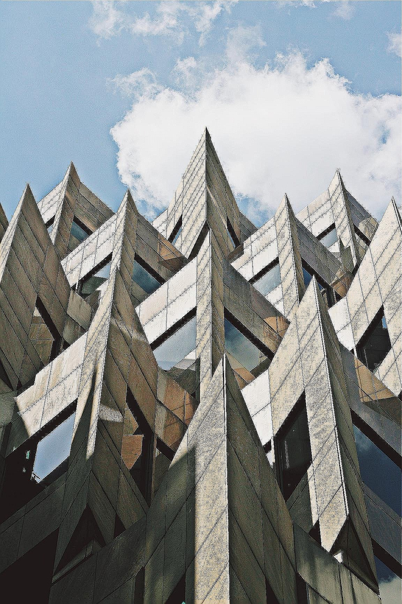
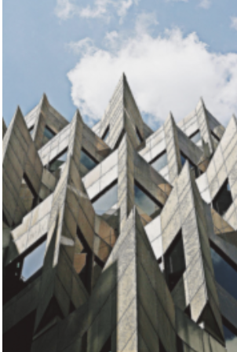
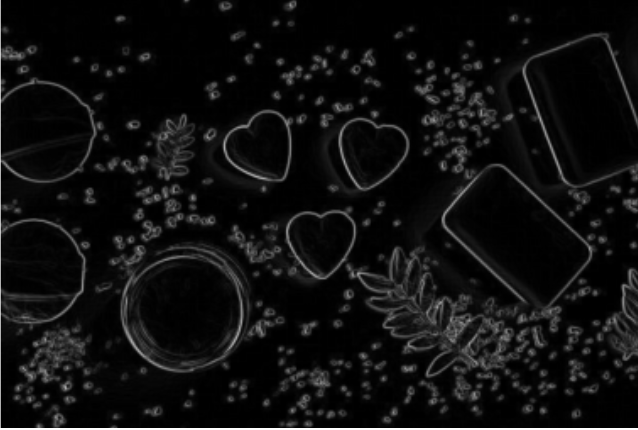
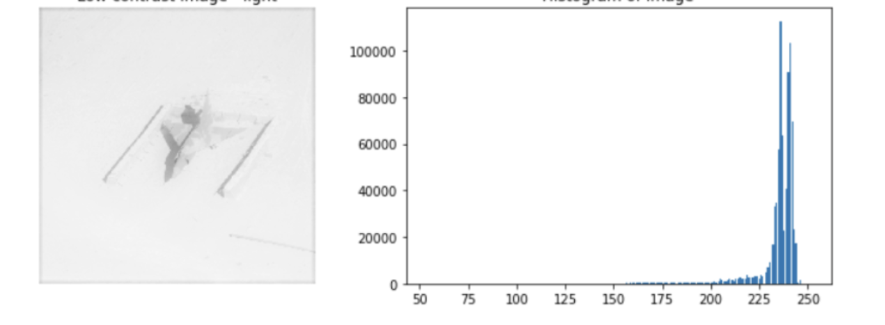
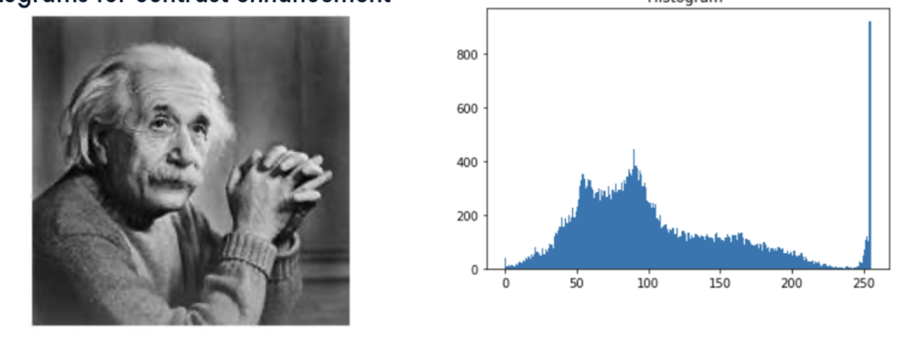
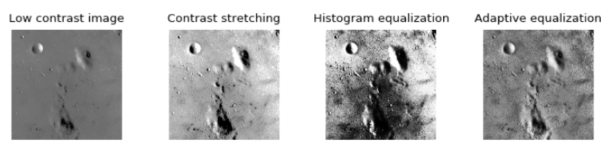
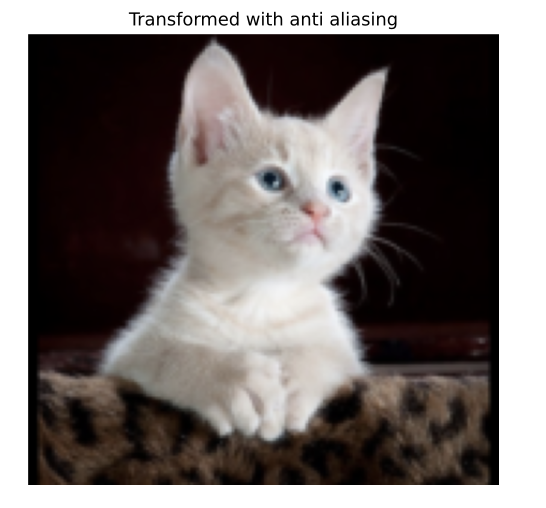
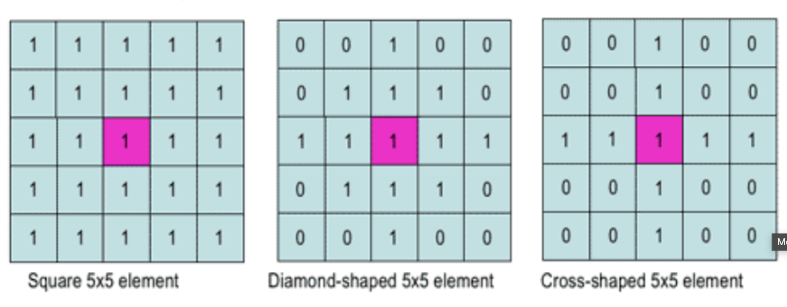

# Filters, Contrast Enhancement, and Morphological Operations

## Image Filters

Image filters are used to modify or enhance images in various ways, such as reducing noise, highlighting features, or preparing for further analysis.

### Common Filter Applications

* **Image Enhancement**: Improving image quality
* **Feature Highlighting**: Emphasizing specific elements in an image
* **Noise Reduction**: Smoothing out unwanted variations
* **Edge Detection**: Finding object boundaries
* **Texture Analysis**: Analyzing surface patterns

### Gaussian Filter

The Gaussian filter is one of the most commonly used smoothing filters. It applies a weighted average to each pixel, with weights following a Gaussian distribution, resulting in a blurred image with reduced noise.

```python
# Import necessary libraries
import numpy as np
import matplotlib.pyplot as plt
from skimage import data
from skimage.filters import gaussian
from skimage.color import rgb2gray

# Define a function to display images side by side
def show_comparison(original, filtered, title_original="Original", title_filtered="Filtered"):
    fig, (ax1, ax2) = plt.subplots(1, 2, figsize=(12, 6))
    
    if original.ndim == 2:  # Grayscale
        ax1.imshow(original, cmap='gray')
        ax2.imshow(filtered, cmap='gray')
    else:  # Color
        ax1.imshow(original)
        ax2.imshow(filtered)
    
    ax1.set_title(title_original)
    ax2.set_title(title_filtered)
    ax1.axis('off')
    ax2.axis('off')
    plt.tight_layout()
    plt.show()

# Load a sample image
building_image = data.astronaut()

# Apply Gaussian filter (sigma controls the amount of blurring)
gaussian_image = gaussian(building_image, sigma=2, multichannel=True)

# Display results
show_comparison(building_image, gaussian_image, "Original", "Gaussian Filter (Reduced Sharpness)")
```




### Edge Detection Filters

Edge detection filters highlight boundaries between different regions in an image. The Sobel filter is a popular choice for edge detection.

```python
# Import necessary libraries
import numpy as np
import matplotlib.pyplot as plt
from skimage import data, color
from skimage.filters import sobel

# Load a sample image
soaps_image = data.astronaut()

# Convert the image to grayscale (required for edge detection)
soaps_image_gray = color.rgb2gray(soaps_image)

# Apply the Sobel edge detection filter
edge_sobel = sobel(soaps_image_gray)

# Display results
show_comparison(soaps_image, edge_sobel, "Original", "Edges with Sobel Filter")
```




### Other Common Filters

| Filter Type | Description | Common Uses |
|-------------|-------------|-------------|
| **Median** | Replaces each pixel with the median value of surrounding pixels | Reducing salt-and-pepper noise while preserving edges |
| **Laplacian** | Second derivative filter that enhances edges | Edge detection and image sharpening |
| **Bilateral** | Edge-preserving smoothing filter | Noise reduction while preserving edges |
| **Prewitt & Scharr** | Edge detection filters | Alternative edge detection methods |

## Contrast Enhancement

Image contrast refers to the difference in intensity between the brightest and darkest parts of an image. Enhancing contrast can make images more visually appealing and can highlight important features.

### Analyzing Contrast with Histograms

A histogram with a narrow range of pixel values indicates low contrast:



A histogram with a wider distribution of pixel values indicates higher contrast:



### Contrast Enhancement Techniques

There are several methods to enhance image contrast:



#### 1. Histogram Equalization

Histogram equalization redistributes pixel intensities to achieve a more uniform distribution across the entire range.

```python
# Import necessary libraries
import numpy as np
import matplotlib.pyplot as plt
from skimage import data, exposure

# Load a sample X-ray image (creating a synthetic one for this example)
chest_xray_image = np.ones((400, 500)) * 0.1  # Dark background

# Add some synthetic structures to simulate an X-ray
from skimage.draw import ellipse
rr, cc = ellipse(200, 250, 150, 100)
chest_xray_image[rr, cc] = 0.2  # Slightly lighter region

# Add some more defined structures
rr, cc = ellipse(200, 250, 100, 50)
chest_xray_image[rr, cc] = 0.3

# Add some smaller details
rr, cc = ellipse(150, 250, 20, 20)
chest_xray_image[rr, cc] = 0.5

# Function to display image with its histogram
def show_image_with_hist(image, title):
    fig, (ax1, ax2) = plt.subplots(1, 2, figsize=(12, 5))
    
    # Display the image
    ax1.imshow(image, cmap='gray')
    ax1.set_title(title)
    ax1.axis('off')
    
    # Display the histogram
    ax2.hist(image.ravel(), bins=256, range=(0, 1), density=True)
    ax2.set_title('Histogram')
    ax2.set_xlabel('Pixel Intensity')
    ax2.set_ylabel('Frequency')
    
    plt.tight_layout()
    plt.show()

# Show original X-ray image and its histogram
show_image_with_hist(chest_xray_image, 'Original X-ray')

# Apply histogram equalization
xray_image_eq = exposure.equalize_hist(chest_xray_image)

# Show the equalized image
show_image_with_hist(xray_image_eq, 'Histogram Equalized X-ray')
```

#### 2. Adaptive Histogram Equalization

Adaptive histogram equalization (AHE) computes multiple histograms for different regions of the image and uses them to redistribute the lightness values. This method is especially useful for enhancing local contrast and bringing out details in images with varying lighting conditions.

```python
# Import necessary libraries
import numpy as np
import matplotlib.pyplot as plt
from skimage import data, exposure

# Load a sample image
original_image = data.coffee()

# Apply regular histogram equalization for comparison
hist_eq_image = exposure.equalize_hist(original_image)

# Apply adaptive histogram equalization (CLAHE)
# The clip_limit parameter prevents over-amplification of noise
adapthist_eq_image = exposure.equalize_adapthist(original_image, clip_limit=0.03)

# Display the results
fig, axes = plt.subplots(1, 3, figsize=(15, 5))

axes[0].imshow(original_image)
axes[0].set_title('Original Image')
axes[0].axis('off')

axes[1].imshow(hist_eq_image)
axes[1].set_title('Histogram Equalization')
axes[1].axis('off')

axes[2].imshow(adapthist_eq_image)
axes[2].set_title('Adaptive Histogram Equalization')
axes[2].axis('off')

plt.tight_layout()
plt.show()
```

### Contrast Enhancement Method Comparison

| Method | Advantages | Disadvantages | Best Use Cases |
|--------|------------|---------------|----------------|
| **Linear Contrast Stretching** | Simple, preserves relationships between pixels | Limited enhancement for images with outliers | General purpose enhancement |
| **Histogram Equalization** | Good enhancement for low-contrast images | May overamplify noise, unnatural appearance | Medical imaging, astronomy |
| **Adaptive Histogram Equalization** | Enhances local details, works well with varying lighting | Computationally expensive, may enhance noise | Medical images, satellite imagery |

## Geometric Transformations

Geometric transformations modify the spatial arrangement of pixels in an image without changing pixel values.

### Common Transformations

#### 1. Rotation

```python
# Import necessary libraries
import numpy as np
import matplotlib.pyplot as plt
from skimage import data
from skimage.transform import rotate

# Load a sample image
image_cat = data.chelsea()  # Cat image

# Rotate the image 90 degrees counter-clockwise
rotated_cat_image = rotate(image_cat, 90)

# Display results
show_comparison(image_cat, rotated_cat_image, "Original", "Rotated 90° Counter-clockwise")
```

#### 2. Rescaling

Rescaling changes the size of an image while maintaining its aspect ratio.

```python
# Import necessary libraries
from skimage.transform import rescale

# Rescale with anti-aliasing (smoother result)
rescaled_with_aa = rescale(image_cat, 0.5, anti_aliasing=True, multichannel=True)

# Rescale without anti-aliasing (more pixelated)
rescaled_without_aa = rescale(image_cat, 0.5, anti_aliasing=False, multichannel=True)

# Display results
fig, axes = plt.subplots(1, 3, figsize=(15, 5))

axes[0].imshow(image_cat)
axes[0].set_title('Original Image')
axes[0].axis('off')

axes[1].imshow(rescaled_with_aa)
axes[1].set_title('Rescaled with Anti-aliasing')
axes[1].axis('off')

axes[2].imshow(rescaled_without_aa)
axes[2].set_title('Rescaled without Anti-aliasing')
axes[2].axis('off')

plt.tight_layout()
plt.show()
```

The anti-aliasing filter prevents pixelation, making the image look smoother but slightly less sharp:




#### 3. Resizing

Resizing allows you to specify exact dimensions for the output image.

```python
# Import necessary libraries
from skimage.transform import resize

# Load a sample banner image
dogs_banner = data.astronaut()  # Using astronaut as example

# Calculate new dimensions (half the original size)
height = int(dogs_banner.shape[0] / 2)
width = int(dogs_banner.shape[1] / 2)

# Resize the image
image_resized = resize(dogs_banner, (height, width), anti_aliasing=True)

# Display results
show_comparison(dogs_banner, image_resized, "Original", "Resized to 50%")
```

## Morphological Operations

Morphological operations are a set of techniques that process images based on shapes. These operations apply a structuring element to an input image and generate an output image of the same size. They are typically applied to binary images but can be used on grayscale images as well.

### Structuring Elements

Structuring elements are small binary matrices that define the neighborhood for processing the image. The center pixel is the origin of the structuring element.



### Basic Morphological Operations

#### 1. Dilation

Dilation adds pixels to the boundaries of objects in an image, typically making objects larger and can be used to fill in small holes.

#### 2. Erosion

Erosion removes pixels from the boundaries of objects, making them smaller and can be used to remove small unwanted details.

```python
# Import necessary libraries
import numpy as np
import matplotlib.pyplot as plt
from skimage import data, color, morphology
from skimage.util import invert

# Create a binary image for demonstration
# Let's create a simple binary image with the letter "R"
binary_r = np.zeros((50, 40), dtype=bool)
binary_r[5:45, 5:10] = True  # Vertical bar
binary_r[5:10, 5:30] = True  # Top horizontal bar
binary_r[20:25, 5:30] = True  # Middle horizontal bar
binary_r[5:25, 25:30] = True  # Curved part top
binary_r[25:45, 5+(np.arange(20)//2):30] = True  # Diagonal part

# Create a binary image of "world" text
world_image = np.zeros((100, 200), dtype=bool)
world_image[40:60, 30:50] = True  # 'W' part 1
world_image[40:60, 55:75] = True  # 'W' part 2
world_image[40:60, 90:110] = True  # 'O'
world_image[40:60, 120:140] = True  # 'R'
world_image[40:60, 150:170] = True  # 'L'
# Make it hollow
world_image[45:55, 35:45] = False
world_image[45:55, 60:70] = False
world_image[45:55, 95:105] = False
world_image[45:55, 125:135] = False
world_image[45:55, 155:165] = False

# Apply erosion to the "R" image
eroded_r = morphology.binary_erosion(binary_r)

# Apply dilation to the "world" image
dilated_world = morphology.binary_dilation(world_image)

# Display results
fig, axes = plt.subplots(2, 2, figsize=(10, 10))

axes[0, 0].imshow(binary_r, cmap='gray')
axes[0, 0].set_title('Original "R"')
axes[0, 0].axis('off')

axes[0, 1].imshow(eroded_r, cmap='gray')
axes[0, 1].set_title('Eroded "R"')
axes[0, 1].axis('off')

axes[1, 0].imshow(world_image, cmap='gray')
axes[1, 0].set_title('Original "world"')
axes[1, 0].axis('off')

axes[1, 1].imshow(dilated_world, cmap='gray')
axes[1, 1].set_title('Dilated "world"')
axes[1, 1].axis('off')

plt.tight_layout()
plt.show()
```

### Advanced Morphological Operations

| Operation | Description | Example Use Case |
|-----------|-------------|------------------|
| **Opening** | Erosion followed by dilation | Removing small objects while preserving object shape |
| **Closing** | Dilation followed by erosion | Filling small holes while preserving object shape |
| **Top Hat** | Difference between original image and opening | Enhancing bright features smaller than structuring element |
| **Black Hat** | Difference between closing and original image | Enhancing dark features smaller than structuring element |

```python
# Import necessary libraries
import numpy as np
import matplotlib.pyplot as plt
from skimage import morphology

# Create a binary image with noise for demonstration
binary_image = np.zeros((100, 100), dtype=bool)
binary_image[25:75, 25:75] = True  # Square in the center

# Add some noise (small dots)
np.random.seed(0)
noise = np.random.random(binary_image.shape) > 0.95
binary_image = np.logical_or(binary_image, noise)

# Add some holes in the square
holes = np.zeros_like(binary_image)
holes[40:60, 40:60] = True
binary_image = np.logical_and(binary_image, ~holes)

# Define structuring element
selem = morphology.disk(3)

# Apply morphological operations
opened = morphology.binary_opening(binary_image, selem)
closed = morphology.binary_closing(binary_image, selem)

# Display results
fig, axes = plt.subplots(1, 3, figsize=(15, 5))

axes[0].imshow(binary_image, cmap='gray')
axes[0].set_title('Original Image with Noise and Holes')
axes[0].axis('off')

axes[1].imshow(opened, cmap='gray')
axes[1].set_title('Opening (Removes Small Objects)')
axes[1].axis('off')

axes[2].imshow(closed, cmap='gray')
axes[2].set_title('Closing (Fills Small Holes)')
axes[2].axis('off')

plt.tight_layout()
plt.show()
```

## Summary

This module covered three essential areas of image processing:

1. **Filters**: Tools for image smoothing, sharpening, and edge detection
2. **Contrast Enhancement**: Techniques to improve visibility and highlight features
3. **Morphological Operations**: Shape-based processing methods for binary and grayscale images

These techniques form the foundation for more advanced image processing operations, such as segmentation, feature extraction, and object recognition, which we'll explore in subsequent modules. 