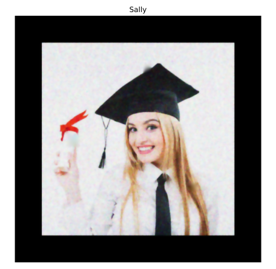

# Image Restoration and Noise Reduction

Image restoration focuses on recovering or enhancing images that have been degraded by various factors such as noise, blur, or missing parts. This module covers techniques to restore image quality and remove unwanted artifacts.

## Inpainting: Restoring Missing Parts

Inpainting is a technique used to reconstruct missing or damaged parts of an image. It's commonly used to:
- Remove unwanted objects from photos
- Restore old or damaged images
- Fill in missing data in medical imaging
- Remove text overlays or watermarks

### Example: Removing a Logo from an Image

```python
# Import necessary libraries
import numpy as np
import matplotlib.pyplot as plt
from skimage import data, color, restoration, transform
from skimage.restoration import inpaint

# Helper function to display images side by side
def show_comparison(original, restored, title_original="Original", title_restored="Restored"):
    fig, (ax1, ax2) = plt.subplots(1, 2, figsize=(12, 6))
    
    if original.ndim == 2:  # Grayscale
        ax1.imshow(original, cmap='gray')
        ax2.imshow(restored, cmap='gray')
    else:  # Color
        ax1.imshow(original)
        ax2.imshow(restored)
    
    ax1.set_title(title_original)
    ax2.set_title(title_restored)
    ax1.axis('off')
    ax2.axis('off')
    plt.tight_layout()
    plt.show()

# Create a sample image with a logo
# For demonstration, let's add a simple "logo" to an image
astronaut = data.astronaut()
image_with_logo = astronaut.copy()

# Add a rectangular "logo" to the image
logo_height, logo_width = 80, 65
logo_y, logo_x = 210, 360
image_with_logo[logo_y:logo_y+logo_height, logo_x:logo_x+logo_width, :] = [255, 0, 0]  # Red logo

# Create a mask for the logo (1 for pixels to inpaint, 0 for pixels to keep)
mask = np.zeros(image_with_logo.shape[:-1], dtype=bool)
mask[logo_y:logo_y+logo_height, logo_x:logo_x+logo_width] = True

# Apply inpainting to remove the logo
image_logo_removed = inpaint.inpaint_biharmonic(image_with_logo, mask, multichannel=True)

# Show the original and logo removed images
show_comparison(image_with_logo, image_logo_removed, 'Image with logo', 'Image with logo removed')
```

### How Inpainting Works

Inpainting algorithms use information from surrounding pixels to fill in missing regions. The biharmonic inpainting algorithm used above:

1. Identifies the boundaries of the region to be filled
2. Analyzes the color and texture patterns of surrounding pixels
3. Propagates this information inward to fill the missing region
4. Ensures smooth transitions between original and inpainted areas

## Noise in Images

Noise refers to random variations in pixel values that don't reflect the true image content. It's typically generated by errors in the acquisition process and can significantly degrade image quality.

### Types of Image Noise

| Noise Type | Description | Common Causes |
|------------|-------------|---------------|
| **Gaussian Noise** | Random variations with a normal distribution | Electronic circuit noise, sensor heat |
| **Salt and Pepper Noise** | Random white and black pixels | Transmission errors, faulty sensor elements |
| **Speckle Noise** | Multiplicative noise | Common in radar and ultrasound imaging |
| **Poisson Noise** | Signal-dependent noise | Low-light photography, medical imaging |

### Adding Noise for Testing

```python
# Import necessary libraries
import numpy as np
import matplotlib.pyplot as plt
from skimage import data, util

# Load a sample image
fruit_image = data.astronaut()

# Add different types of noise
gaussian_noise = util.random_noise(fruit_image, mode='gaussian', var=0.01)
salt_pepper_noise = util.random_noise(fruit_image, mode='s&p', amount=0.02)
speckle_noise = util.random_noise(fruit_image, mode='speckle', var=0.05)
poisson_noise = util.random_noise(fruit_image, mode='poisson')

# Display the results
fig, axes = plt.subplots(1, 5, figsize=(20, 5))

axes[0].imshow(fruit_image)
axes[0].set_title('Original Image')
axes[0].axis('off')

axes[1].imshow(gaussian_noise)
axes[1].set_title('Gaussian Noise')
axes[1].axis('off')

axes[2].imshow(salt_pepper_noise)
axes[2].set_title('Salt & Pepper Noise')
axes[2].axis('off')

axes[3].imshow(speckle_noise)
axes[3].set_title('Speckle Noise')
axes[3].axis('off')

axes[4].imshow(poisson_noise)
axes[4].set_title('Poisson Noise')
axes[4].axis('off')

plt.tight_layout()
plt.show()
```

## Denoising Algorithms

Several algorithms have been developed to remove noise while preserving important image features:

### 1. Total Variation Filter

This method reduces noise by minimizing the total variation of the image, which leads to smoother images while preserving edges.

```python
# Import the module and function
from skimage.restoration import denoise_tv_chambolle

# Create a noisy image for demonstration
noisy_image = util.random_noise(fruit_image, mode='gaussian', var=0.02)

# Apply total variation filter denoising
denoised_image = denoise_tv_chambolle(noisy_image, weight=0.1, multichannel=True)

# Show the noisy and denoised images
show_comparison(noisy_image, denoised_image, 'Noisy Image', 'Total Variation Denoising')
```

### 2. Bilateral Filter

The bilateral filter is an edge-preserving smoothing filter that replaces each pixel's intensity with a weighted average of intensity values from nearby pixels. It preserves edges by considering both spatial distance and intensity difference.

```python
# Import bilateral denoising function
from skimage.restoration import denoise_bilateral

# Load a landscape image or use the existing noisy image
landscape_image = util.random_noise(data.astronaut(), mode='gaussian', var=0.02)

# Apply bilateral filter denoising
denoised_image = denoise_bilateral(landscape_image, sigma_color=0.1, sigma_spatial=1, multichannel=True)

# Show original and resulting images
show_comparison(landscape_image, denoised_image, 'Noisy Image', 'Bilateral Filter Denoising')
```

### 3. Non-Local Means Denoising

Non-local means denoising exploits the redundancy in images by averaging similar patches across the entire image, not just neighboring pixels.

```python
# Import non-local means denoising function
from skimage.restoration import denoise_nl_means

# Apply non-local means denoising
# Note: This is computationally intensive, so we'll use a small patch size
denoised_image = denoise_nl_means(noisy_image, h=0.8, fast_mode=True, 
                                 patch_size=5, patch_distance=3, multichannel=True)

# Show original and resulting images
show_comparison(noisy_image, denoised_image, 'Noisy Image', 'Non-Local Means Denoising')
```

### 4. Wavelet Denoising

Wavelet denoising decomposes the image into wavelets, applies thresholding to remove noise coefficients, and reconstructs the image.

```python
# Import wavelet denoising function
from skimage.restoration import denoise_wavelet

# Apply wavelet denoising
denoised_image = denoise_wavelet(noisy_image, multichannel=True, 
                                 rescale_sigma=True)

# Show original and resulting images
show_comparison(noisy_image, denoised_image, 'Noisy Image', 'Wavelet Denoising')
```

### Comparison of Denoising Methods

```python
# Apply all denoising methods to the same noisy image
# Create a noisy image with Gaussian noise
np.random.seed(0)
noisy_image = util.random_noise(fruit_image, mode='gaussian', var=0.02)

# Apply different denoising methods
tv_denoised = denoise_tv_chambolle(noisy_image, weight=0.1, multichannel=True)
bilateral_denoised = denoise_bilateral(noisy_image, sigma_color=0.1, sigma_spatial=1, multichannel=True)
wavelet_denoised = denoise_wavelet(noisy_image, multichannel=True, rescale_sigma=True)

# Display the results
fig, axes = plt.subplots(2, 2, figsize=(12, 12))

axes[0, 0].imshow(noisy_image)
axes[0, 0].set_title('Noisy Image')
axes[0, 0].axis('off')

axes[0, 1].imshow(tv_denoised)
axes[0, 1].set_title('Total Variation Denoising')
axes[0, 1].axis('off')

axes[1, 0].imshow(bilateral_denoised)
axes[1, 0].set_title('Bilateral Denoising')
axes[1, 0].axis('off')

axes[1, 1].imshow(wavelet_denoised)
axes[1, 1].set_title('Wavelet Denoising')
axes[1, 1].axis('off')

plt.tight_layout()
plt.show()
```

## Segmentation and Superpixels

Segmentation divides an image into meaningful regions, which can be useful for both analysis and restoration.

### Superpixels: Simple Linear Iterative Clustering (SLIC)

Superpixels are groups of pixels with similar colors or grayscale values. They can be used to simplify images for faster processing or as a pre-processing step for more complex algorithms.

```python
# Import necessary libraries
from skimage.segmentation import slic, mark_boundaries
from skimage.color import label2rgb

# Load a sample image
face_image = data.astronaut()

# Apply SLIC to create superpixels
segments = slic(face_image, n_segments=400, compactness=10)

# Create a new image with segment boundaries
boundaries = mark_boundaries(face_image, segments)

# Create a segmented image where each superpixel is represented by its average color
segmented_image = label2rgb(segments, face_image, kind='avg')

# Display the results
fig, axes = plt.subplots(1, 3, figsize=(15, 5))

axes[0].imshow(face_image)
axes[0].set_title('Original Image')
axes[0].axis('off')

axes[1].imshow(boundaries)
axes[1].set_title('Superpixel Boundaries')
axes[1].axis('off')

axes[2].imshow(segmented_image)
axes[2].set_title('Segmented Image (400 superpixels)')
axes[2].axis('off')

plt.tight_layout()
plt.show()
```

## Contour Detection

Contours are the boundaries of objects in an image. They can be used to:
- Determine the number of objects
- Analyze object shapes
- Minimize data size while preserving essential information

### Finding and Using Contours

Contour detection typically requires a binary image, which can be obtained through thresholding or edge detection.

```python
# Import necessary libraries
import numpy as np
import matplotlib.pyplot as plt
from skimage import data, color, filters, measure

# Helper function to show image with contours
def show_image_contour(image, contours):
    fig, ax = plt.subplots(figsize=(8, 8))
    ax.imshow(image, cmap='gray')
    
    for contour in contours:
        ax.plot(contour[:, 1], contour[:, 0], linewidth=2)
    
    ax.axis('image')
    ax.set_xticks([])
    ax.set_yticks([])
    plt.tight_layout()
    plt.show()

# Create a dice image for demonstration
# Let's create a synthetic dice image
dice_image = np.ones((200, 200), dtype=float)

# Create the dice outline
dice_image[50:150, 50:150] = 0.3

# Add dots (pips)
# Center pip
rr, cc = np.ogrid[95:105, 95:105]
dice_mask = (rr - 100)**2 + (cc - 100)**2 <= 25
dice_image[dice_mask] = 0.9

# Top left and bottom right pips
rr, cc = np.ogrid[65:75, 65:75]
dice_mask = (rr - 70)**2 + (cc - 70)**2 <= 25
dice_image[dice_mask] = 0.9

rr, cc = np.ogrid[125:135, 125:135]
dice_mask = (rr - 130)**2 + (cc - 130)**2 <= 25
dice_image[dice_mask] = 0.9

# Top right and bottom left pips
rr, cc = np.ogrid[65:75, 125:135]
dice_mask = (rr - 70)**2 + (cc - 130)**2 <= 25
dice_image[dice_mask] = 0.9

rr, cc = np.ogrid[125:135, 65:75]
dice_mask = (rr - 130)**2 + (cc - 70)**2 <= 25
dice_image[dice_mask] = 0.9

# Apply thresholding to create a binary image
thresh = filters.threshold_otsu(dice_image)
binary = dice_image > thresh

# Find contours
contours = measure.find_contours(binary, 0.8)

# Show the image with contours
show_image_contour(dice_image, contours)

# Count the dots (pips) on the dice
# Filter contours by size to identify the pips
# Typically, pips will be smaller than the dice outline
max_dots_size = 50
dots_contours = [cnt for cnt in contours if cnt.shape[0] < max_dots_size]

# Print the number of dots
print(f"Dice's dots number: {len(dots_contours)}")
```


## Real-World Applications

### Complex Restoration Example: Damaged Image

This example demonstrates a complete restoration workflow for a damaged image:

```python
# Import necessary libraries
import numpy as np
import matplotlib.pyplot as plt
from skimage import data, color, restoration, transform, util
from skimage.restoration import denoise_tv_chambolle, inpaint

# Create a "damaged" image for demonstration
astronaut = data.astronaut()
damaged_image = astronaut.copy()

# Add some "rotation" to simulate misalignment
damaged_image = transform.rotate(damaged_image, -20, resize=True)

# Add some noise
damaged_image = util.random_noise(damaged_image, mode='gaussian', var=0.01)

# Add some "missing" regions
mask = np.zeros(damaged_image.shape[:-1], dtype=bool)
# Create random missing patches
np.random.seed(0)
for i in range(20):
    y, x = np.random.randint(0, damaged_image.shape[0]-30), np.random.randint(0, damaged_image.shape[1]-30)
    mask[y:y+30, x:x+30] = True
    damaged_image[y:y+30, x:x+30] = [1, 1, 1]  # White patches

# Step 1: Rotate the image back to its original orientation
upright_img = transform.rotate(damaged_image, 20, resize=True)

# Step 2: Remove noise
upright_img_without_noise = denoise_tv_chambolle(upright_img, weight=0.1, multichannel=True)

# Step 3: Inpaint missing regions
# Update mask to match the rotated image
mask_rotated = transform.rotate(mask.astype(float), 20, resize=True) > 0.5
result = inpaint.inpaint_biharmonic(upright_img_without_noise, mask_rotated, multichannel=True)

# Display the results of each step
fig, axes = plt.subplots(2, 2, figsize=(12, 12))

axes[0, 0].imshow(astronaut)
axes[0, 0].set_title('Original Image')
axes[0, 0].axis('off')

axes[0, 1].imshow(damaged_image)
axes[0, 1].set_title('Damaged Image')
axes[0, 1].axis('off')

axes[1, 0].imshow(upright_img_without_noise)
axes[1, 0].set_title('After Rotation and Denoising')
axes[1, 0].axis('off')

axes[1, 1].imshow(result)
axes[1, 1].set_title('Final Restored Image')
axes[1, 1].axis('off')

plt.tight_layout()
plt.show()
```




## Summary

This module covered essential techniques for image restoration and enhancement:

1. **Inpainting**: Filling in missing or damaged parts of images
2. **Noise Analysis and Removal**: Understanding and removing different types of image noise
3. **Segmentation**: Dividing images into meaningful regions with superpixels
4. **Contour Detection**: Finding and using object boundaries
5. **Complete Restoration Workflows**: Combining multiple techniques for complex restoration tasks

These techniques are foundational for many image processing applications, including medical imaging, photography, remote sensing, and document restoration. 