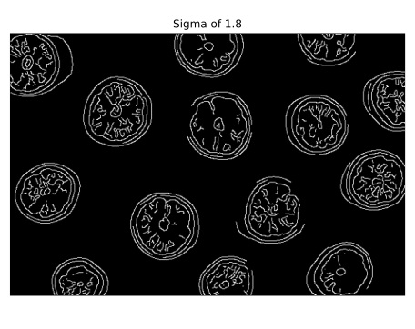
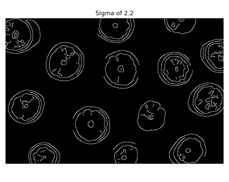
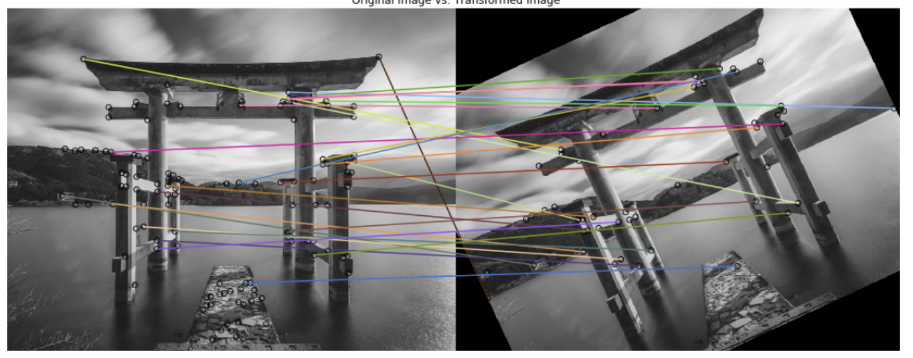

# Advanced Image Processing Operations

This module covers more sophisticated image processing techniques, focusing on feature detection, object recognition, and practical applications of image processing.

## Edge Detection

Edge detection is a fundamental technique in image processing that identifies boundaries between different regions in an image. Edges represent significant local changes in the image intensity and are crucial for shape analysis, object detection, and image segmentation.

### Why Edge Detection Matters

Edge detection reduces the amount of data to process while preserving the important structural properties of an image. Common applications include:

- Object boundary detection
- Image segmentation
- Feature extraction
- Medical image analysis
- Biometrics (fingerprint recognition)
- Autonomous driving and obstacle detection

### Canny Edge Detector

The Canny edge detector is one of the most popular edge detection algorithms. It was developed by John F. Canny in 1986 and is known for its ability to detect true edges while being less susceptible to noise.

The algorithm works in several steps:
1. Noise reduction using Gaussian filter
2. Finding intensity gradients
3. Non-maximum suppression
4. Hysteresis thresholding using two threshold values

```python
# Import necessary libraries
import numpy as np
import matplotlib.pyplot as plt
from skimage import data, color, feature

# Helper function to display images side by side
def show_comparison(images, titles, figsize=(15, 8)):
    fig, axes = plt.subplots(1, len(images), figsize=figsize)
    
    for i, (image, title) in enumerate(zip(images, titles)):
        if len(images) == 1:
            ax = axes
        else:
            ax = axes[i]
            
        if image.ndim == 2:  # Grayscale
            ax.imshow(image, cmap='gray')
        else:  # Color
            ax.imshow(image)
        
        ax.set_title(title)
        ax.axis('off')
    
    plt.tight_layout()
    plt.show()

# Load a sample image
grapefruit = data.astronaut()

# Convert image to grayscale
grapefruit_gray = color.rgb2gray(grapefruit)

# Apply Canny edge detector with different sigma values
# Sigma controls the amount of Gaussian smoothing - higher values detect fewer edges
edges_1_8 = feature.canny(grapefruit_gray, sigma=1.8)
edges_2_2 = feature.canny(grapefruit_gray, sigma=2.2)

# Show the original and resulting edge images
show_comparison(
    [grapefruit, edges_1_8, edges_2_2], 
    ['Original Image', 'Canny Edges (σ=1.8)', 'Canny Edges (σ=2.2)']
)
```





### Effect of Sigma Parameter

The sigma parameter in the Canny edge detector controls the amount of Gaussian blur applied before edge detection:

- **Lower sigma values (e.g., 1.0-1.5)**: Detect more edges, including fine details, but also more susceptible to noise
- **Higher sigma values (e.g., 2.0-3.0)**: Detect fewer edges, focusing on more prominent boundaries, less affected by noise

## Corner Detection

Corners are points where two or more edges meet, creating a point of interest with significant intensity changes in multiple directions. Corner detection is essential for:

- Feature tracking in videos
- Camera calibration
- 3D reconstruction
- Image alignment and stitching
- Motion detection

### Harris Corner Detector

The Harris corner detector is a widely used algorithm that identifies corners based on the intensity changes in different directions around a pixel.

```python
# Import necessary libraries
import numpy as np
import matplotlib.pyplot as plt
from skimage import data, color, feature
from skimage.feature import corner_harris, corner_peaks

# Helper function to show image with corner points
def show_image_with_corners(image, coords):
    fig, ax = plt.subplots(figsize=(10, 8))
    
    if image.ndim == 2:  # Grayscale
        ax.imshow(image, cmap='gray')
    else:  # Color
        ax.imshow(image)
    
    # Plot detected corner points
    ax.plot(coords[:, 1], coords[:, 0], 'r+', markersize=10)
    
    ax.set_title(f'Detected {len(coords)} Corners')
    ax.axis('off')
    plt.tight_layout()
    plt.show()

# Load a sample building image
building_image = data.astronaut()
# For a real building image, you could use data.chelsea() or load your own

# Convert image to grayscale (required for corner detection)
building_image_gray = color.rgb2gray(building_image)

# Apply the Harris corner detector
corner_response = corner_harris(building_image_gray)

# Find the corner peaks
# min_distance: minimum distance between detected corners
# threshold_rel: threshold for corner response (relative to max response)
coords = corner_peaks(corner_response, min_distance=20, threshold_rel=0.02)

# Show original image and detected corners
show_comparison([building_image], ['Original Image'])
show_image_with_corners(building_image, coords)
```

### Applications of Corner Detection

#### Matching Corners in Transformed Images

Corner detection is particularly useful for finding corresponding points between different views of the same scene.



```python
# Example of matching corners between two transformed images
# Import necessary libraries
from skimage import transform
import numpy as np

# Create a transformed version of the original image (e.g., rotated and scaled)
transformed_image = transform.rotate(building_image, angle=15)
transformed_image = transform.rescale(transformed_image, scale=0.8, multichannel=True)

# Detect corners in both images
building_gray = color.rgb2gray(building_image)
transformed_gray = color.rgb2gray(transformed_image)

# Detect corners in original image
corner_response1 = corner_harris(building_gray)
coords1 = corner_peaks(corner_response1, min_distance=20, threshold_rel=0.02)

# Detect corners in transformed image
corner_response2 = corner_harris(transformed_gray)
coords2 = corner_peaks(corner_response2, min_distance=20, threshold_rel=0.02)

# Simple visualization (in a real application, you would match the corners using algorithms like RANSAC)
fig, axes = plt.subplots(1, 2, figsize=(15, 8))

axes[0].imshow(building_image)
axes[0].plot(coords1[:, 1], coords1[:, 0], 'r+', markersize=10)
axes[0].set_title(f'Original Image ({len(coords1)} corners)')
axes[0].axis('off')

axes[1].imshow(transformed_image)
axes[1].plot(coords2[:, 1], coords2[:, 0], 'r+', markersize=10)
axes[1].set_title(f'Transformed Image ({len(coords2)} corners)')
axes[1].axis('off')

plt.tight_layout()
plt.show()
```

## Face Detection

Face detection is the process of identifying and locating human faces in digital images. It's a specific form of object detection and serves as the foundation for many applications:

- Facial recognition
- Emotion analysis
- Biometric authentication
- Photography (auto-focus, exposure adjustment)
- Augmented reality filters
- Video surveillance

### Haar Cascade Classifier

One of the most widely used methods for face detection is the Haar Cascade Classifier, which uses a machine learning approach based on Haar-like features.

```python
# Import necessary libraries
import numpy as np
import matplotlib.pyplot as plt
from skimage import data, color, io
from skimage.feature import Cascade

# Helper function to show detected faces
def show_detected_face(image, detected_faces):
    plt.figure(figsize=(12, 8))
    plt.imshow(image)
    
    for face in detected_faces:
        # Get the face bounding box
        y, x, h, w = face
        # Create a rectangle patch
        rect = plt.Rectangle((x, y), w, h, fill=False, color='red', linewidth=2)
        plt.gca().add_patch(rect)
    
    plt.title(f'Detected {len(detected_faces)} faces')
    plt.axis('off')
    plt.tight_layout()
    plt.show()

# Load a sample image with people
# For this example, let's use a built-in image
night_image = data.astronaut()  # In a real application, load an image with faces

# Load the pre-trained face detection model
trained_file = data.lbp_frontal_face_cascade_filename()

# Initialize the face detector
detector = Cascade(trained_file)

# Detect faces with specified parameters
detected = detector.detect_multi_scale(
    img=night_image,
    scale_factor=1.2,  # How much the image size is reduced at each scale
    step_ratio=1,      # How much the detection window moves by
    min_size=(10, 10), # Minimum size of search window
    max_size=(200, 200) # Maximum size of search window
)

# Show the detected faces
show_detected_face(night_image, detected)
```

### Key Parameters for Face Detection

- **scale_factor**: Controls how much the image is scaled down at each scale level. Smaller values (closer to 1) result in more scales checked, which may detect more faces but is more computationally expensive.
- **step_ratio**: Determines how many pixels the search window skips. A value of 1 checks all possible locations, while larger values increase speed but may miss faces.
- **min_size and max_size**: Define the range of face sizes to look for. Setting these appropriately based on the expected face sizes in the image can significantly improve performance.

### Using Segmentation for Large Images

For large or complex images, segmentation can be used as a pre-processing step to improve face detection:

```python
# Import necessary libraries
from skimage.segmentation import slic
from skimage.color import label2rgb

# Apply SLIC segmentation to create superpixels
segments = slic(night_image, n_segments=100, compactness=10)

# Create a segmented image using average color of each segment
segmented_image = label2rgb(segments, night_image, kind='avg')

# Detect faces on the segmented image
detected = detector.detect_multi_scale(
    img=segmented_image,
    scale_factor=1.2,
    step_ratio=1,
    min_size=(10, 10),
    max_size=(1000, 1000)
)

# Show the detected faces on the segmented image
show_detected_face(segmented_image, detected)
```

## Real-World Applications

### Face Blurring for Privacy

One common application of face detection is to blur faces in images for privacy reasons.

```python
# Import necessary libraries
import numpy as np
import matplotlib.pyplot as plt
from skimage import data, color, filters
from skimage.filters import gaussian

# Helper function to get face rectangle coordinates
def get_face_rectangle(face):
    y, x, h, w = face
    return x, y, w, h

# Helper function to blur a face
def blur_face(image, face, sigma=8):
    # Extract face coordinates
    x, y, w, h = get_face_rectangle(face)
    
    # Extract the face region
    face_region = image[y:y+h, x:x+w]
    
    # Apply Gaussian blur to the face region
    blurred_face = gaussian(face_region, sigma=sigma, multichannel=True)
    
    # Create a copy of the image and replace the face region with the blurred version
    result = image.copy()
    result[y:y+h, x:x+w] = blurred_face
    
    return result

# Load a sample group image
group_image = data.astronaut()  # In a real application, load a group photo

# Detect faces
detected = detector.detect_multi_scale(
    img=group_image,
    scale_factor=1.2,
    step_ratio=1,
    min_size=(10, 10),
    max_size=(100, 100)
)

# Start with original image
resulting_image = group_image.copy()

# Blur each detected face
for face in detected:
    resulting_image = blur_face(resulting_image, face, sigma=8)

# Show the original and blurred faces images
show_comparison(
    [group_image, resulting_image],
    ['Original Image', 'Image with Blurred Faces']
)
```


### Complete Image Restoration Example

This example demonstrates a complete workflow for restoring a damaged image, combining multiple techniques:

```python
# Import necessary libraries
import numpy as np
import matplotlib.pyplot as plt
from skimage import data, color, transform, io
from skimage.restoration import denoise_tv_chambolle, inpaint

# Load a damaged image
# For demonstration, let's create a "damaged" version of an image
damaged_image = data.astronaut().copy()

# Simulate damage: rotation, noise, and missing regions
# 1. Rotate the image
damaged_image = transform.rotate(damaged_image, angle=-20)

# 2. Add some "missing" regions (white rectangles)
h, w = damaged_image.shape[:2]
# Add a few random white patches
np.random.seed(42)
for _ in range(5):
    y = np.random.randint(h - 30)
    x = np.random.randint(w - 30)
    damaged_image[y:y+30, x:x+30] = 1.0  # White patch

# Complete restoration workflow
# Step 1: Rotate the image back to its original orientation
upright_img = transform.rotate(damaged_image, angle=20)

# Step 2: Remove noise using the total variation filter
upright_img_without_noise = denoise_tv_chambolle(upright_img, weight=0.1, multichannel=True)

# Step 3: Create a mask for the missing parts (white regions)
# In a real application, you might need more sophisticated methods to identify damaged regions
mask = (upright_img_without_noise > 0.99).all(axis=2)

# Step 4: Apply biharmonic inpainting to restore the missing parts
result = inpaint.inpaint_biharmonic(upright_img_without_noise, mask, multichannel=True)

# Show the restoration process
show_comparison(
    [damaged_image, upright_img, upright_img_without_noise, result],
    ['Damaged Image', 'After Rotation', 'After Denoising', 'Final Restored Image'],
    figsize=(20, 5)
)
```


## Advanced Feature Detection Methods

Beyond the techniques covered in this module, there are several more advanced feature detection methods used in modern computer vision:

| Method | Description | Key Applications |
|--------|-------------|------------------|
| **SIFT** (Scale-Invariant Feature Transform) | Detects and describes local features invariant to scaling, rotation, and illumination changes | Object recognition, panorama stitching |
| **SURF** (Speeded-Up Robust Features) | Faster alternative to SIFT using integral images | Real-time applications |
| **ORB** (Oriented FAST and Rotated BRIEF) | Efficient alternative to SIFT/SURF without patent restrictions | Mobile applications, SLAM |
| **HOG** (Histogram of Oriented Gradients) | Counts occurrences of gradient orientations in localized portions of an image | Pedestrian detection, object detection |
| **Deep Learning** approaches | Convolutional Neural Networks for feature extraction | Face recognition, object detection, semantic segmentation |

## Summary

This module covered advanced image processing operations:

1. **Edge Detection**: Finding boundaries in images using the Canny edge detector
2. **Corner Detection**: Identifying points of interest using the Harris corner detector
3. **Face Detection**: Locating human faces with Haar Cascade classifiers
4. **Real-World Applications**: Privacy protection through face blurring and complete image restoration workflows

These techniques form the foundation for more sophisticated computer vision applications and can be combined in various ways to solve complex image analysis problems. 