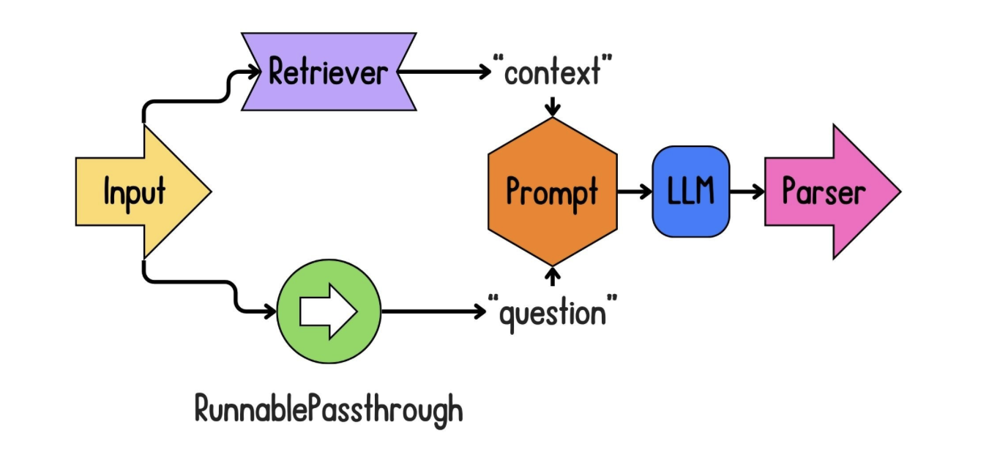
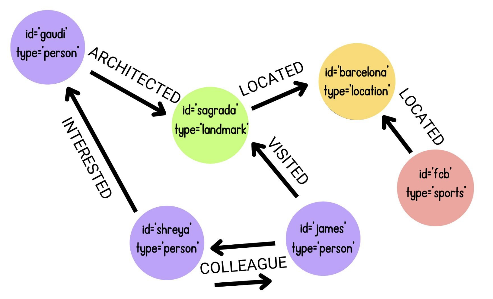
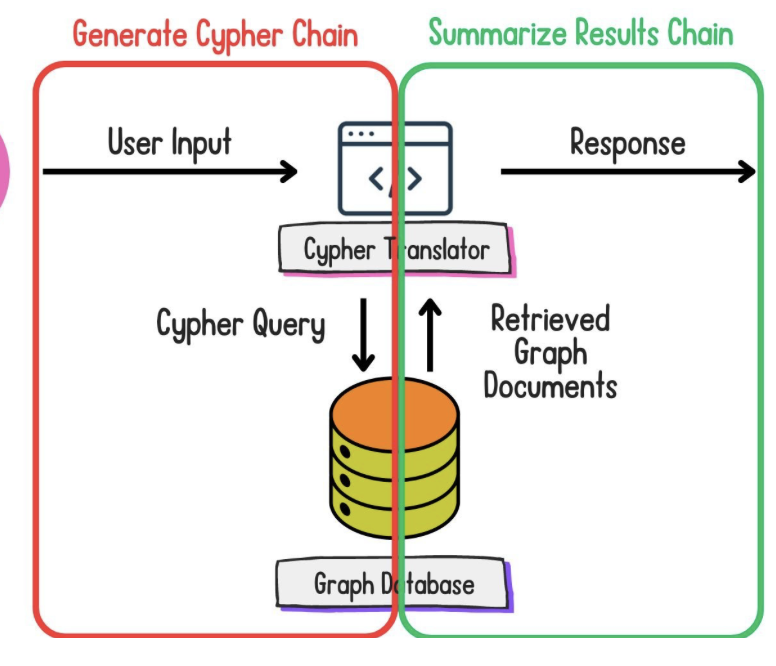

# Retrieval Augmented Generation (RAG) with LangChain

RAG (Retrieval Augmented Generation) enhances Large Language Models by providing them with external, up-to-date knowledge. This approach combines the reasoning capabilities of LLMs with the accuracy of retrieving information from trusted sources.

## 1. RAG Pipeline Overview

The typical RAG workflow consists of the following steps:

1. **Load**: Import data from various sources
2. **Transform/Split**: Split documents into manageable chunks
3. **Embed**: Convert chunks into vector embeddings
4. **Store**: Save embeddings in a vector database
5. **Retrieve**: Query the vector database for relevant documents
6. **Generate**: Use retrieved documents to inform LLM responses



## 2. Loading Documents

LangChain provides various document loaders to import data from different file formats.

### PDF Documents

```python
# Import required libraries
from langchain_community.document_loaders import PyPDFLoader

# Create a document loader for PDF files
loader = PyPDFLoader("rag_paper.pdf")

# Load the document
documents = loader.load()

# Explore the first document
print(f"Total documents: {len(documents)}")
print(f"First document content preview: {documents[0].page_content[:100]}...")
print(f"First document metadata: {documents[0].metadata}")
```

### HTML Documents

```python
# Import required libraries
from langchain_community.document_loaders import UnstructuredHTMLLoader

# Create a document loader for unstructured HTML
loader = UnstructuredHTMLLoader("datacamp-blog.html")

# Load the document
documents = loader.load()

# Explore the first document
print(f"Total documents: {len(documents)}")
print(f"First document content preview: {documents[0].page_content[:100]}...")
print(f"First document metadata: {documents[0].metadata}")
```

### Code Files

```python
# Import required libraries
from langchain_community.document_loaders import PythonLoader, UnstructuredMarkdownLoader

# Load a Markdown file
md_loader = UnstructuredMarkdownLoader("README.md")
markdown_docs = md_loader.load()

# Load a Python file
py_loader = PythonLoader("rag.py")
python_docs = py_loader.load()

print(f"Markdown document metadata: {markdown_docs[0].metadata}")
print(f"Python document metadata: {python_docs[0].metadata}")
```

## 3. Chunking Strategies

Document splitting is a critical step in RAG pipelines that affects retrieval quality. The goal is to find a balance between chunk size and preserving context.

### Simple Character-based Splitting

```python
# Import required libraries
from langchain.text_splitter import CharacterTextSplitter

# Sample text
text = '''RAG (retrieval augmented generation) is an advanced NLP model that combines retrieval mechanisms with generative capabilities. RAG aims to improve the accuracy and relevance of its outputs by grounding responses in precise, contextually appropriate data.'''

# Define a text splitter that splits on the '.' character
text_splitter = CharacterTextSplitter(
    separator=".",
    chunk_size=75,  
    chunk_overlap=10  
)

# Split the text
chunks = text_splitter.split_text(text)

# Check results
print(f"Number of chunks: {len(chunks)}")
print("Chunks:")
for i, chunk in enumerate(chunks):
    print(f"  {i+1}. {chunk} (length: {len(chunk)})")
```

### Recursive Character Splitting

```python
# Import required libraries
from langchain.text_splitter import RecursiveCharacterTextSplitter
from langchain_community.document_loaders import PyPDFLoader

# Load a document
loader = PyPDFLoader("rag_paper.pdf")
document = loader.load()

# Define a recursive text splitter
text_splitter = RecursiveCharacterTextSplitter(
    # Try splitting by newlines first, then periods, then spaces, and finally characters
    separators=['\n', '.', ' ', ''],
    chunk_size=75,  
    chunk_overlap=10  
)

# Split the document
chunks = text_splitter.split_documents(document)

# Check results
print(f"Number of chunks: {len(chunks)}")
print("First 3 chunks:")
for i, chunk in enumerate(chunks[:3]):
    print(f"  {i+1}. {chunk.page_content} (length: {len(chunk.page_content)})")
```

### Language-Aware Splitting for Code

```python
# Import required libraries
from langchain.text_splitter import RecursiveCharacterTextSplitter
from langchain.text_splitter import Language
from langchain_community.document_loaders import PythonLoader

# Load a Python file
loader = PythonLoader("rag.py")
python_docs = loader.load()

# Create a Python-aware recursive character splitter
python_splitter = RecursiveCharacterTextSplitter.from_language(
    language=Language.PYTHON, 
    chunk_size=300, 
    chunk_overlap=100
)

# Split the Python content
chunks = python_splitter.split_documents(python_docs)

# Check results
print(f"Number of Python chunks: {len(chunks)}")
print("First 3 chunks:")
for i, chunk in enumerate(chunks[:3]):
    print(f"Chunk {i+1}:\n{chunk.page_content}\n")
```

### Token-based Splitting

```python
# Import required libraries
import tiktoken
from langchain.text_splitter import TokenTextSplitter
from langchain_community.document_loaders import PyPDFLoader

# Load a document
loader = PyPDFLoader("rag_paper.pdf")
document = loader.load()

# Get the encoding for gpt-4o-mini
encoding = tiktoken.encoding_for_model("gpt-4o-mini")

# Create a token text splitter
token_splitter = TokenTextSplitter(
    encoding_name=encoding.name, 
    chunk_size=100, 
    chunk_overlap=10
)

# Split the document
chunks = token_splitter.split_documents(document)

# Check results
print(f"Number of token-based chunks: {len(chunks)}")
for i, chunk in enumerate(chunks[:3]):
    token_count = len(encoding.encode(chunk.page_content))
    print(f"Chunk {i+1}: {token_count} tokens")
    print(f"{chunk.page_content[:100]}...\n")
```

### Semantic Splitting

```python
# Import required libraries
from langchain.text_splitter import SemanticChunker
from langchain_openai import OpenAIEmbeddings
from langchain_community.document_loaders import PyPDFLoader

# Load a document
loader = PyPDFLoader("rag_paper.pdf")
document = loader.load()

# Instantiate an OpenAI embeddings model
embedding_model = OpenAIEmbeddings(
    api_key="<OPENAI_API_TOKEN>", 
    model='text-embedding-3-small'
)

# Create the semantic text splitter
semantic_splitter = SemanticChunker(
    embeddings=embedding_model, 
    breakpoint_threshold_type="gradient", 
    breakpoint_threshold_amount=0.8
)

# Split the document
chunks = semantic_splitter.split_documents(document)

# Check results
print(f"Number of semantic chunks: {len(chunks)}")
print(f"First chunk preview: {chunks[0].page_content[:100]}...")
```

### Chunking Strategies Comparison

| Chunking Strategy | Pros | Cons | Best Use Cases |
|-------------------|------|------|----------------|
| Character-based | Simple implementation | Can create meaningless chunks | Simple text with clear delimiters |
| Recursive Character | More intelligent splits | May still break semantic units | General purpose chunking |
| Language-aware | Respects code structure | Language-specific | Code and structured documents |
| Token-based | Accurate token counting | Requires token encoder | When controlling exact token count is important |
| Semantic | Creates meaningful semantic units | Computationally expensive | When semantic coherence is critical |

## 4. Embedding and Storage

After splitting documents into chunks, we convert them into vector embeddings and store them in vector databases.

```python
# Import required libraries
from langchain_openai import OpenAIEmbeddings
from langchain_community.vectorstores import Chroma

# Initialize the OpenAI embedding model
embedding_model = OpenAIEmbeddings(
    api_key="<OPENAI_API_TOKEN>", 
    model='text-embedding-3-small'
)

# Create a Chroma vector store and embed the chunks
vector_store = Chroma.from_documents(
    documents=chunks,
    embedding=embedding_model
)

# Search the vector store
query = "What is RAG used for?"
matching_docs = vector_store.similarity_search(query, k=2)
print(f"Found {len(matching_docs)} similar documents")
for i, doc in enumerate(matching_docs):
    print(f"Match {i+1}: {doc.page_content[:100]}...")
```

## 5. Retrieval Techniques

There are multiple approaches to retrieving documents from vector stores, including dense and sparse retrievers.

### Dense Retrieval (Semantic Search)

```python
# Create a dense retriever from the vector store
dense_retriever = vector_store.as_retriever(
    search_type="similarity",  # Find semantically similar documents
    search_kwargs={"k": 3}     # Return top 3 matches
)

# Query the retriever
results = dense_retriever.invoke("What is RAG used for?")
print(f"Found {len(results)} documents")
for i, doc in enumerate(results):
    print(f"Result {i+1}: {doc.page_content[:100]}...")
```

### Sparse Retrieval (BM25)

```python
# Import required libraries
from langchain_community.retrievers import BM25Retriever
from langchain.schema.runnable import RunnablePassthrough
from langchain.prompts import ChatPromptTemplate
from langchain_openai import ChatOpenAI
from langchain.schema.output_parser import StrOutputParser

# Create a BM25 retriever from chunks
bm25_retriever = BM25Retriever.from_documents(
    documents=chunks, 
    k=5  # Return top 5 matches
)

# Initialize the LLM
llm = ChatOpenAI(
    api_key="<OPENAI_API_TOKEN>", 
    model="gpt-4o-mini",
    temperature=0
)

# Create a prompt template
prompt = ChatPromptTemplate.from_template("""
Use only the context provided to answer the following question. 
If you don't know the answer, reply that you are unsure.

Context: {context}
Question: {question}
""")

# Create the retrieval chain
chain = (
    {"context": bm25_retriever, "question": RunnablePassthrough()}
    | prompt
    | llm
    | StrOutputParser()
)

# Query the chain
answer = chain.invoke("What are knowledge-intensive tasks?")
print(f"Answer: {answer}")
```

### Retrieval Strategy Comparison

| Retrieval Strategy | Vector Type | Pros | Cons | Best Use Cases |
|--------------------|-------------|------|------|----------------|
| Dense (Semantic)   | Most vector elements are non-zero | Captures semantic meaning<br>Better with conceptual queries | Computationally expensive<br>Less transparent | General purpose<br>Conceptual queries |
| Sparse (BM25/TF-IDF) | Most vector elements are zero | Precise matching<br>Explainable results<br>Handles rare words better | Less generalization<br>Word-based only | Keyword search<br>When exact matches matter |
| Hybrid             | Both | Combines benefits of both approaches | More complex implementation | Production systems needing both precision and recall |

## 6. Building RAG Chains with LCEL

LangChain Expression Language (LCEL) provides a declarative syntax for building retrieval chains.

```python
# Import required libraries
from langchain.schema.runnable import RunnablePassthrough
from langchain.prompts import ChatPromptTemplate
from langchain_openai import ChatOpenAI
from langchain.schema.output_parser import StrOutputParser
from langchain_community.vectorstores import Chroma
from langchain_openai import OpenAIEmbeddings

# Initialize components
embedding_model = OpenAIEmbeddings(
    api_key="<OPENAI_API_TOKEN>", 
    model='text-embedding-3-small'
)
vector_store = Chroma.from_documents(documents=chunks, embedding=embedding_model)
retriever = vector_store.as_retriever(search_type="similarity", search_kwargs={"k": 2})
llm = ChatOpenAI(api_key="<OPENAI_API_TOKEN>", model="gpt-4o-mini", temperature=0)

# Create a prompt template
prompt = ChatPromptTemplate.from_template("""
Use only the context provided to answer the following question.
If you don't know the answer, reply that you are unsure.

Context:
{context}

Question: {question}
""")

# Create the LCEL retrieval chain
rag_chain = (
    {"context": retriever, "question": RunnablePassthrough()}
    | prompt
    | llm
    | StrOutputParser()
)

# Query the chain
answer = rag_chain.invoke("Who are the authors of the RAG paper?")
print(f"Answer: {answer}")
```

## 7. Evaluation

Evaluating RAG systems is essential to ensure they provide accurate and relevant information.

### LangSmith Evaluation

```python
# Import required libraries
from langchain.evaluation import LangChainStringEvaluator

# Create an evaluation LLM
eval_llm = ChatOpenAI(
    api_key="<OPENAI_API_TOKEN>", 
    model="gpt-4-turbo", 
    temperature=0
)

# Define sample query, prediction, and reference
query = "How does RAG improve question answering with LLMs?"
predicted_answer = "RAG improves question answering by retrieving relevant knowledge from external sources and incorporating it into the LLM's generation process."
ref_answer = "RAG improves question answering with LLMs by retrieving relevant documents from a knowledge base and providing them as context, which helps ground the model's responses in factual information."

# Create a prompt template for evaluation
eval_prompt = ChatPromptTemplate.from_template("""
You are evaluating a question answering system.

Question: {input}
Reference Answer: {reference}
Model Answer: {prediction}

Score the model's answer on a scale from 1 to 5, where:
1 = Completely wrong or unrelated
5 = Perfectly accurate and complete

Provide your score:
""")

# Create the QA string evaluator
qa_evaluator = LangChainStringEvaluator(
    "qa",
    config={
        "llm": eval_llm,
        "prompt": eval_prompt
    }
)

# Evaluate the RAG output
score = qa_evaluator.evaluator.evaluate_strings(
    prediction=predicted_answer,
    reference=ref_answer,
    input=query
)

print(f"Evaluation Score: {score}")
```

### Ragas Evaluation Framework

```python
# Import required libraries
from ragas.metrics import faithfulness, context_precision
from ragas.langchain import EvaluatorChain

# Initialize components
embedding_model = OpenAIEmbeddings(
    api_key="<OPENAI_API_TOKEN>", 
    model='text-embedding-3-small'
)
llm = ChatOpenAI(
    api_key="<OPENAI_API_TOKEN>", 
    model="gpt-4-turbo", 
    temperature=0
)

# Query to evaluate
query = "How does RAG improve question answering with LLMs?"

# Get retrieved documents and answer
retriever_results = retriever.invoke(query)
retrieved_docs = [doc.page_content for doc in retriever_results]
rag_answer = rag_chain.invoke(query)

# 1. Evaluate faithfulness (whether the answer is supported by the retrieved documents)
faithfulness_chain = EvaluatorChain(
    metric=faithfulness, 
    llm=llm, 
    embeddings=embedding_model
)

faithfulness_result = faithfulness_chain({
    "question": query,
    "answer": rag_answer,
    "contexts": retrieved_docs
})

print(f"Faithfulness Score: {faithfulness_result['faithfulness']}")

# 2. Evaluate context precision (whether retrieved documents are relevant to the query)
context_precision_chain = EvaluatorChain(
    metric=context_precision, 
    llm=llm, 
    embeddings=embedding_model
)

ground_truth = "RAG improves question answering by integrating external data in generative models."

precision_result = context_precision_chain({
    "question": query,
    "ground_truth": ground_truth,
    "contexts": retrieved_docs
})

print(f"Context Precision: {precision_result['context_precision']}")
```

### Evaluation Metrics

| Metric | Description | What It Measures |
|--------|-------------|------------------|
| Faithfulness | Whether the answer is supported by the retrieved documents | Hallucination detection |
| Answer Relevance | Whether the answer addresses the question | Response quality |
| Context Precision | Proportion of retrieved documents that are relevant | Retrieval precision |
| Context Recall | Whether all relevant information was retrieved | Retrieval completeness |
| Latency | Response time | System performance |

## 8. Advanced RAG Techniques

Several advanced techniques can enhance RAG performance:

1. **Hybrid Search**: Combine dense and sparse retrievers
2. **Multi-query Retrieval**: Generate multiple queries for the same question
3. **Re-ranking**: Use a second model to re-rank retrieved documents
4. **Query Transformation**: Rewrite queries to improve retrieval

## 9. Graph RAG

Graph RAG addresses limitations of vector databases by using graph structures to represent relationships between concepts.

### Advantages Over Traditional Vector Databases

- Represents relationships between concepts explicitly
- More scalable for complex knowledge
- Easier to integrate diverse data types
- Better for multi-hop reasoning



### Converting Documents to Graph Structures

```python
# Import required libraries
from langchain_openai import ChatOpenAI
from langchain_experimental.graph_transformers import LLMGraphTransformer

# Define the LLM
llm = ChatOpenAI(
    api_key="<OPENAI_API_TOKEN>", 
    model="gpt-4o-mini", 
    temperature=0
)

# Load documents (assumes docs is already defined)
# docs = document_loader.load()

# Instantiate the LLM graph transformer
llm_transformer = LLMGraphTransformer(llm=llm)

# Convert the text documents to graph documents
graph_documents = llm_transformer.convert_to_graph_documents(docs)

# Explore the generated graph structure
print(f"Derived Nodes:\n{graph_documents[0].nodes}\n")
print(f"Derived Edges:\n{graph_documents[0].relationships}")
```

### Storing and Querying with Neo4j

```python
# Import required libraries
from langchain_community.graphs import Neo4jGraph

# Neo4j connection details
url = "bolt://localhost:7687"
user = "neo4j"
password = "password"

# Instantiate the Neo4j graph
graph = Neo4jGraph(url=url, username=user, password=password)

# Add the graph documents
graph.add_graph_documents(
    graph_documents, 
    include_source=True,  # Link nodes to source documents with MENTIONS edge
    baseEntityLabel=True  # Add __Entity__ label to each node
)

# Refresh and get the schema
graph.refresh_schema()
print(f"Graph Schema:\n{graph.get_schema}")

# Query the graph with Cypher
results = graph.query("""
MATCH (relativity:Concept {id: "Theory Of Relativity"}) <-[:KNOWN_FOR]- (scientist)
RETURN scientist
""")

print(f"Query Results: {results}")
```

### Graph RAG Architecture



### Building Graph QA Chains

```python
# Import required libraries
from langchain.chains import GraphCypherQAChain
from langchain_openai import ChatOpenAI

# Initialize the LLM
llm = ChatOpenAI(
    api_key="<OPENAI_API_TOKEN>", 
    model="gpt-4o-mini", 
    temperature=0
)

# Create the Graph Cypher QA chain
graph_qa_chain = GraphCypherQAChain.from_llm(
    llm=llm, 
    graph=graph, 
    verbose=True
)

# Query the graph chain
result = graph_qa_chain.invoke({"query": "Who discovered the element Radium?"})
print(f"Final answer: {result['result']}")
```

Example output:
```
> Entering new GraphCypherQAChain chain...
Generated Cypher:
MATCH (p:Person)-[:DISCOVERED]->(e:Element {id: "Radium"})
RETURN p
Full Context:
[{'p': {'id': 'Marie Curie'}}]

> Finished chain.
Final answer: Marie Curie discovered the element Radium.
```

### Advanced Graph QA Techniques

#### Filtering Node Types

```python
# Create a graph QA chain excluding specific node types
graph_qa_chain = GraphCypherQAChain.from_llm(
    graph=graph, 
    llm=llm, 
    exclude_types=["Concept"],  # Exclude Concept nodes from search
    verbose=True
)

# Query the chain
result = graph_qa_chain.invoke({"query": "Who was Marie Curie married to?"})
print(f"Final answer: {result['result']}")
```

#### Validating Cypher Queries

```python
# Create a graph QA chain with query validation
graph_qa_chain = GraphCypherQAChain.from_llm(
    graph=graph, 
    llm=llm, 
    validate_cypher=True,  # Validate generated Cypher queries
    verbose=True
)

# Query the chain
result = graph_qa_chain.invoke({"query": "Who won the Nobel Prize in Physics?"})
print(f"Final answer: {result['result']}")
```

#### Few-Shot Prompting for Better Cypher Generation

```python
# Import required libraries
from langchain.prompts import PromptTemplate, FewShotPromptTemplate

# Define example Cypher queries
examples = [
    {"question": "Who discovered Radium?", 
     "query": "MATCH (p:Person)-[:DISCOVERED]->(e:Element {id: 'Radium'}) RETURN p"},
    {"question": "What elements did Marie Curie discover?",
     "query": "MATCH (p:Person {id: 'Marie Curie'})-[:DISCOVERED]->(e:Element) RETURN e"},
]

# Create an example prompt template
example_prompt = PromptTemplate.from_template(
    "User input: {question}\nCypher query: {query}"
)

# Create the few-shot prompt template
cypher_prompt = FewShotPromptTemplate(
    examples=examples,
    example_prompt=example_prompt,
    prefix="You are a Neo4j expert. Given an input question, create a syntactically correct Cypher query to run.\n\nHere is the schema information\n{schema}.\n\nBelow are examples of questions and their corresponding Cypher queries:",
    suffix="User input: {question}\nCypher query: ",
    input_variables=["question", "schema"]
)

# Create the graph Cypher QA chain with few-shot prompting
graph_qa_chain = GraphCypherQAChain.from_llm(
    graph=graph, 
    llm=llm, 
    cypher_prompt=cypher_prompt,
    verbose=True, 
    validate_cypher=True
)

# Query the chain
result = graph_qa_chain.invoke({"query": "Which scientist proposed the Theory Of Relativity?"})
print(f"Final answer: {result['result']}")
```

### Graph vs. Vector RAG Comparison

| Feature | Vector Database RAG | Graph Database RAG |
|---------|---------------------|-------------------|
| Data Representation | Points in high-dimensional space | Nodes and relationships |
| Relationship Handling | Implicit in embeddings | Explicit as graph edges |
| Multi-hop Queries | Difficult | Natural |
| Query Mechanism | Vector similarity | Graph traversal |
| Scalability | Can degrade with size | Better for complex knowledge |
| Best Use Cases | Semantic similarity search | Knowledge graphs, complex relationships |
