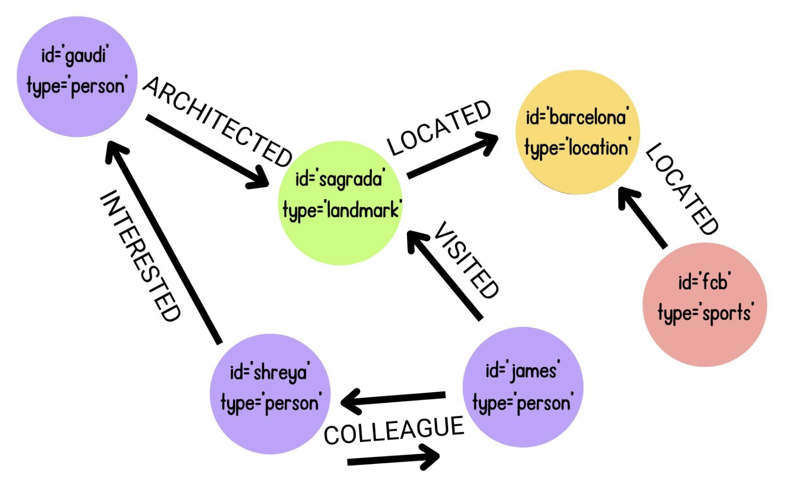
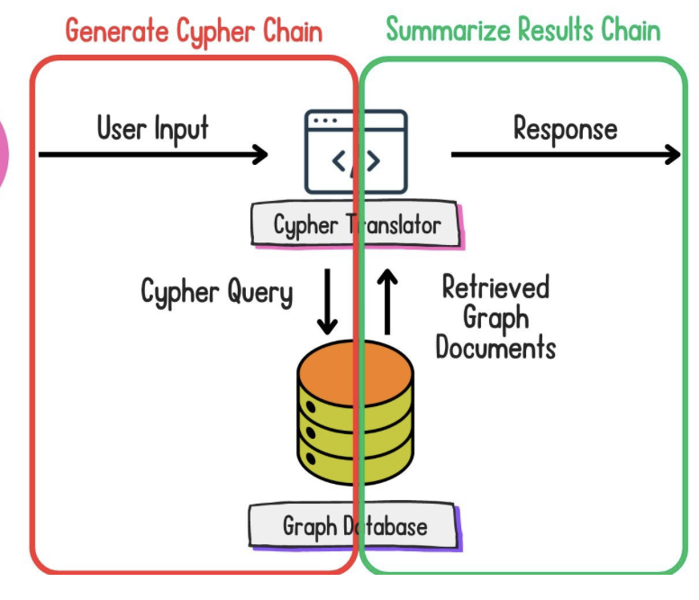

# LangChain Comprehensive Guide

This guide provides a comprehensive overview of LangChain, covering core components, Retrieval Augmented Generation (RAG), Agentic Systems, and best practices.

## 1. Introduction to LangChain

LangChain is a framework designed to simplify the development of applications powered by large language models (LLMs). It provides modular components and tools to build context-aware, reasoning applications, from simple chatbots to complex autonomous agents.

**Core Concepts:**

*   **LLMs**: The underlying language models providing text generation and understanding capabilities.
*   **Prompt Templates**: Structures for creating dynamic prompts for LLMs.
*   **Chains**: Sequences of calls, either to LLMs or other utilities, often using LangChain Expression Language (LCEL).
*   **Retrieval Augmented Generation (RAG)**: Enhancing LLMs by retrieving relevant data from external sources before generation.
*   **Agents**: Systems that use LLMs to reason, plan, and interact with tools to accomplish tasks.

## 2. Core Components

### 2.1. LLM Providers

LangChain integrates with various LLM providers.

**OpenAI:**

```python
from langchain_openai import ChatOpenAI

# Define the LLM
llm = ChatOpenAI(model="gpt-4o-mini", api_key="<OPENAI_API_TOKEN>")

# Predict the words following the text in question
prompt = 'Three reasons for using LangChain for LLM application development.'
response = llm.invoke(prompt)

print(response.content)
```

**Hugging Face:**

```python
# Import the class for defining Hugging Face pipelines
from langchain_huggingface import HuggingFacePipeline

# Define the LLM from the Hugging Face model ID
llm = HuggingFacePipeline.from_model_id(
    model_id="crumb/nano-mistral",
    task="text-generation",
    pipeline_kwargs={"max_new_tokens": 20}
)

prompt = "Hugging Face is"

# Invoke the model
response = llm.invoke(prompt)
print(response)
```

### 2.2. Prompt Templates

Prompt templates help create dynamic and structured inputs for LLMs.

**Basic Template (`PromptTemplate.from_template`):**

```python
from langchain.prompts import PromptTemplate
from langchain_openai import ChatOpenAI

# Create a prompt template from the template string
template = "You are an artificial intelligence assistant, answer the question. {question}"
prompt = PromptTemplate.from_template(
    template=template
)

llm = ChatOpenAI(model="gpt-4o-mini", api_key='<OPENAI_API_TOKEN>')

# Create a chain to integrate the prompt template and LLM
llm_chain = prompt | llm

# Invoke the chain on the question
question = "How does LangChain make LLM application development easier?"
print(llm_chain.invoke({"question": question}))
```

**Chat Template (`ChatPromptTemplate.from_messages`):**

```python
from langchain.prompts import ChatPromptTemplate
from langchain_openai import ChatOpenAI

llm = ChatOpenAI(model="gpt-4o-mini", api_key='<OPENAI_API_TOKEN>')

# Create a chat prompt template
prompt_template = ChatPromptTemplate.from_messages(
    [
        ("system", "You are a geography expert that returns the colors present in a country's flag."),
        ("human", "France"),
        ("ai", "blue, white, red"),
        ("human", "{country}")
    ]
)

# Chain the prompt template and model, and invoke the chain
llm_chain = prompt_template | llm

country = "Japan"
response = llm_chain.invoke({"country": country})
print(response.content)
```

**Few-Shot Template (`FewShotPromptTemplate`):**

```python
from langchain.prompts import PromptTemplate, FewShotPromptTemplate
from langchain_openai import ChatOpenAI

# Create the examples list of dicts
examples = [
  {
    "question": "How many DataCamp courses has Jack completed?",
    "answer": "36"
  },
  {
    "question": "How much XP does Jack have on DataCamp?",
    "answer": "284,320XP"
  },
  {
    "question": "What technology does Jack learn about most on DataCamp?",
    "answer": "Python"
  }
]

# Complete the prompt for formatting examples
example_prompt = PromptTemplate.from_template("Question: {question}\n{answer}")

# Create the few-shot prompt template
prompt_template = FewShotPromptTemplate(
    examples=examples,
    example_prompt=example_prompt,
    suffix="Question: {input}",
    input_variables=["input"],
)

# Create an OpenAI chat LLM
llm = ChatOpenAI(model="gpt-4o-mini", api_key='<OPENAI_API_TOKEN>')

# Create and invoke the chain
llm_chain = prompt_template | llm
print(llm_chain.invoke({"input": "What is Jack's favorite technology on DataCamp?"}))
```

### 2.3. Output Parsers

Output parsers structure the LLM's response. `StrOutputParser` is commonly used for text output.

```python
from langchain.schema.output_parser import StrOutputParser

# Example usage within a chain
chain = prompt | llm | StrOutputParser()
result_string = chain.invoke({"input": "some input"})
print(result_string)
```

### 2.4. Chains & LangChain Expression Language (LCEL)

LCEL provides a declarative way to compose chains. The pipe symbol (`|`) links components together.

```python
from langchain.prompts import ChatPromptTemplate
from langchain_openai import ChatOpenAI
from langchain.schema.output_parser import StrOutputParser
from langchain.schema.runnable import RunnablePassthrough

prompt = ChatPromptTemplate.from_template("Tell me a short joke about {topic}")
model = ChatOpenAI()
output_parser = StrOutputParser()

# Define the chain using LCEL
chain = {"topic": RunnablePassthrough()} | prompt | model | output_parser

# Invoke the chain
print(chain.invoke("ice cream"))
```

## 3. Retrieval Augmented Generation (RAG)

RAG enhances LLMs by providing external, relevant context retrieved from data sources before generating a response.

### 3.1. RAG Pipeline Overview

1.  **Load**: Import data (PDFs, HTML, code, CSVs, etc.).
2.  **Split**: Divide documents into smaller, manageable chunks.
3.  **Embed**: Convert text chunks into numerical vector embeddings.
4.  **Store**: Index embeddings in a vector database for efficient search.
5.  **Retrieve**: Find relevant chunks based on user query similarity.
6.  **Generate**: Feed the retrieved context and query to the LLM for an informed response.

 *(Assuming this image exists in the specified path)*

### 3.2. Loading Documents

LangChain offers various loaders:

**PDF:**

```python
from langchain_community.document_loaders import PyPDFLoader

loader = PyPDFLoader("example_rag_paper.pdf") # Replace with your PDF file
documents = loader.load()
print(f"Loaded {len(documents)} pages from PDF.")
print(f"Metadata of first page: {documents[0].metadata}")
print(f"Content preview: {documents[0].page_content[:200]}...")
```

**HTML:**

```python
from langchain_community.document_loaders import UnstructuredHTMLLoader

loader = UnstructuredHTMLLoader("example_blog_page.html") # Replace with your HTML file
documents = loader.load()
print(f"Loaded {len(documents)} document(s) from HTML.")
print(f"Metadata: {documents[0].metadata}")
print(f"Content preview: {documents[0].page_content[:200]}...")
```

**CSV:**

```python
from langchain_community.document_loaders.csv_loader import CSVLoader

loader = CSVLoader("example_data.csv") # Replace with your CSV file
documents = loader.load()
print(f"Loaded {len(documents)} document(s) from CSV.")
print(f"Metadata of first row: {documents[0].metadata}")
print(f"Content preview: {documents[0].page_content[:200]}...")

```

**Code (Python/Markdown):**

```python
from langchain_community.document_loaders import PythonLoader, UnstructuredMarkdownLoader

# Load a Python file
py_loader = PythonLoader("example_script.py") # Replace with your Python file
python_docs = py_loader.load()
print(f"Loaded Python file. Metadata: {python_docs[0].metadata}")

# Load a Markdown file
md_loader = UnstructuredMarkdownLoader("example_readme.md") # Replace with your Markdown file
markdown_docs = md_loader.load()
print(f"Loaded Markdown file. Metadata: {markdown_docs[0].metadata}")
```

### 3.3. Chunking / Splitting Documents

Splitting large documents ensures that retrieved context fits within the LLM's context window.

**Recursive Character Splitting (Recommended General Purpose):**

```python
from langchain.text_splitter import RecursiveCharacterTextSplitter

# Assume 'documents' is loaded from a loader
text_splitter = RecursiveCharacterTextSplitter(
    separators=['\n\n', '\n', '.', ' ', ''], # Order matters
    chunk_size=500,
    chunk_overlap=50
)
chunks = text_splitter.split_documents(documents)
print(f"Split into {len(chunks)} chunks.")
print(f"First chunk preview: {chunks[0].page_content[:200]}...")
```

**Other Strategies:** CharacterTextSplitter, Language-aware (for code), TokenTextSplitter, SemanticChunker.

**Chunking Strategy Comparison:**

| Chunking Strategy | Pros | Cons | Best Use Cases |
|-------------------|------|------|----------------|
| Character-based | Simple implementation | Can create meaningless chunks | Simple text with clear delimiters |
| Recursive Character | More intelligent splits | May still break semantic units | General purpose chunking |
| Language-aware | Respects code structure | Language-specific | Code and structured documents |
| Token-based | Accurate token counting | Requires token encoder | When controlling exact token count is important |
| Semantic | Creates meaningful semantic units | Computationally expensive | When semantic coherence is critical |

### 3.4. Embedding and Vector Stores

Embeddings capture the semantic meaning of text chunks. Vector stores index these embeddings for fast retrieval.

```python
import os
from langchain_openai import OpenAIEmbeddings
from langchain_community.vectorstores import Chroma

# Assume 'chunks' is the output from the splitter
# Ensure OPENAI_API_KEY is set in your environment or passed directly
embedding_model = OpenAIEmbeddings(
    api_key="<OPENAI_API_TOKEN>",
    model='text-embedding-3-small'
)

# Create a Chroma vector store in memory (or specify persist_directory)
vector_store = Chroma.from_documents(
    documents=chunks,
    embedding=embedding_model
    # persist_directory="./chroma_db" # Optional: for saving to disk
)

print("Vector store created.")

# Example search
query = "What is the main topic of the document?"
matching_docs = vector_store.similarity_search(query, k=2)
print(f"Found {len(matching_docs)} similar documents for query: '{query}'")
```

### 3.5. Retrieval

Retrievers fetch relevant chunks from the vector store based on the query.

**Dense Retrieval (Semantic Search):** Uses embedding similarity.

```python
# Create a retriever from the vector store
dense_retriever = vector_store.as_retriever(
    search_type="similarity",  # Options: "similarity", "mmr", "similarity_score_threshold"
    search_kwargs={"k": 3}     # Return top 3 matches
)

# Query the retriever
query = "Explain the key methodology."
results = dense_retriever.invoke(query)
print(f"Retrieved {len(results)} documents using dense retrieval.")
```

**Sparse Retrieval (Keyword-based, e.g., BM25):** Uses keyword matching.

```python
from langchain_community.retrievers import BM25Retriever

# Requires 'rank_bm25' library: pip install rank_bm25
# Assume 'chunks' is the output from the splitter
bm25_retriever = BM25Retriever.from_documents(
    documents=chunks,
    k=3 # Return top 3 matches
)

# Query the retriever
query = "Find sections mentioning specific keywords."
results = bm25_retriever.invoke(query)
print(f"Retrieved {len(results)} documents using sparse retrieval (BM25).")
```

**Retrieval Strategy Comparison:**

| Retrieval Strategy | Vector Type | Pros | Cons | Best Use Cases |
|--------------------|-------------|------|------|----------------|
| Dense (Semantic)   | Most vector elements are non-zero | Captures semantic meaning<br>Better with conceptual queries | Computationally expensive<br>Less transparent | General purpose<br>Conceptual queries |
| Sparse (BM25/TF-IDF) | Most vector elements are zero | Precise matching<br>Explainable results<br>Handles rare words better | Less generalization<br>Word-based only | Keyword search<br>When exact matches matter |
| Hybrid             | Both | Combines benefits of both approaches | More complex implementation | Production systems needing both precision and recall |


### 3.6. Building RAG Chains with LCEL

Combine retrieval and generation using LCEL.

```python
from langchain.prompts import ChatPromptTemplate
from langchain_openai import ChatOpenAI
from langchain.schema.output_parser import StrOutputParser
from langchain.schema.runnable import RunnablePassthrough

# Assume 'dense_retriever' and 'llm' (e.g., ChatOpenAI) are initialized

# Define the prompt template
template = """
Answer the question based only on the following context:
{context}

Question: {question}
"""
prompt = ChatPromptTemplate.from_template(template)

# Define the RAG chain
rag_chain = (
    {"context": dense_retriever, "question": RunnablePassthrough()}
    | prompt
    | llm
    | StrOutputParser()
)

# Invoke the chain
query = "What conclusions were drawn in the document?"
answer = rag_chain.invoke(query)
print(f"RAG Chain Answer:
{answer}")
```

### 3.7. Evaluating RAG Systems

Evaluation ensures RAG systems provide accurate and relevant responses.

**Key Metrics:**

| Metric | Description | What It Measures |
|--------|-------------|------------------|
| Faithfulness | Whether the answer is supported by the retrieved documents | Hallucination detection |
| Answer Relevance | Whether the answer addresses the question | Response quality |
| Context Precision | Proportion of retrieved documents that are relevant | Retrieval precision |
| Context Recall | Whether all relevant information was retrieved | Retrieval completeness |
| Latency | Response time | System performance |

**Using Ragas (Example - requires `pip install ragas`):**

```python
# NOTE: Requires ragas library and potentially OPENAI_API_KEY for evaluation models
# This is a conceptual example - setup and dependencies need careful handling.

# from ragas.metrics import faithfulness, context_precision
# from ragas.langchain import EvaluatorChain
# from langchain_openai import ChatOpenAI, OpenAIEmbeddings

# # Assume 'rag_chain', 'retriever', 'llm', 'embedding_model' are initialized
# # Assume 'query', 'retrieved_docs', 'rag_answer' are obtained from the chain

# eval_llm = ChatOpenAI(model="gpt-4-turbo", temperature=0) # Use a powerful model for evaluation

# # Faithfulness Evaluation
# faithfulness_chain = EvaluatorChain(metric=faithfulness, llm=eval_llm, embeddings=embedding_model)
# faithfulness_result = faithfulness_chain({
#     "question": query,
#     "answer": rag_answer,
#     "contexts": [doc.page_content for doc in retrieved_docs] # Pass contexts as strings
# })
# print(f"Faithfulness Score: {faithfulness_result.get('faithfulness', 'N/A')}")

# # Context Precision Evaluation (Requires ground truth)
# context_precision_chain = EvaluatorChain(metric=context_precision, llm=eval_llm, embeddings=embedding_model)
# ground_truth = "A known correct answer or statement relevant to the query."
# precision_result = context_precision_chain({
#     "question": query,
#     "ground_truth": ground_truth,
#     "contexts": [doc.page_content for doc in retrieved_docs]
# })
# print(f"Context Precision: {precision_result.get('context_precision', 'N/A')}")
```
*(Note: LangSmith evaluation is also available but requires setup)*

### 3.8. Advanced RAG Techniques

- **Hybrid Search**: Combine dense and sparse retrieval results.
- **Multi-query Retrieval**: Generate variations of the user query to retrieve a broader set of documents.
- **Re-ranking**: Use a simpler model first, then a more powerful (but slower) model to re-rank the top results.
- **Query Transformation**: Rewrite user queries for better retrieval (e.g., breaking down complex questions).

### 3.9. Graph RAG

Uses graph databases (like Neo4j) to represent and query relationships between entities in documents, enabling more complex reasoning.

**Concepts & Advantages:** Explicit relationships, better multi-hop reasoning, easier integration of diverse data.

 *(Assuming this image exists)*

**Converting Documents to Graph:**

```python
# Requires langchain_experimental, install if needed
from langchain_openai import ChatOpenAI
from langchain_experimental.graph_transformers import LLMGraphTransformer

# Assume 'documents' is loaded
llm = ChatOpenAI(model="gpt-4o-mini", temperature=0, api_key="<OPENAI_API_TOKEN>")
llm_transformer = LLMGraphTransformer(llm=llm)

# Convert documents (can be slow and costly for large datasets)
# graph_documents = llm_transformer.convert_to_graph_documents(documents)
# print("Example Graph Document Nodes:", graph_documents[0].nodes)
# print("Example Graph Document Relationships:", graph_documents[0].relationships)
```

**Storing & Querying (Neo4j Example):**

```python
# Requires neo4j driver: pip install neo4j
# Requires a running Neo4j instance
from langchain_community.graphs import Neo4jGraph

# Neo4j connection details (replace with yours)
url = "bolt://localhost:7687"
user = "neo4j"
password = "your_neo4j_password" # Replace!

# Instantiate the Neo4j graph connection
graph = Neo4jGraph(url=url, username=user, password=password)

# Add graph documents (obtained from LLMGraphTransformer)
# graph.add_graph_documents(
#     graph_documents,
#     include_source=True,
#     baseEntityLabel=True
# )
# graph.refresh_schema()
# print(f"Graph Schema:
{graph.get_schema}")

# Example Cypher Query
# results = graph.query("MATCH (p:Person)-[:WORKED_AT]->(o:Organization) RETURN p.id, o.id LIMIT 5")
# print("Example Query Results:", results)
```

 *(Assuming this image exists)*

**Building Graph QA Chains:**

```python
from langchain.chains import GraphCypherQAChain
from langchain_openai import ChatOpenAI

# Assume 'graph' is the initialized Neo4jGraph object
llm = ChatOpenAI(model="gpt-4o-mini", temperature=0, api_key="<OPENAI_API_TOKEN>")

# Create the QA chain
graph_qa_chain = GraphCypherQAChain.from_llm(
    llm=llm,
    graph=graph,
    verbose=True # Shows generated Cypher query
)

# Query the chain
# result = graph_qa_chain.invoke({"query": "Which organizations has Person X worked at?"})
# print(f"Graph QA Answer: {result.get('result', 'N/A')}")
```

**Advanced Graph QA:** Filtering node types, validating Cypher, Few-shot prompting for better Cypher generation.

**Comparison: Graph vs. Vector RAG:**

| Feature | Vector Database RAG | Graph Database RAG |
|---------|---------------------|-------------------|
| Data Representation | Points in high-dimensional space | Nodes and relationships |
| Relationship Handling | Implicit in embeddings | Explicit as graph edges |
| Multi-hop Queries | Difficult | Natural |
| Query Mechanism | Vector similarity | Graph traversal |
| Scalability | Can degrade with size | Better for complex knowledge |
| Best Use Cases | Semantic similarity search | Knowledge graphs, complex relationships |

## 4. Agentic Systems

Agents use LLMs to reason, plan, and utilize tools to achieve goals autonomously.

### 4.1. Introduction to Agents

- **Capabilities**: Reason, plan, use tools, learn (limited in basic LangChain agents), reflect.
- **ReAct Framework**: Cycle of **Rea**soning -> **Act**ion -> Observation.

### 4.2. Building Blocks

**Tools:** Functions agents can call. Defined using `@tool` decorator with clear docstrings.

```python
from langchain.tools import tool
import math

@tool
def calculate_circle_area(radius: float) -> float:
    """Calculates the area of a circle given its radius."""
    return math.pi * (radius ** 2)

print(f"Tool Name: {calculate_circle_area.name}")
print(f"Tool Description: {calculate_circle_area.description}")
print(f"Tool Args Schema: {calculate_circle_area.args}")
```

**LLM:** The agent's "brain" for decision-making. Typically a chat model.

**State Management:** Tracking conversation history, intermediate results (often handled internally by agent executors or LangGraph state).

### 4.3. Creating Basic Agents (`create_react_agent`)

Combines an LLM, tools, and a prompt template designed for the ReAct framework.

```python
from langchain.agents import create_react_agent, AgentExecutor
from langchain_openai import ChatOpenAI
from langchain import hub # For pulling standard prompts

# Assume 'calculate_circle_area' tool is defined above
tools = [calculate_circle_area]
llm = ChatOpenAI(model="gpt-4o-mini", temperature=0, api_key="<OPENAI_API_TOKEN>")

# Pull a standard ReAct prompt
prompt = hub.pull("hwchase17/react")

# Create the agent
agent = create_react_agent(llm, tools, prompt)

# Create an AgentExecutor to run the agent
agent_executor = AgentExecutor(agent=agent, tools=tools, verbose=True) # verbose=True shows reasoning

# Invoke the agent
response = agent_executor.invoke({"input": "What is the area of a circle with a radius of 5?"})
print(f"Agent Final Answer: {response.get('output', 'N/A')}")
```

### 4.4. Tools

**Integration:** Agents select and use tools based on the query and tool descriptions.

**Common Tool Types:** Information Retrieval (Search, DBs), Computation, Code Execution, API Interaction, File Operations.

**Custom Tool Sets:** Combine multiple `@tool`-decorated functions.

```python
from langchain.tools import tool

@tool
def get_current_weather(location: str) -> str:
    """Fetches the current weather for a given location."""
    # In a real scenario, this would call a weather API
    if "london" in location.lower():
        return "It's currently cloudy and 15°C in London."
    else:
        return f"Sorry, I don't have weather information for {location}."

# Combine tools
tools = [calculate_circle_area, get_current_weather]

# Recreate agent and executor with the new toolset
# agent = create_react_agent(llm, tools, prompt)
# agent_executor = AgentExecutor(agent=agent, tools=tools, verbose=True)
# response = agent_executor.invoke({"input": "What's the weather like in London?"})
# print(f"Agent Final Answer: {response.get('output', 'N/A')}")
```

**Tool Selection Logic:** Primarily LLM-driven based on descriptions, but can be guided by prompt engineering or more complex routing logic (see LangGraph).

### 4.5. Graph-Based Agents with LangGraph

LangGraph builds stateful, multi-actor applications (including complex agents) using graph structures.

**Fundamentals:**
*   **Nodes**: Represent functions or computational steps (e.g., calling the LLM, calling a tool).
*   **Edges**: Define the flow of control and data between nodes.
*   **State**: A shared object passed between nodes, updated at each step.

```python
# Requires langgraph: pip install langgraph
import os
from typing import Annotated, TypedDict, List
from langgraph.graph import StateGraph, START, END
from langgraph.prebuilt import ToolNode # Simplifies tool calling
from langchain_core.messages import BaseMessage, HumanMessage, AIMessage
from langchain_openai import ChatOpenAI

# Assume 'tools' list (e.g., [calculate_circle_area, get_current_weather]) is defined
llm = ChatOpenAI(model="gpt-4o-mini", temperature=0, api_key="<OPENAI_API_TOKEN>")
llm_with_tools = llm.bind_tools(tools) # Bind tools for easier calling

# Define the state structure
class AgentState(TypedDict):
    messages: Annotated[List[BaseMessage], lambda x, y: x + y] # Append messages

# Define node functions
def should_continue(state: AgentState) -> str:
    """Conditional edge: Decide whether to call tools or end."""
    last_message = state['messages'][-1]
    if isinstance(last_message, AIMessage) and last_message.tool_calls:
        return "continue" # Route to ToolNode
    else:
        return "end" # Finish execution

def call_model(state: AgentState):
    """Node: Call the LLM."""
    messages = state['messages']
    response = llm_with_tools.invoke(messages)
    return {"messages": [response]}

# Initialize the graph
workflow = StateGraph(AgentState)

# Add nodes
workflow.add_node("agent", call_model)
tool_node = ToolNode(tools) # Prebuilt node for executing tools
workflow.add_node("action", tool_node)

# Define edges
workflow.set_entry_point("agent") # Start with the agent node
workflow.add_conditional_edges(
    "agent",          # Source node
    should_continue,  # Function to decide the next path
    {
        "continue": "action", # If should_continue returns "continue", go to "action"
        "end": END            # If should_continue returns "end", finish
    }
)
workflow.add_edge("action", "agent") # After tool execution, go back to the agent node

# Compile the graph into a runnable application
app = workflow.compile()

# Run the LangGraph agent
# inputs = {"messages": [HumanMessage(content="What is the weather in London? And the area of a circle with radius 3?")]}
# for output in app.stream(inputs):
#     # stream() yields detailed state updates
#     for key, value in output.items():
#         print(f"Output from node '{key}': {value}")
#     print("----")
```

**Stateful Conversations & Visualization:** LangGraph manages state inherently. Graphs can be visualized (`app.get_graph().draw_mermaid_png()`).

**Conditional Branching & Multi-turn Conversations:** Handled via conditional edges and state management (LangGraph supports checkpoints for persistent memory).

### 4.6. Conversational Agents

Focus on maintaining dialogue history and interacting naturally. LangGraph is well-suited for this. Streaming responses enhance UX.

```python
# Example using the compiled LangGraph 'app' from above with streaming

# inputs = {"messages": [HumanMessage(content="Tell me about LangChain agents.")]}
# print("Agent Response (Streaming): ")
# for output in app.stream(inputs, stream_mode="values"): # stream_mode="values" gives node outputs directly
#     # Print content from AIMessage updates
#     agent_output = output.get("agent")
#     if agent_output and agent_output['messages']:
#         last_message = agent_output['messages'][-1]
#         if isinstance(last_message, AIMessage):
#              print(last_message.content, end="", flush=True)
# print() # Newline after streaming finishes
```

### 4.7. Evaluating and Debugging Agents

**Evaluation Metrics:**

| Metric | Description | How to Measure |
|--------|-------------|----------------|
| Task Completion | Whether the agent successfully completes assigned tasks | Success rate on benchmark tasks |
| Time Efficiency | How quickly the agent completes tasks | Average time to completion |
| Tool Usage | How effectively the agent uses available tools | Appropriate tool selection rate, hallucinated tool calls |
| Response Quality | How accurate and relevant the responses are | Human evaluation scores, LLM-based evaluation |
| Conversational Flow | How natural and coherent the conversation is | User satisfaction ratings |

**Debugging Techniques:**
*   **Verbose Output**: Use `verbose=True` in `AgentExecutor` or print state in LangGraph nodes. LangSmith tracing is highly recommended.
*   **Graph Visualization**: (`app.get_graph().draw_mermaid_png()`) helps understand flow.
*   **Step-by-Step Execution**: Invoke individual nodes in LangGraph or examine intermediate steps in `AgentExecutor`.
*   **State Inspection**: Print the `state` object within LangGraph nodes.

## 5. Best Practices

### 5.1. Design Principles

*   **Single Responsibility Tools**: Keep tools focused.
*   **Clear Tool Descriptions**: Crucial for LLM selection.
*   **Error Handling**: Implement robust error handling within tools.
*   **Stateless Tools**: Prefer stateless tools where possible.
*   **Incremental Complexity**: Start simple, add features gradually.

### 5.2. Performance Optimization

*   **Caching**: Cache LLM calls or tool results where appropriate.
*   **Parallelization**: LangGraph can support parallel tool calls if structured correctly.
*   **Streaming**: Essential for conversational UX.
*   **Efficient Memory**: Be mindful of growing state, especially conversation history. Use checkpointing effectively.

### 5.3. Security Considerations

*   **Input Validation**: Sanitize inputs to tools.
*   **Tool Permissions**: Limit tool capabilities (e.g., file system access, API calls).
*   **Sandboxing**: Isolate execution of potentially risky tools (e.g., code execution).
*   **Rate Limiting**: Prevent abuse of external APIs.
*   **Audit Logging**: Track agent actions, especially critical ones. Use tracing (LangSmith).

## 6. Applications

| Application Type | Description | Key Agent Components |
|------------------|-------------|---------------------|
| Customer Support | Automated support agent handling common queries | Knowledge base retrieval (RAG), escalation logic, database tools |
| Research Assistant | Agent that helps find and synthesize information | Web search, document analysis (RAG), summarization tools |
| Creative Collaborator | Agent that assists in creative processes | Idea generation, reference gathering, feedback tools |
| Coding Assistant | Agent that helps with programming tasks | Code generation/execution tools, debugging tools, documentation search |
| Data Analyst | Agent that automates data analysis workflows | Data retrieval (SQL/API tools), visualization tools, statistical tools |

This guide provides a foundation for building sophisticated LLM applications with LangChain, LangChain Expression Language, and LangGraph. 