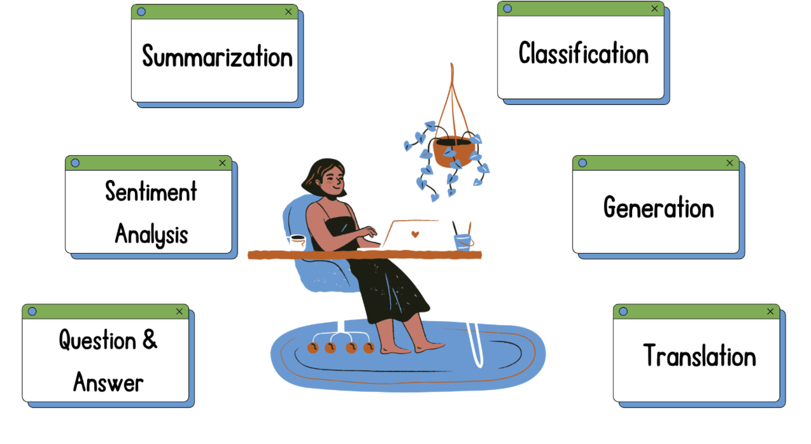

# Large Language Models (LLMs): Fundamentals

Large Language Models (LLMs) are advanced AI systems capable of understanding, interpreting, and generating human language. These models are primarily based on neural network architectures, with transformers being the most prevalent architecture used in modern LLMs.

## Key Characteristics of LLMs

- **Scale**: Trained on massive datasets with billions of parameters
- **Transfer Learning**: Pre-trained on general text data, then fine-tuned for specific tasks
- **Zero/Few-Shot Learning**: Ability to perform tasks with minimal examples
- **Context Understanding**: Capable of maintaining coherence over long contexts
- **Multimodal Capabilities**: Newer models can process images, audio, and other data types alongside text

## Common Applications

LLMs can perform a wide variety of natural language processing tasks:



### Text Summarization

Summarization reduces lengthy text into concise versions while preserving key information. LLMs can generate abstractive summaries that rephrase content in new words rather than simply extracting sentences.

```python
# Import necessary libraries
from transformers import pipeline

# Load the model pipeline
summarizer = pipeline(task="summarization", model="cnicu/t5-small-booksum")

# Example long text
long_text = """
The transformer architecture has revolutionized natural language processing. 
Introduced in the paper "Attention Is All You Need" by Vaswani et al. in 2017, 
it relies on self-attention mechanisms instead of recurrence or convolutions. 
This innovation allows for more efficient parallel processing and better modeling 
of long-range dependencies in sequential data. The transformer has become the 
foundation for models like BERT, GPT, T5, and many others that have achieved 
state-of-the-art performance across various NLP tasks.
"""

# Pass the long text to the model
output = summarizer(long_text, max_length=50)

# Access and print the summarized text
print("Summary:", output[0]["summary_text"])
```

### Text Generation

Text generation creates new content that continues from a given prompt. This capability powers applications like chatbots, story writing, and content creation.

```python
# Import necessary libraries
from transformers import pipeline

# Instantiate the pipeline
generator = pipeline(task="text-generation", model="gpt2")

# Example customer review
text = "I really enjoyed my stay at your hotel. The room was clean and the staff was very helpful."

# Hotel's initial response
response = "Dear valued customer, I am glad to hear you had a good stay with us."

# Create a prompt combining review and partial response
prompt = f"Customer review:\n{text}\n\nHotel response to the customer:\n{response}"

# Generate completion with the model pipeline
outputs = generator(
    prompt, 
    max_length=150, 
    pad_token_id=generator.tokenizer.eos_token_id, 
    truncation=True,
    do_sample=True,
    temperature=0.7  # Controls randomness: lower = more deterministic
)

print("Generated response:", outputs[0]["generated_text"])
```

### Translation

Translation converts text from one language to another while preserving meaning. Modern LLMs can translate between numerous language pairs with high accuracy.

```python
# Import necessary libraries
from transformers import pipeline

# Example Spanish text
spanish_text = "Este curso sobre LLMs se está poniendo muy interesante"

# Define the pipeline
translator = pipeline(task="translation_es_to_en", model="Helsinki-NLP/opus-mt-es-en")

# Translate the Spanish text
translations = translator(spanish_text, clean_up_tokenization_spaces=True)

print("English translation:", translations[0]["translation_text"])
```

## LLM Architectures

The transformer architecture can be implemented in different configurations, each optimized for specific types of tasks:


### Encoder-only Models

**Examples**: BERT, RoBERTa, DistilBERT

**Characteristics**:
- Bidirectional attention (looks at entire context)
- Optimized for understanding input text
- Usually smaller than decoder models

**Common Applications**:
- Text classification
- Named entity recognition
- Sentiment analysis
- Extractive question answering
- Feature extraction/embeddings

```python
from transformers import AutoTokenizer, AutoModel

# Load BERT model and tokenizer
tokenizer = AutoTokenizer.from_pretrained("bert-base-uncased")
model = AutoModel.from_pretrained("bert-base-uncased")

# Encode text for classification
inputs = tokenizer("I love machine learning", return_tensors="pt")
outputs = model(**inputs)

# Get the [CLS] token embedding (commonly used for classification)
sentence_embedding = outputs.last_hidden_state[:, 0, :]
```

### Decoder-only Models

**Examples**: GPT family, LLaMA, Mistral

**Characteristics**:
- Unidirectional attention (only looks at previous tokens)
- Optimized for generating fluent text
- Often very large (billions of parameters)

**Common Applications**:
- Text generation
- Creative writing
- Chatbots
- Code generation
- Generative question answering

```python
from transformers import GPT2Tokenizer, GPT2LMHeadModel

# Load GPT-2 model and tokenizer
tokenizer = GPT2Tokenizer.from_pretrained("gpt2")
model = GPT2LMHeadModel.from_pretrained("gpt2")

# Generate text from a prompt
prompt = "Artificial intelligence will"
input_ids = tokenizer.encode(prompt, return_tensors="pt")

# Generate output text
output = model.generate(
    input_ids, 
    max_length=50, 
    num_return_sequences=1, 
    do_sample=True, 
    top_p=0.92
)

# Decode and print the generated text
generated_text = tokenizer.decode(output[0], skip_special_tokens=True)
print(generated_text)
```

### Encoder-decoder Models

**Examples**: T5, BART, mT5

**Characteristics**:
- Combines both encoder and decoder components
- Encoder processes input, decoder generates output
- Particularly well-suited for tasks requiring input transformation

**Common Applications**:
- Machine translation
- Text summarization
- Question answering
- Dialogue systems
- Data-to-text generation

```python
from transformers import AutoTokenizer, AutoModelForSeq2SeqLM

# Load T5 model and tokenizer
tokenizer = AutoTokenizer.from_pretrained("t5-small")
model = AutoModelForSeq2SeqLM.from_pretrained("t5-small")

# For summarization with T5, prefix the input with "summarize: "
input_text = "summarize: " + long_article
input_ids = tokenizer.encode(input_text, return_tensors="pt")

# Generate summary
summary_ids = model.generate(
    input_ids, 
    max_length=100, 
    min_length=30, 
    num_beams=4, 
    early_stopping=True
)

# Decode the generated summary
summary = tokenizer.decode(summary_ids[0], skip_special_tokens=True)
print(summary)
```

## Training Approaches

Modern LLMs follow a multi-stage training process:

1. **Pre-training**: Training on large general text corpora using self-supervised learning
2. **Fine-tuning**: Adapting the pre-trained model to specific tasks using labeled data
3. **Alignment**: Ensuring model outputs conform to human preferences (RLHF, DPO, etc.)

This approach allows LLMs to learn general language patterns and then specialize for particular applications with relatively small amounts of task-specific data.
