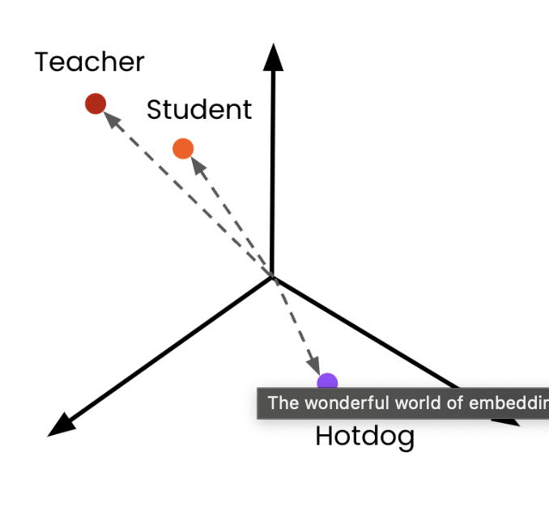
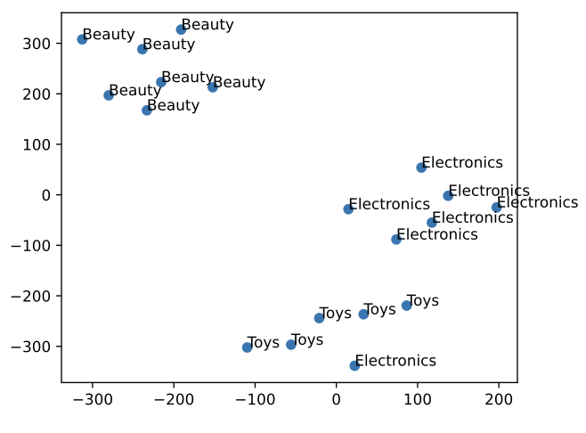
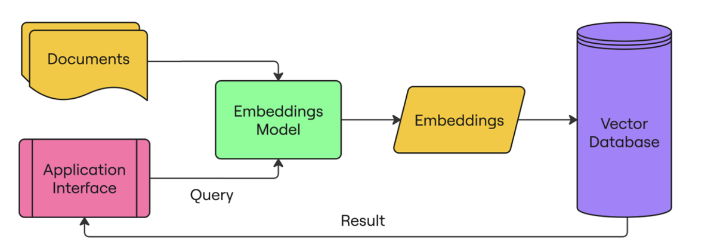

# Text Embeddings

## What Are Embeddings?

Embeddings are numerical representations (vectors) of text in a multi-dimensional space. They allow machines to understand semantic relationships between words and phrases by mapping them to points in this space where:

- Similar concepts appear closer together
- Dissimilar concepts appear farther apart
- Relationships between concepts can be represented mathematically



## Key Properties of Embeddings

- **Dimensionality**: OpenAI's embedding models produce vectors with different dimensions:
  - text-embedding-3-small: 1536 dimensions
  - text-embedding-3-large: 3072 dimensions
  - text-embedding-ada-002 (legacy): 1536 dimensions
- **Similarity Measurement**: Commonly measured using cosine similarity or distance
- **Contextual Understanding**: Captures nuanced meaning based on context

## Popular Embedding Models Comparison

| Model | Dimensions | Performance | Cost (per 1K tokens) | Use Case |
|-------|------------|-------------|----------------------|----------|
| text-embedding-3-small | 1536 | Good | $0.00002 | General purpose, cost-effective |
| text-embedding-3-large | 3072 | Better | $0.00013 | High-accuracy applications |
| text-embedding-ada-002 | 1536 | Good (legacy) | $0.00010 | Legacy applications |

## Working with Embeddings

### Basic Usage: Creating a Single Embedding

```python
import numpy as np
from openai import OpenAI
from scipy.spatial import distance
import matplotlib.pyplot as plt
from sklearn.manifold import TSNE

# Initialize the OpenAI client
client = OpenAI(api_key="YOUR_API_KEY")

# Create a request to obtain embeddings for a single text
response = client.embeddings.create(
    model="text-embedding-3-small",
    input="Just testing embeddings"
)

# Convert the response into a dictionary
response_dict = response.model_dump()

# Extract the total tokens used (useful for cost estimation)
print(f"Tokens used: {response_dict['usage']['total_tokens']}")

# Extract the embedding vector (1536 dimensions for text-embedding-3-small)
embedding_vector = response_dict['data'][0]["embedding"]
print(f"Vector dimensions: {len(embedding_vector)}")
print(f"First few values: {embedding_vector[:5]}...")
```

### Creating Multiple Embeddings at Once

```python
# Example product data
products = [
    {"id": 1, "title": "Laptop", "short_description": "High-performance laptop with 16GB RAM", "category": "Electronics", "features": ["16GB RAM", "512GB SSD", "15-inch display"]},
    {"id": 2, "title": "Smartphone", "short_description": "Latest smartphone with advanced camera", "category": "Electronics", "features": ["12MP camera", "128GB storage", "5G"]},
    {"id": 3, "title": "Hair Dryer", "short_description": "Professional salon-quality hair dryer", "category": "Beauty", "features": ["1800W", "Multiple heat settings", "Ionic technology"]},
    {"id": 4, "title": "Dog Food", "short_description": "Premium organic dog food for all breeds", "category": "Pet Supplies", "features": ["Organic", "Grain-free", "All natural ingredients"]}
]

# Extract a list of product short descriptions
product_descriptions = [product["short_description"] for product in products]

# Create embeddings for all descriptions in a single API call
response = client.embeddings.create(
    model="text-embedding-3-small",
    input=product_descriptions
)
response_dict = response.model_dump()

# Store the embeddings back in the product dictionaries
for i, product in enumerate(products):
    product['embedding'] = response_dict["data"][i]["embedding"]

print(f"First product title: {products[0]['title']}")
print(f"First product embedding dimensions: {len(products[0]['embedding'])}")
```

### Visualizing Embeddings with Dimensionality Reduction

Embedding vectors are typically high-dimensional (1536 dimensions for text-embedding-3-small), making them difficult to visualize directly. We can use dimensionality reduction techniques like t-SNE to project them into 2D space for visualization.

```python
# Extract categories and embeddings
categories = [product['category'] for product in products]
embeddings = [product['embedding'] for product in products]

# Reduce dimensions to 2D using t-SNE for visualization
tsne = TSNE(n_components=2, perplexity=5, random_state=42)
embeddings_2d = tsne.fit_transform(np.array(embeddings))

# Create a scatter plot
plt.figure(figsize=(10, 8))
plt.scatter(embeddings_2d[:,0], embeddings_2d[:,1], c=['blue', 'blue', 'orange', 'green'])

# Add category labels to each point
for i, category in enumerate(categories):
    plt.annotate(category, (embeddings_2d[i, 0], embeddings_2d[i, 1]), 
                 fontsize=12, alpha=0.8)

plt.title('Product Categories in 2D Embedding Space')
plt.xlabel('t-SNE Dimension 1')
plt.ylabel('t-SNE Dimension 2')
plt.grid(alpha=0.3)
plt.show()
```



## Measuring Text Similarity with Embeddings

One of the most common uses of embeddings is measuring how similar texts are to each other.

```python
# Helper function to create embeddings
def create_embeddings(texts):
    """
    Create embeddings for one or more texts
    
    Args:
        texts: A string or list of strings to embed
        
    Returns:
        A list of embedding vectors
    """
    # Handle single string input
    if isinstance(texts, str):
        texts = [texts]
    
    response = client.embeddings.create(
        model="text-embedding-3-small",
        input=texts
    )
    response_dict = response.model_dump()
    
    return [data['embedding'] for data in response_dict['data']]

# Find the most similar product to a search query
search_text = "soap"
search_embedding = create_embeddings(search_text)[0]

# Calculate cosine distances between search query and all products
distances = []
for product in products:
    # Lower cosine distance = higher similarity
    dist = distance.cosine(search_embedding, product['embedding'])
    distances.append(dist)

# Find and print the most similar product
min_dist_ind = np.argmin(distances)
print(f"Search query: '{search_text}'")
print(f"Most similar product: {products[min_dist_ind]['title']}")
print(f"Description: {products[min_dist_ind]['short_description']}")
print(f"Similarity score: {1 - distances[min_dist_ind]:.4f}")  # Convert distance to similarity
```

# Applications of Embeddings

## 1. Semantic Search

Semantic search uses embeddings to find relevant content based on meaning rather than keyword matching.

```python
# Function to create a rich text representation of products
def create_product_text(product):
    """
    Combine product attributes into a single searchable text
    
    Args:
        product: Dictionary containing product information
        
    Returns:
        String containing formatted product information
    """
    return f"""Title: {product["title"]}
Description: {product["short_description"]}
Category: {product["category"]}
Features: {", ".join(product["features"])}"""

# Function to find N closest matches
def find_n_closest(query_vector, embeddings, n=3):
    """
    Find the n closest embeddings to a query vector
    
    Args:
        query_vector: The embedding vector to compare against
        embeddings: List of embedding vectors to search through
        n: Number of closest matches to return
        
    Returns:
        List of dictionaries containing distances and indices
    """
    distances = []
    for index, embedding in enumerate(embeddings):
        # Calculate cosine distance (lower = more similar)
        dist = distance.cosine(query_vector, embedding)
        distances.append({"distance": dist, "index": index})
    
    # Sort by distance (ascending)
    distances_sorted = sorted(distances, key=lambda x: x["distance"])
    
    # Return the top n results
    return distances_sorted[:n]

# Create rich text descriptions for each product
product_texts = [create_product_text(product) for product in products]

# Create embeddings for all product texts
product_embeddings = create_embeddings(product_texts)

# Example search query
query_text = "electronic device for work"
query_vector = create_embeddings(query_text)[0]

# Find the five most similar products
hits = find_n_closest(query_vector, product_embeddings, 5)

print(f"Search query: '{query_text}'")
print("\nTop matching products:")
for i, hit in enumerate(hits):
    product = products[hit["index"]]
    similarity = 1 - hit["distance"]  # Convert distance to similarity score
    print(f"{i+1}. {product['title']} (Similarity: {similarity:.4f})")
```

## 2. Recommendation Systems

Recommendation systems can use embeddings to suggest items similar to those a user has previously interacted with.

```python
# Example user history - products the user has viewed or purchased
user_history = [products[0], products[1]]  # User has interacted with laptop and smartphone

# Create embeddings for user history items
history_texts = [create_product_text(item) for item in user_history]
history_embeddings = create_embeddings(history_texts)

# Calculate mean embedding of user history
# Note: For better results, you could use a weighted mean to emphasize recent interactions
mean_history_embedding = np.mean(history_embeddings, axis=0)

# Filter out products the user has already seen
products_filtered = [product for product in products if product not in user_history]

# Create embeddings for filtered products
product_texts = [create_product_text(product) for product in products_filtered]
product_embeddings = create_embeddings(product_texts)

# Find products similar to user's history
recommendations = find_n_closest(mean_history_embedding, product_embeddings, 2)

print("Based on user's history:")
for item in user_history:
    print(f"- {item['title']}")

print("\nRecommended products:")
for i, rec in enumerate(recommendations):
    product = products_filtered[rec["index"]]
    similarity = 1 - rec["distance"]
    print(f"{i+1}. {product['title']} (Similarity: {similarity:.4f})")
```

## 3. Classification

Embeddings can be used for classification by comparing an item to examples of different classes.

```python
# Example sentiment classes
sentiments = [
    {"label": "positive", "description": "expressing approval or satisfaction"},
    {"label": "negative", "description": "expressing disapproval or criticism"},
    {"label": "neutral", "description": "not expressing strong feelings"}
]

# Example reviews to classify
reviews = [
    "This product is amazing! I love it!",
    "Terrible experience, will not buy again.",
    "It arrived on time and works as expected."
]

# Function to find the closest class
def find_closest(query_vector, embeddings):
    """
    Find the closest embedding to a query vector
    
    Args:
        query_vector: The embedding vector to compare against
        embeddings: List of embedding vectors to search through
        
    Returns:
        Dictionary containing the distance and index of the closest match
    """
    distances = []
    for index, embedding in enumerate(embeddings):
        dist = distance.cosine(query_vector, embedding)
        distances.append({"distance": dist, "index": index})
    return min(distances, key=lambda x: x["distance"])

# Create embeddings for class descriptions and reviews
class_descriptions = [sentiment['description'] for sentiment in sentiments]
class_embeddings = create_embeddings(class_descriptions)
review_embeddings = create_embeddings(reviews)

print("Sentiment Classification Results:")
for index, review in enumerate(reviews):
    # Find the closest sentiment class
    closest = find_closest(review_embeddings[index], class_embeddings)
    # Get the label of the closest class
    label = sentiments[closest["index"]]["label"]
    similarity = 1 - closest["distance"]
    print(f"\nReview: \"{review}\"")
    print(f"Classification: {label} (Confidence: {similarity:.4f})")
```

# Vector Databases

As your application scales, storing and querying embeddings efficiently becomes crucial. This is where vector databases come in.



## What is a Vector Database?

A vector database is specialized for storing and searching high-dimensional vectors (embeddings). They enable fast similarity searches that would be impractical with traditional databases.

## Key Components of Vector Databases

- **Embeddings**: The vector representations of your content
- **Source Text**: The original text that was embedded
- **Metadata**: Additional information like IDs, timestamps, or any data used for filtering

## Vector Database Comparison

| Database | Type | Hosting | Approximate Search | Filtering | Open Source |
|----------|------|---------|-------------------|-----------|-------------|
| Chroma | In-memory/Persistent | Self-hosted/Cloud | Yes | Yes | Yes |
| Pinecone | Cloud-native | Managed | Yes | Yes | No |
| Weaviate | Persistent | Self-hosted/Cloud | Yes | Yes | Yes |
| Milvus | Distributed | Self-hosted/Cloud | Yes | Yes | Yes |
| Qdrant | Persistent | Self-hosted/Cloud | Yes | Yes | Yes |

## Working with ChromaDB

ChromaDB is a popular open-source embedding database that's easy to set up.

### Installation and Setup

```bash
pip install chromadb tiktoken
```

### Creating Collections

```python
import chromadb
from chromadb.utils.embedding_functions import OpenAIEmbeddingFunction

# Create a persistent client (stores data on disk)
client = chromadb.PersistentClient(path="./chroma_db")

# Create an embedding function using OpenAI
embedding_function = OpenAIEmbeddingFunction(
    model_name="text-embedding-3-small",
    api_key="YOUR_API_KEY"
)

# Create or get a collection
collection = client.create_collection(
    name="product_catalog",
    embedding_function=embedding_function,
    metadata={"description": "Product catalog for e-commerce site"}
)

# Example product data
products = [
    {"id": "prod_1", "text": "High-performance laptop with 16GB RAM", "metadata": {"category": "Electronics", "price": 1299.99}},
    {"id": "prod_2", "text": "Latest smartphone with advanced camera", "metadata": {"category": "Electronics", "price": 899.99}},
    {"id": "prod_3", "text": "Professional salon-quality hair dryer", "metadata": {"category": "Beauty", "price": 149.99}},
    {"id": "prod_4", "text": "Premium organic dog food for all breeds", "metadata": {"category": "Pet Supplies", "price": 49.99}}
]

# Add documents to the collection
collection.add(
    ids=[p["id"] for p in products],
    documents=[p["text"] for p in products],
    metadatas=[p["metadata"] for p in products]
)

# Check collection info
print(f"Collection '{collection.name}' created with {collection.count()} documents")
print(f"First few items: {collection.peek()}")
```

### Calculating Embedding Costs

```python
import tiktoken

# Load the tokenizer for the embedding model
enc = tiktoken.encoding_for_model("text-embedding-3-small")

# Calculate tokens for each document
documents = [p["text"] for p in products]
token_counts = [len(enc.encode(doc)) for doc in documents]

# Calculate total tokens and cost
total_tokens = sum(token_counts)
cost_per_1k_tokens = 0.00002  # $0.00002 per 1K tokens for text-embedding-3-small

print(f"Total tokens: {total_tokens}")
print(f"Estimated cost: ${cost_per_1k_tokens * (total_tokens/1000):.6f}")
print(f"Average tokens per document: {total_tokens/len(documents):.1f}")
```

### Querying a Vector Database

```python
# Basic query for similar products
query_result = collection.query(
    query_texts=["laptop for gaming"],
    n_results=2
)

print("Basic Query Results:")
for i, (id, document, distance) in enumerate(zip(
    query_result["ids"][0],
    query_result["documents"][0],
    query_result["distances"][0]
)):
    print(f"{i+1}. ID: {id}")
    print(f"   Document: {document}")
    print(f"   Distance: {distance}")
    print()

# Query with metadata filtering
filtered_result = collection.query(
    query_texts=["electronics device"],
    n_results=2,
    where={"price": {"$lt": 1000}}  # Only products under $1000
)

print("Filtered Query Results (under $1000):")
for i, (id, document, metadata) in enumerate(zip(
    filtered_result["ids"][0],
    filtered_result["documents"][0],
    filtered_result["metadatas"][0]
)):
    print(f"{i+1}. ID: {id}")
    print(f"   Document: {document}")
    print(f"   Category: {metadata['category']}")
    print(f"   Price: ${metadata['price']}")
    print()
```

### Updating and Deleting Records

```python
# Update existing documents
collection.update(
    ids=["prod_1"],
    documents=["High-performance gaming laptop with 32GB RAM and RTX 4080"],
    metadatas=[{"category": "Electronics", "price": 1999.99}]
)

# Upsert (create if not exists, update if exists)
collection.upsert(
    ids=["prod_5"],
    documents=["Wireless noise-cancelling headphones with 30-hour battery life"],
    metadatas=[{"category": "Electronics", "price": 349.99}]
)

# Delete documents
collection.delete(
    ids=["prod_3"]
)

print(f"Updated collection now has {collection.count()} documents")
```

### Multiple Queries and Advanced Filtering

```python
# Get documents using IDs
reference_ids = ["prod_1", "prod_5"]
reference_docs = collection.get(
    ids=reference_ids
)

print("Retrieved documents by ID:")
for id, doc, metadata in zip(
    reference_docs["ids"],
    reference_docs["documents"],
    reference_docs["metadatas"]
):
    print(f"ID: {id}")
    print(f"Document: {doc}")
    print(f"Metadata: {metadata}")
    print()

# Complex filtering with AND/OR conditions
complex_result = collection.query(
    query_texts=["high quality electronics"],
    n_results=3,
    where={
        "$and": [
            {"category": {"$eq": "Electronics"}},
            {"price": {"$gte": 300}}
        ]
    }
)

print("Complex Query Results (Electronics $300+):")
for i, (id, document, metadata) in enumerate(zip(
    complex_result["ids"][0] if complex_result["ids"] else [],
    complex_result["documents"][0] if complex_result["documents"] else [],
    complex_result["metadatas"][0] if complex_result["metadatas"] else []
)):
    print(f"{i+1}. ID: {id}")
    print(f"   Document: {document}")
    print(f"   Price: ${metadata['price']}")
```

## Best Practices for Working with Embeddings

1. **Chunking Strategy**: Split long documents into smaller, semantically meaningful chunks
2. **Metadata Design**: Include relevant metadata for filtering and organizing results
3. **Batch Processing**: Generate embeddings in batches to reduce API costs
4. **Model Selection**: Use smaller models for cost-efficiency, larger models for higher accuracy
5. **Hybrid Search**: Combine vector search with keyword search for better results

## Advanced Techniques

- **Hybrid search**: Combining traditional search with embedding-based search
- **Re-ranking**: Using embeddings for initial retrieval, then refining with more complex models
- **Fine-tuning**: Creating custom embeddings for specific domains and applications
- **Clustering**: Grouping similar items for organization and analysis