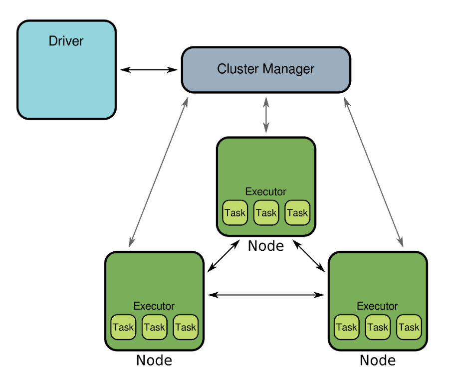

# Spark

Framework to compute across a distributed cluster.it's faster because data is processed in memory 



# Submodules

* Structured data: `pyspark.sql`
* Streaming data: `pyspark.streaming`
* Machine learning `pyspark.ml`

# Connecting to spark

```python 
# Import the SparkSession class
from pyspark.sql import SparkSession

# Create SparkSession object
spark = SparkSession.builder \
                    .master('local[*]') \
                    .appName("test") \
                    .getOrCreate()

# What version of Spark?
print(spark.version)

# Terminate the cluster
spark.stop()
```

# Loading data

## infer data types

This si more computationally expensive because Spark has to look into the data to infer those types. This is important for huge datasets

```python 
# Read data from CSV file
flights = spark.read.csv('flights.csv',
                         sep=",",
                         header=True,
                         inferSchema=True,
                         nullValue='NA')

# Get number of records
print("The data contain %d records." % flights.count())

# View the first five records
flights.show(5)

# Check column data types
print(flights.dtypes)
```
Output:
```shell
    The data contain 50000 records.
    +---+---+---+-------+------+---+----+------+--------+-----+
    |mon|dom|dow|carrier|flight|org|mile|depart|duration|delay|
    +---+---+---+-------+------+---+----+------+--------+-----+
    | 11| 20|  6|     US|    19|JFK|2153|  9.48|     351| null|
    |  0| 22|  2|     UA|  1107|ORD| 316| 16.33|      82|   30|
    |  2| 20|  4|     UA|   226|SFO| 337|  6.17|      82|   -8|
    |  9| 13|  1|     AA|   419|ORD|1236| 10.33|     195|   -5|
    |  4|  2|  5|     AA|   325|ORD| 258|  8.92|      65| null|
    +---+---+---+-------+------+---+----+------+--------+-----+
    only showing top 5 rows
    
    [('mon', 'int'), ('dom', 'int'), ('dow', 'int'), ('carrier', 'string'), ('flight', 'int'), ('org', 'string'), ('mile', 'int'), ('depart', 'double'), ('duration', 'int'), ('delay', 'int')]
```

## Set data types explicitly

```python 
from pyspark.sql.types import StructType, StructField, IntegerType, StringType

# Specify column names and types
schema = StructType([
    StructField("id", IntegerType()),
    StructField("text", StringType()),
    StructField("label", IntegerType())
])

# Load data from a delimited file
sms = spark.read.csv('sms.csv', sep=';', header=False, schema=schema)

# Print schema of DataFrame
sms.printSchema()
```
Output:
```shell
root
    |-- id: integer (nullable = true)
    |-- text: string (nullable = true)
    |-- label: integer (nullable = true
```