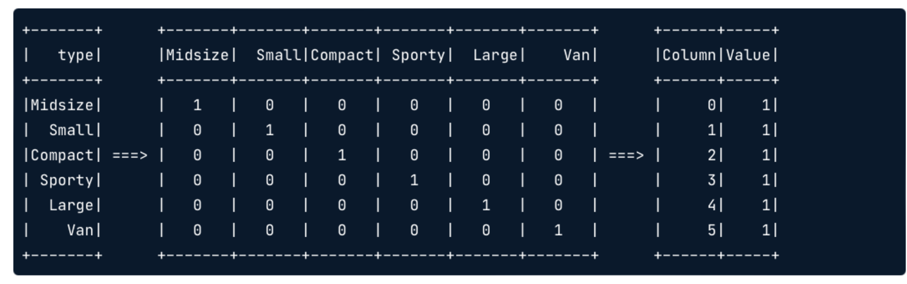

# One hot encoding

Using StringIndexer does not help for regression because the numerical value has no meaning. Instead of that you could use dummy variables. 

This ends on increasing the amount of columns if the input column has a lot of different values. To deal with that you can use a sparse representation.



```python 
# Import the one hot encoder class
from pyspark.ml.feature import OneHotEncoder

# Create an instance of the one hot encoder
onehot = OneHotEncoder(inputCols=['org_idx'], outputCols=['org_dummy'])

# Apply the one hot encoder to the flights data
onehot = onehot.fit(flights)
flights_onehot = onehot.transform(flights)

# Check the results
flights_onehot.select('org', 'org_idx', 'org_dummy').distinct().sort('org_idx').show()
```

# Regression

```python 
from pyspark.ml.regression import LinearRegression
from pyspark.ml.evaluation import RegressionEvaluator

# Create a regression object and train on training data
regression = LinearRegression(labelCol="duration").fit(flights_train)

# Create predictions for the testing data and take a look at the predictions
predictions = regression.transform(flights_test)
predictions.select('duration', 'prediction').show(5, False)

# Calculate the RMSE
RegressionEvaluator(labelCol="duration").evaluate(predictions)
```

# Bucketing and engineering

Group continuous variables into groups and create categorical variable. 

```python 
from pyspark.ml.feature import Bucketizer, OneHotEncoder

# Create buckets at 3 hour intervals through the day
buckets = Bucketizer(splits=[0, 3, 6, 9, 12, 15, 18, 21, 24], inputCol="depart", outputCol="depart_bucket")

# Bucket the departure times
bucketed = buckets.transform(flights)
bucketed.select("depart", "depart_bucket").show(5)

# Create a one-hot encoder
onehot = OneHotEncoder(inputCols=["depart_bucket"], outputCols=["depart_dummy"])

# One-hot encode the bucketed departure times
flights_onehot = onehot.fit(bucketed).transform(bucketed)
flights_onehot.select("depart", "depart_bucket", "depart_dummy").show(5)
```

Output: 

```python 
|depart|depart_bucket| depart_dummy|
+------+-------------+-------------+
|  9.48|          3.0|(7,[3],[1.0])|
| 16.33|          5.0|(7,[5],[1.0])|
|  6.17|          2.0|(7,[2],[1.0])|
| 10.33|          3.0|(7,[3],[1.0])|
|  8.92|          2.0|(7,[2],[1.0])|
+------+-------------+-------------+
```

You can also apply operation to certain column to condense data into one 

# Regularization

## Lasso

```python 
from pyspark.ml.regression import LinearRegression
from pyspark.ml.evaluation import RegressionEvaluator

# Fit Lasso model (λ = 1, α = 1) to training data
regression = LinearRegression(labelCol="duration", regParam=1, elasticNetParam=1).fit(flights_train)

# Calculate the RMSE on testing data
rmse = RegressionEvaluator(labelCol="duration").evaluate(regression.transform(flights_test))
print("The test RMSE is", rmse)

# Look at the model coefficients
coeffs = regression.coefficients
print(coeffs)

# Number of zero coefficients
zero_coeff = sum([beta == 0 for beta in regression.coefficients])
print("Number of coefficients equal to 0:", zero_coeff)
```

Output: 

```shell
The test RMSE is 11.847247620737766
[0.07344906677784574,1.4137375580081961,-2.6351822824590694,24.553439498948325,17.75959505190589,-5.839936949637352,-3.4762916785809956,-17.899747838796426,0.0,0.0,0.0,0.0,0.0,0.6335877870029832,0.46819806830962624,0.0,0.0,0.0,0.0,0.0,0.0,0.0,0.0,0.0,0.0,0.0,0.0,0.0,0.0,0.0,0.0,0.0]
Number of coefficients equal to 0: 22
```

Normal regression modal got a RMSE of  11.365305439060927.